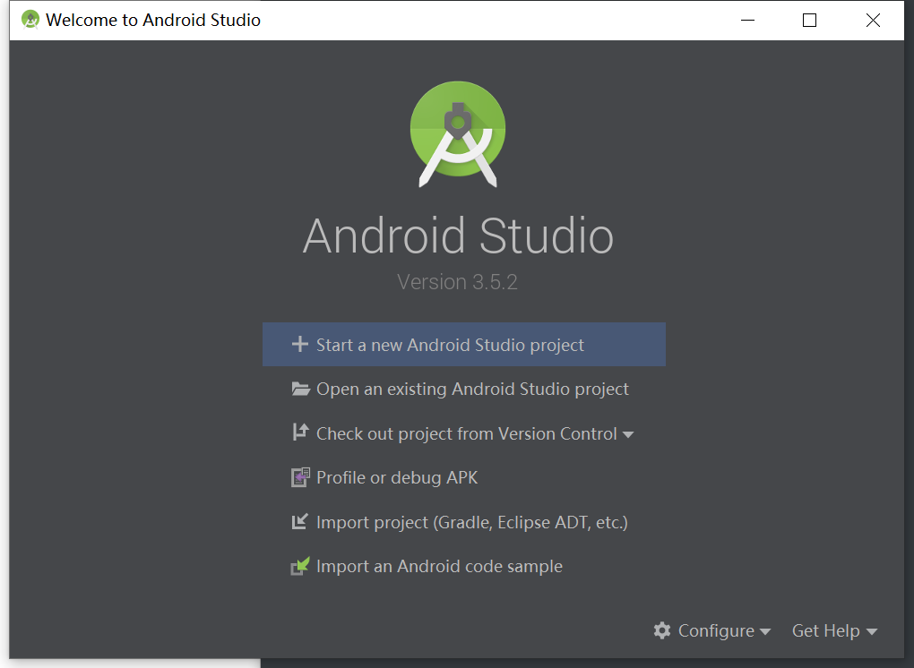
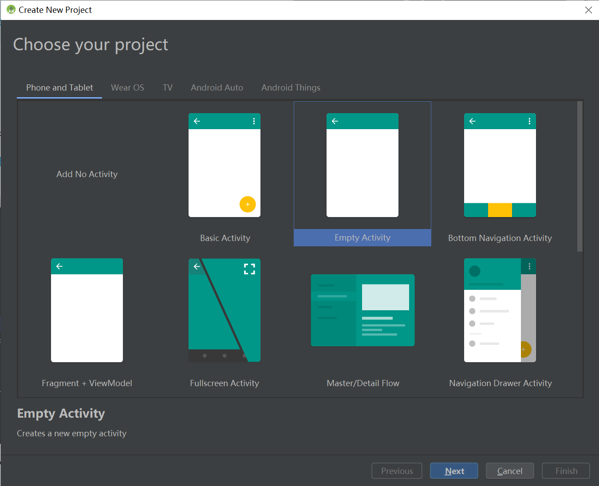
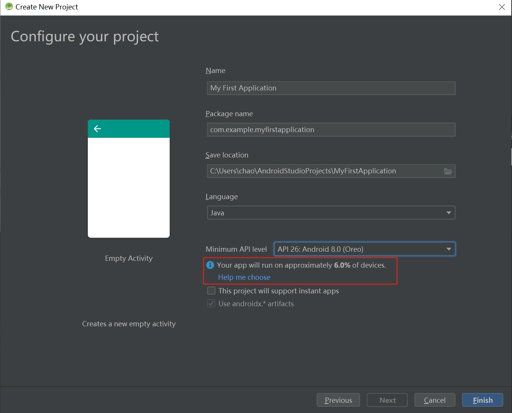
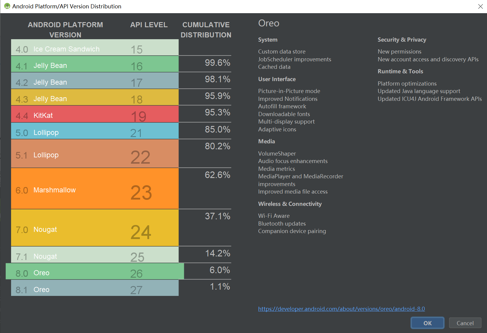
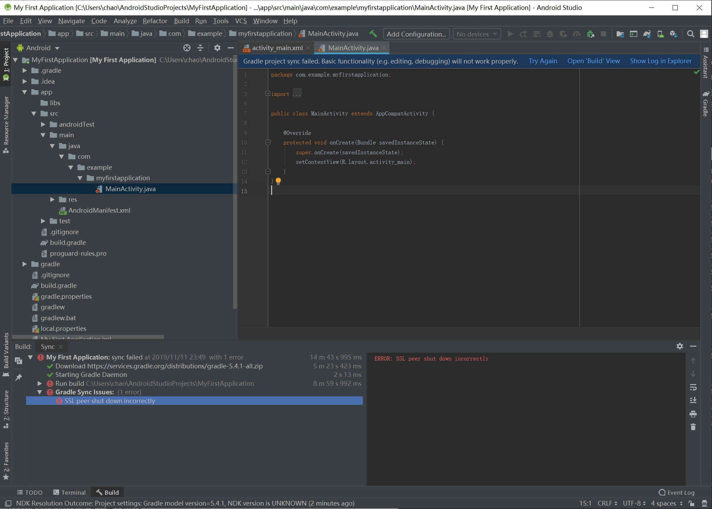

# 创建 Android 项目

>   本文学习链接 [创建 Android 项目](https://developer.android.google.cn/training/basics/firstapp/creating-project)

本文学习如何使用 Android Studio 创建一个新的 Android 项目，并初步了解项目中的一些文件的作用。本人将使用最新版的 Android studio 3.5.2 完成。

## 创建项目

1.  打开 Android Studio，点击 Start a new Android Studio project.

    

2.  在 Choose your project 窗口中，选择 Empty Activity。然后点击 next。

    

3.  在 Configure your project 窗口中填写应用名，包名，选择项目保存路径，开发该项目使用的语言，需要兼容的最低 API 版本。

    

    进入该窗口时，默认选择的语言为 Kotlin。看来 Google 真的在推广 Kotlin，但是我目前不会 Kotlin，会一些 Java，所以就选择 Java 了。默认选择的最低 API level 为 API 21:Android 5。我选择的是 Android 8.0 对应的 API 26，因为我手上的 三星 S8+ 系统为 Android 9，公司给的测试机系统为 Android 8，而且我打算开发的应用不会给其他人用，所以没必要兼容 Android 8 以下的版本。在我选完 API 26 后，下面弹出的提示说：你的应用大概只能在 6% 的设备上运行。然后点击 “Help me choose”，就会弹出一个窗口，统计了各个 Android  API 版本能兼容的机器所占的市场份额。如下图：

    

    这个统计图明显不准确，都 2019 年双十一了，小米，三星等厂商早就推送过 Android 10 了，连我两年前的 S8+ 都是 Android 9，这个统计图上却看不到 Android 9 和 10 的统计。虽然 Android 9 和 10 的比例可能比较少，但也不是没有吧。

4.  点击 Finish 后，Android Studio 就会进入如下 IDE 界面。

    

    看来我的 Gradle 没配置好。Android Studio 使用 Gradle 构建项目，看来我得先弄好 Gradle 才能继续。

> Gradle 我已经配置好，详情请看番外篇

## 项目结构分析

在 IDE 左侧的 Project 窗口可以看到项目中的各个文件。

**` app > java > com.example.myfirstapp > MainActivity`**

应用的主 Activity（应用入口）。构建和运行应用时，系统会启动该 Activity 实例并加载其布局。

 **`app > res > layout > activity_main.xml`** 

这个 XML 文件定义了主 Activity 的界面布局。默认添加了一个 `TextView` 控件，默认文本为“Hello world!”

 **`app > manifests > AndroidManifest.xml`** 

清单文件，描述应用的基本特性并定义应用的每个组件。

 **`Gradle Scripts > build.gradle`** 

有两个 `build.gradle` 文件，一个用于项目 My First Application，一个用于模块 app。每个模块都有自己的 `build.gradle` 文件，目前该项目只有一个 app 模块。我们将主要使用模块的 `build.gradle` 文件来配置 Gradle 如何编译和构建应用。想详细了解该文件，可以参考[配置编译系统](https://developer.android.google.cn/studio/build/index.html) 。

## 运行应用

