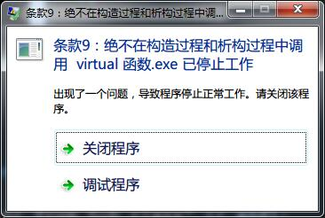

# 条款09：不要在构造过程和析构过程中调用 virtual 方法

## 问题背景

我们知道通过指针或引用调用对象的虚函数会触发动态绑定，根据对象的实际类型调用对应的版本。但是如果是在构造函数或析构函数中调用 virtual 函数呢？

构造函数的特殊之处在于，当创建一个扩展类对象时，先调用基类的构造函数，此时扩展类的成员变量都未初始化（某种意义上扩展类部分还不存在），如果此时在基类的构造函数中调用一个 virtual 函数会触发动态绑定吗？因为构造函数中调用成员函数，也是相当于通过 this 指针调用的。

析构函数的特殊之处在于，销毁一个子类对象时，先调用扩展类的析构函数，再调用基类的析构函数，调用基类的析构函数时，扩展类的一些资源已经释放，如果此时调用 virtual 函数会触发动态绑定吗？调用的会是子类的 virtual 函数版本吗？

## 实验

针对上面的疑问，虽然已经从《Effective C++》中找到了答案，但还是自己动手实验一下深刻一点。

### 实验一：

代码如下：

```c++
#include <iostream>

using std::cout;
using std::endl;

class Base
{
public:
	Base()
	{
		vfunc();
	}

	virtual void vfunc()
	{
		cout << "vfunc from Base class" << endl;
	}
};

class Sub :public Base
{
public:
	Sub() {}

	void vfunc() override
	{
		cout << "vfunc from Sub class" << endl;
	}
};

int main()
{
	Sub s;

	return 0;
}
```

运行后，输出的结果为：

```shell
vfucn from Base class
```

说明调用的是基类中的虚函数版本。并没触发动态绑定。

### 实验二

如果基类中的虚函数未提供实现（纯虚函数）怎么办？我们把基类中的虚函数实现移除再试试。

将基类的虚函数改成

```c++
virtual void vfunc() = 0;
```

发现链接时就出现错误

```shell
 error LNK2019: 无法解析的外部符号 "public: virtual void __thiscall Base::vfunc(void)" (?vfunc@Base@@UAEXXZ)，该符号在函数 "public: __thiscall Base::Base(void)" (??0Base@@QAE@XZ) 中被引用
```

再次证明在基类的构造过程中调用虚函数是静态绑定。

### 实验三

上面链接过程中，编译器检查出了基类虚函数未实现的错误。假如我们把错误做的隐蔽一点，在基类的构造函数中调用一个普通函数，再在这个普通函数中调用虚函数，编译器会检查出错误吗？

将基类的代码改成如下：

```c++
class Base
{
public:
	Base()
	{
		func();
	}

	void func()
	{
		vfunc();
	}

	virtual void vfunc() = 0;
};
```

编译并没报任何错误，但是运行时程序奔溃了。如下：



说明编译器并未对这种复杂虚函数调用做检查。

## 解释

因为在创建扩展类对象时，先调用基类的构造函数，此时扩展类部分并未初始化，为了安全考虑，C++ 此时认为对象是基类对象。所以即使此时调用虚函数，也是静态绑定到基类的版本。

同理，销毁一个扩展类对象时，先调用扩展类的析构函数，再调用基类的析构函数。调用基类的析构函数时，扩展类部分的资源已经释放，C++ 也任务此时的对象属于基类对象，一切调用都静态绑定到基类。

### 实验四：

我们再来用 C++ 提供的运行时类型识别功能来验证一下在基类构造函数调用时对象的具体类型。

代码如下：

```c++
#include <iostream>

using std::cout;
using std::endl;

class Base
{
public:
	class Sub; // 声明 Sub 是一个类，因为此时 Sub 还未定义，不声明的话，当前作用域中并没有 Sub 符号
	Base()
	{
		if (typeid(*this) == typeid(Base))
		{
			cout << "类型为 Base" << endl;
		}
		else if (typeid(*this) == typeid(Sub))
		{
			cout << "类型为 Sub" << endl;
		}
	}

};

class Sub :public Base
{
public:
	Sub()
	{
		if (typeid(*this) == typeid(Base))
		{
			cout << "类型为 Base" << endl;
		}
		else if (typeid(*this) == typeid(Sub))
		{
			cout << "类型为 Sub" << endl;
		}
	}
};

int main()
{
	Sub s;

	return 0;
}
```

输出如下：

```shell
类型为 Base
类型为 Sub
```

说明在基类的构造函数被调用时，对象还是一个 Base 类型的对象。

### 实验五：

再来用 C++ 提供的运行时类型识别功能来验证一下在基类析构函数调用时对象的具体类型。

代码如下：

```c++
#include <iostream>

using std::cout;
using std::endl;

class Base
{
public:
	class Sub;
	~Base()
	{
		if (typeid(*this) == typeid(Base))
		{
			cout << "类型为 Base" << endl;
		}
		else if (typeid(*this) == typeid(Sub))
		{
			cout << "类型为 Sub" << endl;
		}
	}

};

class Sub :public Base
{
public:
	~Sub()
	{
		if (typeid(*this) == typeid(Base))
		{
			cout << "类型为 Base" << endl;
		}
		else if (typeid(*this) == typeid(Sub))
		{
			cout << "类型为 Sub" << endl;
		}
	}
};

int main()
{
	Sub s;

	return 0;
}
```

输出如下：

```c++
类型为 Sub
类型为 Base
```

说明随着扩展类的析构函数调用完毕，调用基类的析构函数时，C++ 已经认为对象为基类对象。