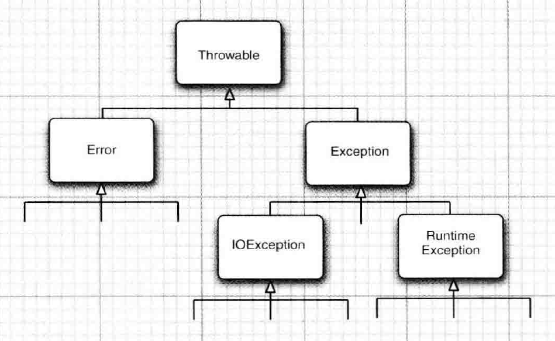

# Java 异常

## 前言

在学生时代写代码时觉得异常有时候很有用，可以对程序中的错误进行兜底处理。有时候又觉得异常很繁琐，有的 API 会抛出一个受查的异常，这时候你必须对其进行 try catch 处理，不然编译器会报错。处理这种受查异常就很会很纠结，你用 try catch 捕获到这种异常后，是继续向上抛出呢，还是自己处理呢，如果继续向上抛出，则上层的代码就不得不处理这种异常，麻烦只是转移一个位置。所以很多时候我们都是 try catch 后什么都不做，总感觉有点不安。

在前一段时间的后端业务开发中，我发现我需要区分两种类型的异常：一种是业务上的，比如前端传递参数不对，或者没有权限，这种情况下我需要返回给前端一个消息码和一行文字说明。另一种是程序内部错误，是我程序内部本身的问题，比如访问对象前没做判空处理，导致出现NPE（空指针异常），或者调用的其他服务超时或者挂了，这种情况下我需要返回给前端另种消息码和文字说明，然后还必须记录日志，便于后续查找原因。

另外，从我7月份参加工作，从事业务开发以来就一直有一个疑问，如果我的代码中充斥着异常检测和处理，那正常的代码逻辑就会淹没在这些异常处理中，变得难以阅读和维护，感觉很不优雅。我越来越觉得怎么处理代码中的错误，怎么使用异常是一个工程规范问题。所以是是时候重新开始学习 Java 异常。

后续我将阅读《Java 核心技术卷一》第10版，网络搜索大家对异常的讨论，结合自己半年来的编码经验完成本篇学习笔记。

## 异常是一种错误处理机制

按照《Java 核心技术卷一》第七章说法，理想情况下，我们编写的代码都没有 bug，用户的输入永远正确，程序所处的环境永远不会出错。但我们处在现实世界中，用户肯定会输入错误的参数，人写的代码肯定会有 bug，物理环境肯定会出错或者崩溃，这时候程序肯定不能正常的执行下去，程序需要感知这些错误，并尽可能的妥善处理这些错误。《Java 核心技术卷一》认为程序至少应该做到以下几点：

- 向用户通告错误
- 保存所有的工作结果
- 允许用户以妥善的形式退出程序

个人觉得这几点措施只适用于那些和用户之间交互的程序，同常是用户桌面上带界面的那种，程序运行在用户的设备上，程序员也不能方便收集并分系程序出现的问题。而后端程序不和用户直接交互，程序通常部署上服务器上，程序员可以方便的用日志记录问题并分析问题，所以后端程序在处理错误时还需要尽可能的记录问题出现时的上下文，便于后续对问题进行分析并修复。

另外，在程序出现问题时，如果问题只是一个可以接受的局部错误，我们可以将该错误控制在一定范围内，不让它影响整个程序的执行。

Java 及其他一些语言将导致程序不能正常执行的问题称为异常，并提出一种机制来处理这些问题，处理这些问题的机制也叫做异常。所以我们平常所说的异常即指程序出现的问题，也指处理问题的一种机制。

## 异常处理的形式

Java 中最常见最基本的异常处理的形式如下：

```java
try {
    // 正常的执行流
    // 但是可能为出现异常
} catch(Exception e) {
    // 异常处理逻辑
}
```

用 try 语句块包裹可能会出现异常的语句，这些语句是程序正常的执行流程。在 try 语句中的任何一行代码出现异常时，当前的执行流就会跳转到对应的 catch 语句块中，catch 的 Exception 参数保存了异常信息。

这里需要关注的重点时，try 语句块中的代码发生异常，程序执行流从 try 跳转到了 catch 语句块中，如果没发生异常，try 语句块中的代码会被正常正常执行，程序的执行流也不会跳转到 catch 语句块中。从静态的纬度来看，正常逻辑代码和异常处理代码分布在不同的代码块中。从动态执行的纬度来看，正常逻辑代码和异常处理代码处于不同的执行流中，发生异常时程序会从正常的执行流跳转到异常处理。

所以 Java 的异常处理机制也依赖于底层的程序执行流跳转技术。

> 程序执行流跳转技术包括 beak、continue、return 以及 C 预约特有 goto，这些关键字都能影响程序的执行流程。

## 异常和错误返回码的区别

异常是一种错误处理机制，但异常处理机制不止异常一种。大多数人更熟悉更传统的一种错误处理机制是返回码。比如下面的 C 语言代码通过函数的返回值来判断是否出错，并对错误进行处理。

```c
FILE * fp = fopen("hello.txt", "r");
if(fp == null) {
    perror("打开文件失败，error code:%d", errno);
} else {
    // 读取文件
}
```

该代码通过判断 `fopen` 的返回值来判断打开文件是否出错，如果返回值为`null` 说明打开文件失败。并且 `fopen` 会在出错时会将全局变量 `errno` 设置一个整数值，不同的值代码不同类型的错误，访问 `errno` 就可以知道发生了什么类型的错误。C Linux 编程中的其他函数，比如 send、read 都是通过函数的返回值来判断是否发送错误，一般是返回 -1 或者 0 表示函数调用出错，返回其他值则表示正常的业务数据。

个人认为这种错误处理机制对比异常处理不好的地方在于：

1. 将错误信息（表示出错的返回值）和正常的业务返回混合在一起，不能将有效的区分业务数据和错误。比如 send 返回 -1 表示出错，返回大于 0 的整数表示发送出了多少字节的数据。如果某个函数调用的正常情况就是要返回 -1 呢，那就得令外规定表示错误的返回值，也就是错误类型占用了正常业务数据的取值范围。为了尽量减少错误信息对正常业务数据取值范围的占用，C Linux 编程中会创建一个全局的变量 errno，让 errno 的不同值来表示不同类型的错误。但 errno 是全局的，不同的线程都可以访问它，所以在多线程环境下访问到的 errno 可能是其他线程设置的值。（errno 的多线程访问问题是可以解决的，不过不在本篇的讨论范围内。）
2. 将错误处理逻辑和程序的正常逻辑混合在一起。在在前面的例子中看到，`fopen` 发生错误时，程序的执行流还是依次向下执行，对错误的检测和处理必须就地进行。导致程序员写代码时要一边思考正常逻辑的同时还要兼顾可能出错的情况，这样写出来的代码往往是正常逻辑和错误处理逻辑交替在一起，阅读起来也不直观。
3. 无法对一片代码进行兜底的错误处理。在 Java 中如果你不知道还有哪些错误没有考虑到，可以用一个 try catch 将一个代码块包裹起来，这片代码中发送你事先没有考虑的异常时都可以跳转到 catch语句中进行处理，这个代码块的错误不会扩散到其他地方。但是在 C 语言中，如果某行代码出现内存访问错误，比如空指针和数组越界访问，你是无法对其进行判断并兜底处理的，这时候整个程序或当前线程或进程都会崩溃。

关于第二点，使用错误返回码会将正常处理逻辑和错误处理逻辑混合到一起，可能有人会反驳就算用异常也可能会这样啊。这个是当然的，如果你每行代码都用一个单独的 try catch 包裹起来，这样看起来正常代码逻辑和错误处理逻辑交替混合在一起。但是使用异常处理比使用错误返回码更不容易写出这样的代码，使用错误返回码更容易写出这种混合逻辑的代码。不管设计的多么科学的水果刀也阻止不了人削出形状丑陋的水果。工具只是提升使用者的上限和下限而已。

## Java 异常的层次结构和分类

Java 将不同的错误用不同的异常来处理，异常的分类即错误的分类。《Java 核心技术卷一》这一章的我错误分类我感觉有点混乱，分类的依据不明确，例子不够多，没有考虑开发中通常遇到的情况。个人觉得程序中的错误可以分为以下几类：

- 程序可以检测到但无法处理的错误。比如物理设备错误，硬盘坏了或者硬盘存储空间不够。遇到这种错误，程序能做的很少，只能将情况记录并告知用户，然后退出。
- 程序可以检测和处理的错误，比如输入参数错误，程序可以检测到错误后让用户重新输入。
- 代码 bug，比如访问空指针，数据越界访问，用 0 做除数，不正确的对象类型转换等。出现这种异常后需要修复代码 bug。

对于这些错误类型，Java 对于的异常层次结构入下图：



所有的异常都继承自 Throwable 类，然后 Throwable 的子类又分为 Error 和 Exception。Throwable 代表了 Java 语言中所有能被 JVM 虚拟机以及 Java 代码能抛出的异常，只有 Throwable 或其子类才能作为 try catch 语句中 catch 的参数类型。

Error 表示 Java 运行时系统的内部错误和资源耗尽错误，这种情况极少出现，我们在程序代码中不需要抛出和捕获这种异常，出现了这种错误，应用程序也无能为力，只能告知用户后尽可能的安全终止程序。我们在程序设计中一般不需要关心这种异常。

Exception 表示一个合理设计的应用程序需要关心的异常情况。Exception 又分为两个子类 IOException 和 Runtime Exception。Runtime Exception 表示程序本身错误导致的异常。程序本身没错误，其他原因导致的异常属于 IOException。不要被 IOException 的名字迷惑，IOException 不仅包括由 IO 错误导致的异常，也包括其他非 Runtime Exception，比如视图根据给定的字符串查找一个并不存在 Class 对象。Runtime Exception 一定时由你的代码 bug 导致的，而 IOException 则是其他原因导致，比如环境问题。

Java 将 Error、RuntimeException 及其子类称为 unchecked 异常，所有其他异常称为 checked 异常。Unchecked 异常不需要你用 try catch 来捕获，因为 Error 你捕获也处理不了，Runtime Exception 虽然可以捕获并处理，但 Runtime Exception 属于代码有 bug，这种情况需要修复代码 bug，而不是代码中捕获和处理。一个不可控，一个可以避免发生。

checked 异常有语法层面的支持，编译器会检查你在代码中是否主动对 checked 进行处理，要么用 try catch 捕获并处理该类异常，要么在方法的声明中使用 throw 语句表明该方法可能会向上抛出该类异常。如果你不这么做，编译器将会报错。

