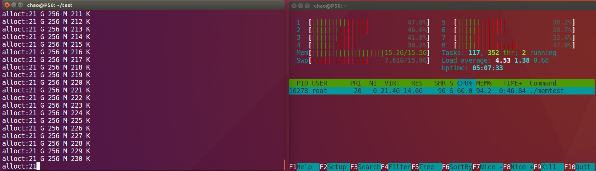
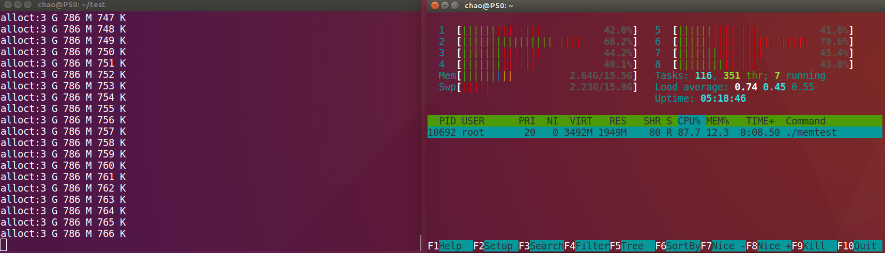

# Docker 容器 CPU、内存资源限制实验

## 概述

Docker 利用 Linux Cgroups 来实现容器资源的限制与隔离，比如限制容器所使用的内存大小、CPU 核、磁盘大小等。看 Docker 命令行工具的帮助文档感觉还是不熟悉。所以想自己动手做下实验，看看 Docker 的资源限制和隔离提供了哪些功能，支持到了什么地步。本次实验只尝试了限制 CPU 和 内存的使用，关于网络和磁盘资源的限制以后再说。

## 背景知识介绍

### cgroups

cgroups（control groups 的缩写）是 Linux 内核提供的功能，用来限制、记录、隔离进程组（process groups）所使用的系统资源（CPU、内存、磁盘 I/O、网络，等）。这个项目最早由 Google 的工程师发起，后来被合并到 Linux 内核的 2.6.24 版本（2008 年发布）中。后来又加入了很多功能，比如对 kernfs、防火墙的支持。

### Docker 提供的资源限制参数

我的系统为 Ubuntu 16.04 x64，Docker 版本为 1.12.3。

通过`docker run --help`查看`docker run`命令的选项，其中和`cpu`资源相关的选项如下：

```shell
 --cpu-percent int             CPU percent (Windows only)
      --cpu-period int              Limit CPU CFS (Completely Fair Scheduler) period
      --cpu-quota int               Limit CPU CFS (Completely Fair Scheduler) quota
  -c, --cpu-shares int              CPU shares (relative weight)
      --cpuset-cpus string          CPUs in which to allow execution (0-3, 0,1)
      --cpuset-mems string          MEMs in which to allow execution (0-3, 0,1)
```

和内存相关的选项如下：

```shell
-m, --memory string               Memory limit
      --memory-reservation string   Memory soft limit
      --memory-swap string          Swap limit equal to memory plus swap: '-1' to enable unlimited swap
      --memory-swappiness int       Tune container memory swappiness (0 to 100) (default -1)
```

`-m,--memory`表示对容器内存大小的限制。

`--memory-swap`表示限制容器内存和 swap 分区的总大小。并且只能和`-m,--memory`一起使用。

`--memory-reservation`表示对内存的软性限制。

本次实验只测试`-m, --memory`、`--memory-swap`、`--memory-reservation`三个选项。`--memory-swappiness`暂不知道其用途，从测试结果中也没发现规律。

## Linux 性能监测工具

## 实验环境

我的宿主机是一台 ThinkPad P50，CPU 是 8 核的 I7-6700HQ，内存 15.5 G。系统设置的 swap 大小15.9 G

docker 的版本信息如下：

```shell
$ docker version
Client:
Version:      1.12.3
API version:  1.24
Go version:   go1.6.3
Git commit:   6b644ec
Built:        Wed Oct 26 22:01:48 2016
OS/Arch:      linux/amd64

Server:
Version:      1.12.3
API version:  1.24
Go version:   go1.6.3
Git commit:   6b644ec
Built:        Wed Oct 26 22:01:48 2016
OS/Arch:      linux/amd64
```


## CPU 限制实验

todo

## 内存限制实验

根据文档，`docker run`命令的`-m`选项表示容器可用内存大小，`--memory-swap`选项表示容器能用的内存和 swap 分区大小总和。`--memory-swap`设置为 -1 时表示不限制容器能用的 swap 分区的大小。

>   你可能在进行下面的实验时发现`docker run`命令报错：WARNING: Your kernel does not support swap limit capabilities, memory limited without swap.
>
>   这是因为宿主机内核的相关功能没有打开。按照下面的设置就行。
>
>   step 1：编辑`/etc/default/grub`文件，将`GRUB_CMDLINE_LINUX`一行改为`GRUB_CMDLINE_LINUX="cgroup_enable=memory swapaccount=1"`
>
>   step 2：更新 GRUB，即执行`$ sudo update-grub`
>
>   step 3: 重新系统。

### 准备测试程序

我们用 C  语言写一个不停申请内存的程序。看看能否耗尽系统内存。代码如下：

```c
#include <stdio.h>
#include <stdlib.h>
#include <string.h>
#include <unistd.h>

int main()
{
    void *p;
    int k = 0;
    while(1)
    {
        p = malloc(1024);
        k += 1;
        int kbs = k % 1024;
        int mbs = k / 1024 % 1024;
        int gbs = k / 1024 /1024;

        printf("alloct:");
        if(gbs > 0 )
        {
          printf("%d G ", gbs);
        }
        if (mbs > 0)
        {
          printf("%d M ", mbs);
        }
        printf("%d K\n", kbs);

        memset(p, 0, 1024);
    }
}
```

程序在申请内存之前会 sleep 20s，是为了留出时间，查询出测试容器的 PID，方便用`htop`观察测试容器进程。程序没申请一次内存都会输出当前已经申请到的总内存。

### 测试 1：不加任何限制

我们先不加任何限制来执行测试容器，看看容器是否会用完系统的所有内存。

打开左右两个终端，左边终端用于执行测试容器，右边终端用于观察内存情况。

在左边终端中输入：

```shell
$ docker run --rm -it cgroup:memtest-ubuntu-16.04
```

此时程序正在 sleep，我们赶紧在右边终端中查询容器进程的 PID。

```shell
$ ps -aux | grep memtest

```

可以看到容器进程的 PID 为 10278，根据该 PID 观察内存的使用情况。在右边终端中执行：

```shell
$ htop -p 10278
```

就可以看到系统和该进程的内存使用情况了。

过了一会左边窗口的输出信息开始刷屏。`top`命令窗口显示系统被占用的内存越来越多。

可以看到截图的时候，系统内存 15.5 G 已被用 15.2 G，而且已经开始使用 swap 分区。PID 为1630 的进程占用了系统 94.2% 的内存。我截图的时候，明显感觉到系统越来越卡。再过了一会，swap 分区也被用完了。程序就被杀死，htop窗口也显示系统内存恢复正常。左边终端窗口的输出表示最后总共申请到了 29G 355 M 652 K 内存。差不多是物理内存 + swap 分区的总大小。

说明不加限制的时候，容器和普通进程一样，耗尽系统内存后就会被杀死。

### 测试 2：使用`-m` 选项

同样，在左边窗口输入：

```shell
$ docker run --rm -it -m 2G cgroup:memtest-ubuntu-16.04
```

即限制容器只可以使用 2G 内存。同样在右边终端中查询 PID，并用`htop`观察，不再赘述。

程序执行过程中的截图如下。



可以看到，虽然我们限制了程序的使用内存为 2G，但左边的输出表示程序已经申请到了超过 3G 的内存。我观察右边窗口时，发现物理内存(Mem)慢增加到 2.64G 后就不再增加了，而 Swap 开始慢慢增大。memtest 进程占用的内存也慢慢变大。说明系统给测试容器分配完 2G 内存后，接下来容器申请的内存都是在 swap 分区中。

最后程序在申请到接近 4G 内存的时候被自动杀死。

后面我把`-m`的参数改为其他数值，过程也类似。都是在申请完指定的内存后，开始使用 swap 分区。进程在申请到`-m`参数指定的 2倍内存后被杀死。

该次实验说明，仅使用`-m`参数时，容器能使用的内存大小为`-m`参数所设置数值的两倍。其中一半为物理内存，一半为 swap 分区，物理内存用完后才使用 swap 分区。

### 测试 3：使用 `-m`选项和`--memory-swap`选项

通过测试 2 发现，容器的 swap 默认大小为`-m`的大小。我们将 swap 设置为不同大小试试。

>   我在实验中发现，`--memory-swap`选项 只能和`-m`选项一起使用，不能单独设置。否则 docker 会报错。

#### 测试 3.1：swap 设置为 0

在左边终端执行：

```shell
$ docker run --rm -it -m 2G --memory-swap 0 cgroup:memtest-ubuntu-16.04
```

出乎意料的是：这次的观察结果和测试 2 一样。好像`--memory-swap 0`没起任何作用。

#### 测试 3.2: 将 swap 设置的比`-m`参数小

```shell
$ docker run --rm -it -m 1G --memory-swap 1280M cgroup:memtest-ubuntu-16.04
```

由于`--memory-swap`是`-m`参数和 swap 大小的总和，所以我将`-m`设置为 1G，`--memory-swap`设置为1280M，即把 swap 的大小设置为 256M。

观察过程和前面类似，不再赘述。最终观察到的结果是：测试容器最终申请到的内存大小是 1G+234M+574K，大致符合`--mempry-swap`参数的大小。系统内存和 swap 分区的占用也大致符合`-m`和`--memory-swap`的设置。

#### 测试 3.3: 将 swap 设置的比`-m`参数大

```shell
$ docker run --rm -it -m 1G --memory-swap 3G cgroup:memtest-ubuntu-16.04
```

实验结果和`-m`和`--memory-swap`的数值大致符合。容器用了 1G 物理内存，2G swap 分区，程序一共申请到了 3G 内存。

### 测试 4: 使用`--memory-reservation`选项

`--memory-reservation`直译是内存的软性设置。难道这种限制更灵活一点吗？

```shell
$ docker run --rm -it --memory-reservation 4G cgroup:memtest-ubuntu-16.04
```

我原以为这种软性设置会然容器申请到比 4G 多一点的内存。实验结果类似测试 1：进程一直不停的申请内存，物理内存用的差不多了，开始使用 swap 分区。直到接近系统内存的底线。与测试 1 不同的是：容器申请的内存在接近宿主机系统底线后开始放缓，申请内存的速度变慢，好一会才被杀死。进程被杀死时申请到的总内存比测试 1 的略小。但是在接近系统底线时，系统变得好卡，我想手动杀死该容器都没办法操作。

虽然官方的说法是，该设置可以保证容器不会长时间占用系统的大量内存，但是我觉得还是和容器内的进程行为相关。比如本次测试用的程序就会让系统变卡，最终导致容器被杀死。