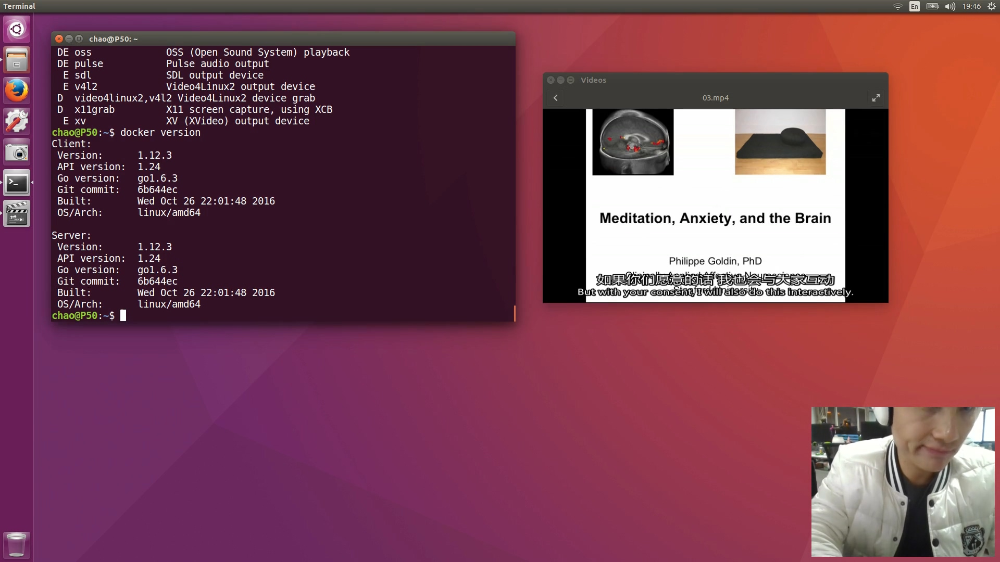
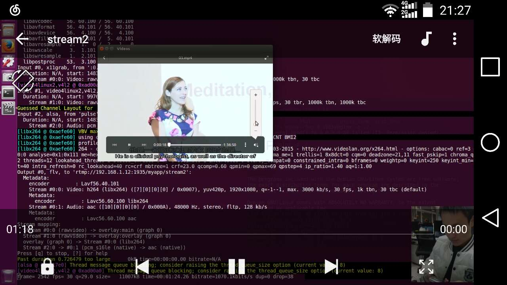

# FFmpeg 录制桌面、麦克风、摄像头

## 前言

老师要我们试试能不能用手机拍摄视频然后发送到树莓派上。可能以后要然树莓派处理视频之类。老师描述的场景好像实时的。虽然需求不明确，我们就先试试吧。我的计划是在树莓派上搭建好流媒体服务器，然后手机拍摄视频并推送到服务器。但是找了好久也找不到靠谱的可以实时拍摄视频并推送到服务器的 Android 应用。我们也不会 Android 开发。好不容器把树莓派上的 `rtmp` 服务搭建好，不想在 Android 开发浪费时间了。直接在笔记本用 `FFmpeg` 推流吧，只要能证明树莓派可以接收视频就可以了。

虽然之前用过 `FFmppeg` 的转码服务，但是采集视频和录音还真没干过。折腾了一天，终于知道了一些套路。先记录下来。下一步试试实时推送到树莓派上的 rtmp 服务上。

我的系统为`Ubuntu 16.04 Desktop x64`

## 录制麦克风

### 双声道，MP3 编码，MP3 文件格式

```shell
$ ffmpeg -f alsa -ac 2 -i hw:0,0 -acodec libmp3lame -f mp3 test1.mp3
```

### AC3 编码，ACC 文件格式

```shell
$ ffmpeg -f alsa -ac 2 -i hw:0,0 -acodec ac3 -f ac3 test1.aac
```

>   选择音频采集设备时可以用 `-i hw:0,0` 也可以用 `-i plus` 。官网给出的示例用的是 `-i /dev/dsp` 但在我的系统上提示没有这个文件或目录。

## 录制桌面

```shell
$ ffmpeg -f x11grab -s 1920x1080 -i :0.0 -vcodec libx264 -f mp4 test1.mp4
```

分辨率设为 1080P，并采用 H.264 编码，最后保存为 MP4 格式。

## 录制摄像头

```shell
$ ffmpeg -f video4linux2 -s 1920x1080 -t 30 -i /dev/video0 -vcodec libx264 -f mp4 test2.mp4
```

`-t 30` 表示录制 30 秒视频。

## 录制桌面+麦克风

```shell
$ ffmpeg -f alsa -ac 2 -i pulse -f x11grab -video_size 1920x1080 -i :0.0 -vcodec libx264 -acodec ac3 test3.mp4
```

## 录制摄像头+麦克风

```shell
$ ffmpeg -f alsa -ac 2 -ar 44100 -i pulse  -f video4linux2 -framerate 30 -i /dev/video0 -framerate 30 -vcodec libx264 -acodec ac3 test4.mp4
```

女主播就是这么干的。

## 录制桌面+摄像头

将摄像头拍摄到的画面叠加在录制到的桌面画面的右下角

```shell
$ ffmpeg -thread_queue_size 96 -f x11grab -video_size 1920x1080 -i :0.0 -f video4linux2 -video_size 400x300  -i /dev/video0  -filter_complex '[0:v][1:v]overlay=x=main_w-overlay_w-10:y=main_h-overlay_h-10[out]' -map '[out]'  test5.mp4
```

这个任务消耗有点大，`-thread_queue_size` 必须设置一个比较大的值，要不然会看到 `FFmpeg`输出的日志信息中不停的提醒：`[video4linux2,v4l2 @ 0x25fbc40] Thread message queue blocking; consider raising the thread_queue_size option (current value: 8)`，拍摄到的视频也会出现莫名其妙的错误，比如帧率很高，无法正常播放，视频不流畅等等。把 `-thread_queue_size` 设置为一个比较大的值，直到看不到该提示即可。

## 录制桌面+摄像头+麦克风

```shell
$ ffmpeg -thread_queue_size 128 -f x11grab -video_size 1920x1080 -framerate 30 -i :0.0 -f video4linux2 -video_size 400x300 -framerate 30 -i /dev/video0 -f alsa -ac 2  -i pulse -filter_complex '[0:v][1:v]overlay=x=main_w-overlay_w-10:y=main_h-overlay_h-10[out]' -map '[out]' -map 2:a  -vcodec libx264 -acodec ac3 test6.mp4
```

和上面一样，注意给 `-thread_queue_size` 设置一个足够大的值。

补一个录制到的视频截图：

估计很多教程视频都是这么录制的。把录制的视频推一下流，就能直播写代码，直播玩游戏了。


再补一个成功推流后在手机上观看的截图：



推流命令：

```shell
$ ffmpeg -thread_queue_size 128 -f x11grab -video_size 1920x1080 -framerate 30 -i :0.0 -f video4linux2 -video_size 400x300 -framerate 30 -i /dev/video0 -f alsa -ac 2  -i pulse -filter_complex '[0:v][1:v]overlay=x=main_w-overlay_w-10:y=main_h-overlay_h-10[out]' -map '[out]' -map 2:a  -vcodec libx264 -vprofile baseline -acodec aac -strict -2 -maxrate 3000k -b:a 128k -f flv rtmp://192.168.1.12:1935/myapp/stream2
```

