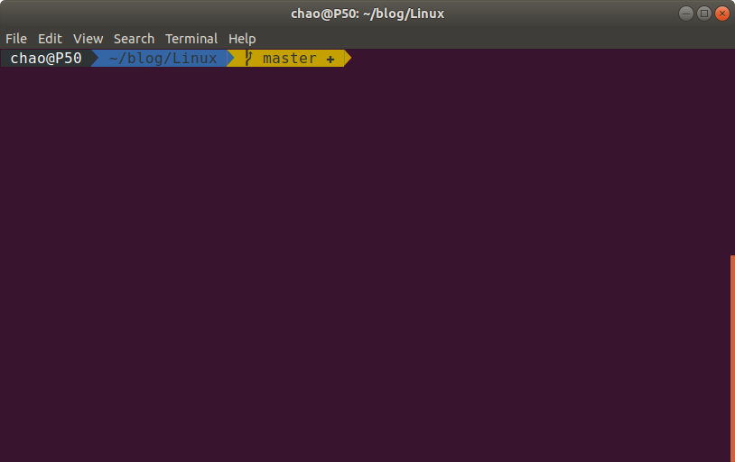

# oh my zsh 的安装和配置

每次换环境都要配置一遍 oh my zsh，每次都需要上网搜索多个页面，这里记录一下，加快下次安装和配置的速度。

## 先安装 zsh

oh my zsh 是 zsh 的包装和美化，所以要先安装 zsh。

```shell
$ sudo apt insatll zsh
```

## 将 zsh 设置为默认 shell

```shell
$ chsh -s /bin/zsh
```

需要在注销后才生效。如果你没做这一步，那以后新开一个终端还是会进入默认的 bash，而不是 zsh，你需要运行 `zsh` 命令后才会 zsh，这样会比较麻烦。

## 安装 oh my zsh

通过 curl 安装

```shell
$ sh -c "$(curl -fsSL https://raw.github.com/robbyrussell/oh-my-zsh/master/tools/install.sh)"
```

或者通过 wget 安装

```shell
$ sh -c "$(wget https://raw.github.com/robbyrussell/oh-my-zsh/master/tools/install.sh -O -)"
```

到这一步就能看到终端里面命令提示符变了。

## 配置主题

oh my zsh 有多款主题，[详见这里]( https://github.com/robbyrussell/oh-my-zsh/wiki/Themes)。我最喜欢的还是 agnoster。编辑 ~/.zshrc。找到 ZSH_THEME，将其改为

```shell
ZSH_THEME="agnoster"
```

编辑完成后，运行下面命令使其生效

```shell
$ source .zshrc
```

## 安装字体支持

 前面配置主题后，你可能会看到命令提示符显示乱码，这是字体的原因，安装 powerline 就行。

```shell
sudo apt-get install fonts-powerline
```

如果还显示乱码，则需要设置终端的字体为名字中带 powerline 的。

## 效果截图

最后配置好的效果如下图。



## 其他命令

修改当前用户的默认 shell

```shell
$ chsh -s /bin/zsh
```

改为 bash，则是

```shell
$ chsh -s /bin/bash
```

查看系统中安装的所有 shell：

```shell
$ cat /etc/shells 
# /etc/shells: valid login shells
/bin/sh
/bin/bash
/bin/rbash
/bin/dash
/bin/zsh
/usr/bin/zsh
```

查看当前 shell：

```shell
$ echo $SHELL
/bin/zsh
```

