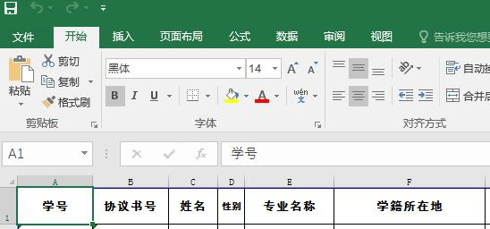

# Excel处理库xlwings笔记

最近需要从一个 Excel 文件中读取大量数据。在网上搜了一下，都说 xlwings 库是最好用的。大概是我对 Excel 不熟悉，感觉 xlwings 也不怎么好理解。这里记录一下其基本的使用方式。如果以后还要用，就仔细看一下其官方文档，好好学习一下。

## 连接到一个已存在的Excel文件

```python
import xlwings as xw
wb = xw.Book(r'C:\Users\Administrator\Documents\Tencent Files\531236305\FileRecv\15届计算机学院.xlsx')
```

xw.Book的第一个参数为要打开的 Excel 文件的路径。Book 为工作簿对象。我在 Windows 终端下面用 Python 解释器命令运行上述程序，会发现该代码会弹出一个 Excel 窗口。大概是 xlwings 库是通过微软的 Excel 程序来操作对应的 Excel 文件的，而不是自己去解析。但是在交互式环境中运行上面的代码则不会弹出 Excel 窗口。

## 静默连接

如果不想在程序运行时弹出 Excel 窗口，则需要改变打开文件是的默认设置，如下所示。

```python
import xlwings as xw
app = xw.App(visible=False, add_book=False)
app.display_alerts=False
app.screen_updating= False
wb = app.books.open(r'C:\Users\Administrator\Documents\Tencent Files\531236305\FileRecv\15届计算机学院.xlsx')
```

## 退出操作

```python
wb.save() # 修改过文件则需要保存
wb.close() # 关闭文件
app.quit() # 关闭 Excel 程序
```

## 访问工作表

一般一个 Excel 文件中可能会有多张表，就是我们平常看到的 Sheet1、Sheet2...。工作簿 wb 对象的 sheets 属性保存了对应 Excel 文件中的所有工作表，可以通过下标或者表名来访问指定的工作表。

```]python
wb.sheets[0] # 通过下标访问第一张表
wb.sheets['Sheet1'] # 通过表名访问
```

##访问单元格

Excel 表中的表按字母标号，行用数字编号。比如第一列第一行的单元格编号为A1，第二列第三行的单元格编号为B3。在访问到工作表后，就可以通过编号来访问单元格。也可以通过二维数组下标访问单元格。



###读取单元格的内容

```shell
>>> sht = wb.sheets[0]
>>> sht.range('A1').value # 通过编号
'学号'
>>> sht[0,0].value # 通过二维数组下标
'学号'
```

###修改单元格的内容

```shell
>>> sht.range('A1').value='number'
>>> sht.range('A1').value
'number'
```

### 一次引用多个单元格

```python
mg = sht['A1:B5'] # 这会将AB两列第1行~5行所有的单元格以一维数组的形式返回，保存到数组中的顺序为从左至右，从上至下
```

```shell
mg = sht.range((1,1),(3,3)) # 当单元格中的第一行第一列到第三行第三列中的内容以二维数组的形式返回
```

注意：工作表中的单元格的行列下标从1开始。

```python
sht.range('A1').value=[1,2,3] # 将列表[1,2,3]储存在A1：C1中
sht.range('A1').options(transpose=True).value=[1,2,3] # 将列表[1,2,3]储存在A1:A3中
sht.range('A1').options(expand='table')=[[1,2],[3,4]] # 将2x2表格，即二维数组，储存在A1:B2中，如第一行1，2，第二行3，4
```

