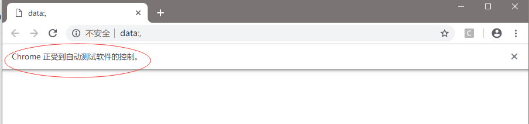

# Selenium 使用笔记

## 安装

PIP 安装 Selenium

```shell
pip install selenium
```

[Selenium 主页](https://www.seleniumhq.org/)

Selenium 通过 web driver 操作浏览器，不同的浏览器需要不同的 web driver。

安装 ChromeDriver

[ChromeDriver 下载地址]( http://chromedriver.storage.googleapis.com/index.html )

[FirefoxDriver 下载地址](https://github.com/mozilla/geckodriver/releases/)

## 用代码控制浏览器（以 Chrome 为例）

前提是先安装 Chrome 浏览器，下载好 chromedriver。

### 打开一个浏览器窗口

```python
from selenium import webdriver

driver = webdriver.Chrome(executable_path="D:\Documents\Downloads\chromedriver.exe")
```

执行 `webdriver.Chrome` 方法后，selenium 会通过 webdriver 打开一个Chrome 浏览器窗口。后面就可以控制浏览器模仿用户的操作了。



Chrome 窗口上的提示：“Chrome 正受到自动测试软件的控制” 表示我们已经连上浏览器了。

### 访问网页

```python
# 接上
driver.get('http://www.baidu.com')
```

你会看到刚打开的 Chrome 窗口正在访问百度页面。

### 找到网页 DOM 中的某个元素

Selenium 使用 XPath 语法来访问网页 DOM 中的节点。比如要找到页面上一个 id 为 code-button 的按钮元素：

```python
button = driver.find_element_by_xpath('//button[@id="code-button"]')
```

### 设置找到一个元素的超时时间

`driver.find_element_by_xpath` 查找一个元素可能会花一些时间，可以执行操作前用 `driver.`implicitly_wait 设置 selenium 查找一个元素或完成一个命令的超时时间。

```python
driver.implicitly_wait(10)  # 超时时间 10s
```

该方法每个会话只需要调用一次即可。

### 点击按钮

```python
# 接上
button.click()
```

元素的 `click()` 方法可以模仿鼠标的点击操作。

### 移动鼠标

有的 web 页面会在执行元素的 `click()` 时检测用户的鼠标轨迹，根据轨迹来判断是真人还是爬虫程序在控制浏览器。最简单的检测就是检测用户的鼠标是否移动过。如果没移动过，及时元素的 `click()` 被执行也不会触发真正的请求。幸好 selenium 可以操作鼠标坐标，让我们逃过检测。

```python
ActionChains(driver).move_by_offset(0,0).perform()
time.sleep(0.5)
ActionChains(driver).move_by_offset(100,103).perform()
button.click()
```

`ActionChains(driver).move_by_offset(0,0).perform()` 可以在鼠标移动到指定的坐标。中间调用 `time.sleep(0.5)` 停顿 0.5s 是为了模仿用户拖动鼠标的时间。

如果 web 页面对鼠标轨迹进行了更复杂的判断，则我们移动鼠标的轨迹更细致才能绕过检测。

## 通过 remote-debugging 控制浏览器

通过前面的方式直接用 selenium 驱动 webdriver 启动浏览器，会被浏览器感知到。如下图所示：


这种情况下浏览器会有一些特殊环境变量值，有些网站正式通过前端页面的 js 脚本收集这些变量值来防爬。但是先用 `remote-debug` 的方式启动 chrome 浏览器，监听一个端口，然后再启动脚本连接到该端口就不会被感知到，也无法收集那些特殊的变量值。

先启动 chome

```shell
chrome.exe --remote-debugging-port=9222 --user-data-dir="D:\Documents\python_code\web_driver_test"
```

再启动脚本，不过脚本要做如下修改。

```python
chrome_options = Options()
chrome_options.add_experimental_option("debuggerAddress", "127.0.0.1:9222")

driver = webdriver.Chrome(chrome_options=chrome_options, executable_path="D:\Documents\Downloads\chromedriver.exe")

```

