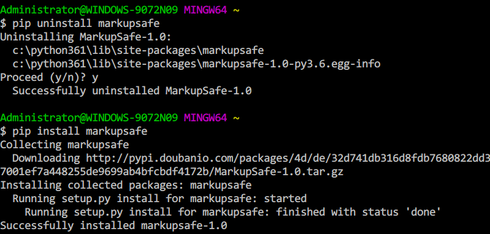

前几天写 Python 爬虫，在 Windows 7 上用 pip 安装了很多Python 库。但是安装 jinja2 时遇到了问题。第一次安装 jinja2 失败，第二次显示成功。但是我到Python IDLE 里 import jinja2 时却出现下面的错误：

```shell
>>> import jinja2
Traceback (most recent call last):
  File "<pyshell#1>", line 1, in <module>
    import jinja2
  File "C:\Python361\lib\site-packages\jinja2\__init__.py", line 33, in <module>
    from jinja2.environment import Environment, Template
  File "C:\Python361\lib\site-packages\jinja2\environment.py", line 15, in <module>
    from jinja2 import nodes
  File "C:\Python361\lib\site-packages\jinja2\nodes.py", line 19, in <module>
    from jinja2.utils import Markup
  File "C:\Python361\lib\site-packages\jinja2\utils.py", line 624, in <module>
    from markupsafe import Markup, escape, soft_unicode
  File "C:\Python361\lib\site-packages\markupsafe\__init__.py", line 14, in <module>
    from markupsafe._compat import text_type, string_types, int_types, \
ModuleNotFoundError: No module named 'markupsafe._compat'
```

看起来是 jinja2 依赖的库 markupsafe 没安装成功。我又反复卸载重装了 markupsafe，都是第一次安装错误，第二次安装假成功，实际上都没安装好。没安装失败的报错如下：

```shell
C:\Windows\System32>pip install markupsafe
Collecting markupsafe
  Downloading http://pypi.doubanio.com/packages/4d/de/32d741db316d8fdb7680822dd3
7001ef7a448255de9699ab4bfcbdf4172b/MarkupSafe-1.0.tar.gz
Installing collected packages: markupsafe
  Running setup.py install for markupsafe ... error
Exception:
Traceback (most recent call last):
  File "c:\python361\lib\site-packages\pip\compat\__init__.py", line 73, in cons
ole_to_str
    return s.decode(sys.__stdout__.encoding)
UnicodeDecodeError: 'utf-8' codec can't decode byte 0xb6 in position 33: invalid
 start byte

During handling of the above exception, another exception occurred:

Traceback (most recent call last):
  File "c:\python361\lib\site-packages\pip\basecommand.py", line 215, in main
    status = self.run(options, args)
  File "c:\python361\lib\site-packages\pip\commands\install.py", line 342, in ru
n
    prefix=options.prefix_path,
  File "c:\python361\lib\site-packages\pip\req\req_set.py", line 784, in install

    **kwargs
  File "c:\python361\lib\site-packages\pip\req\req_install.py", line 878, in ins
tall
    spinner=spinner,
  File "c:\python361\lib\site-packages\pip\utils\__init__.py", line 676, in call
_subprocess
    line = console_to_str(proc.stdout.readline())
  File "c:\python361\lib\site-packages\pip\compat\__init__.py", line 75, in cons
ole_to_str
    return s.decode('utf_8')
UnicodeDecodeError: 'utf-8' codec can't decode byte 0xb6 in position 33: invalid
 start byte
```

网上搜索了一下很多没成功。但问题确定在 markupsafe 身上。将 markupsafe 的 whl 文件下载到本地直接安装也不行。后来我只能放弃使用 jinja2，转而使用 Mako。

今天我重新卸载、安装 markupsafe，还是老问题。再次搜索了一下，发现[这里](https://segmentfault.com/q/1010000008071661)有人说是编码的问题。

>   打开`c:\program files\python36\lib\site-packages\pip\compat\__init__.py`约75行
>   `return s.decode('utf_8')` 改为`return s.decode('cp936')`

>   编码问题，虽然py3统一用utf-8了。但win下的终端显示用的还是gbk编码

可我不想修改 pip 的安装脚本，感觉太危险。既然是 Windows cmd 的编码问题，那我换个终端试试。于是用 Git Bash 终端重新安装 markupsafe，一次就成功了。



在 IDLE 里也能成功导入 jinja2 了。

```shell
Python 3.6.1 (v3.6.1:69c0db5, Mar 21 2017, 18:41:36) [MSC v.1900 64 bit (AMD64)] on win32
Type "copyright", "credits" or "license()" for more information.
>>> import jinja2
>>> 
```

## 解决方法

用 Git Base 运行 pip 安装 markupsafe。

## 未决的疑问

为什么终端的字符编码会影响 pip 安装 Python 库呢？