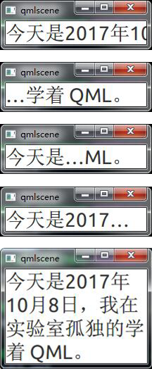
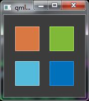
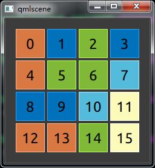

# QML 初步

QML 是 Qt 5 中用于描述 UI 的声明式语言，本章我们就对它做一个初步了解。我们会先看一下 QML 由元素组成的树形结构。再遍历一下几个最重要的基本元素。然后简要了解一下自定义元素（也就是组件），以及使用属性对元素进行变换操作。最后，我们探讨一下怎么在一个布局中安排元素。最后的最后，我们看一下可以接受用户输入的元素。

## QML 语法

QML 将 UI 分解成很小的元素，这些元素又可以组合成组件。QML 描述了这些 UI 元素的外观和行为。QML 还支持使用 JavaScript 代码来添加简单或复杂的逻辑，以此增强描述。QML 有点类似于网页开发中的 HTML-JavaScript 模式。不同地是，QML 是重新从底层设计、用于描述用户界面，而后者是用于描述文本文档。

简单来说，QML 是元素组成的层次结构。子元素继承了父元素坐标系统。元素的 `x,y` 坐标总是相对于父元素而言的。

假如我们要创建一个简单的界面：显示一张图片，图片下面有一段文字描述。这种界面在 QML 中的结构如下图所示：


可以看出这种层次结构就是树形结构。

我们来实现以下，具体代码如下：

```xml
// RectangleExample.qml
import QtQuick 2.6

Rectangle {
    width: 320; height: 330
    
    color:"#4A4A4A"

    Image {
        id:single_dog  // 为该 Image 元素指定一个 id
        x:(parent.width - width)/2
        y:0
        source:'./images/dog.jpg'
    }

    Text {
        y:single_dog.y+single_dog.height+20 // 通过 id 访问某个元素
        width: parent.width // 通过 parent 访问父元素
        color:'white'
        horizontalAlignment: Text.AlignHCenter
        text:'来自单身狗的凝视'
    }
}
```

-   `import`  语句用于导入一个模块的特定版本。一般来说，我们总是导入 QtQuick 2.X 作为初始元素集。（你可以理解为 QtQuick 定义了很多基本元素，不同版本的 QtQuick 可能不一样）
-   单行注释在 `//` 之后，多行注释放在`/* */` 中。这个 C/C++ 和 JavaScript 中一样。
-   每个 QML 文档都必须有且仅有一个根元素，这里为 `Rectangle`。
-   元素的声明由类型名后跟 `{}` 指定。`{}` 里面是关于该元素的描述。
-   元素有很多属性，属性的声明格式为`name: value`。
-   任何元素都可通过其 `id` 访问到。（`id` 为没有双引号的唯一标识）
-   元素可以嵌套，父元素里面可以嵌套子元素。子元素可以通过 `parent` 关键字访问父元素。

>   Tip
>
>   一般我们将根元素的 id 设为 root，这样记起来来比较方便。

我们运行一下上面的代码，看一下结果：

`$ qmlscene RectangleExample.qml `


和 QmlBook 上不同的是，由于我们的 Qt 版本比较新，qmlscene 给我们的 UI 加上了一个窗口边框。

### 属性

虽然通过名称（类型名）可以声明一个元素，但更重要的是它的属性，或者自定义属性。一个属性就是一个键值对，例如：`width : 100`，`text: 'Greetings'`，'color : '#FF0000'。属性有类型，并可赋予初值。下面是一个文本元素的例子：

```xml
Text {
        id: thisLabel // 标识

        x: 24; y: 16 // x,y 坐标

        height: 2 * width // 高度设为宽度的两倍

        property int times: 24 // 自定义属性

        property alias anotherTimes: thisLabel.times  // 属性别名

        text: "Greetings " + times // 字符串+整数值 合成新的字符串值
		
		// 字体属于分组属性
        font.family: "Ubuntu"
        font.pixelSize: 24

        KeyNavigation.tab: otherLabel // KeyNavigation 是关联属性

        onHeightChanged: console.log('height:', height) // 属性变化的信号处理器

        focus: true // 可以获得焦点(focus)才能接收按键事件(key event)

        color: focus?"red":"black" // 根据 focus 值改变颜色
    }
```

结合这个例子，我们来看一下属性的几个特性：

-   `id` 是一个非常像属性的值（意思是 id 不是属性），用于在一个 QML 文档中引用各种元素。`id` 不是字符串类型，而是一个标识符，是 QML 语法的一部分。`id` 在一个文档中必须是唯一的，而且不能重新设置为其他值，也不能被查询。（有点类型 C++ 中的指针）
-   可以根据属性的类型给属性设置一个值。如果没有给数组指定一个值，该属性将使用默认初始值。对于特定元素，你可以查看相关文档查询它的默认初始值。
-   一个属性可以依赖另外一个或多个属性。这种行为叫_绑定_。绑定属性会随着它所依赖的属性值的改变而更新。比如上面例子中 `height` 属性依赖于 `width` 属性，`text` 属性依赖于 `times` 属性。
-   给元素添加一个自定义属性（也就是元素原来没有的，我们自己添加的）可以通过修饰发 `property` 修饰符，后跟类型、名称和可选的初始值（格式为：`property <type> <name> : <value>`）来指定。如果没有给定值，将使用一个系统初始值。
-   另一种声明属性的重要方式是通过 `alias` 关键字（属性别名）（`property alias <name> : <reference>`）。`alias` 可以让我们将一个对象的属性或对象本身的可见性提升到外层作用域。后面我们封装组件时将使用这个技术将内嵌元素的属性或 id 导出到根级别。属性别名不需要类型，它将使用所引用属性或对象的类型。
-   有些属性属于分组属性。该特性表示属性是有多个需要设置的值的或者一些相关属性需要被组合到一起。比如上面示例代码中的字体，字体一般有字体族，字体大小等。另一种声明分组属性的格式是 `font {family: "Ubuntu"; pixelSize : 24}`。
-   有些属性与元素本身相关联，不需要通过 id 而是通过元素名引用。这主要针对全局相关元素，它们在整个应用中只有一个实例（比如键盘输入）。格式为 ``<Element>.<property>: <value>`。 
-   对每一个属性，你都可以提供一个信号处理器。该信号处理器将在属性发生更改后被调用。比如上面的代码示例中，我们想在每次 `Height` 属性发生变化时通过内置的控制台打印一次消息，于是给 `onHeightChanged`添 信号停机了一个处理器。也就是 `onHeightChanged: console.log('height:', height)`。

### 脚本

QML 和 JavaScript 是最好的搭档。在 _JavaScript_ 章节，我们将详细的讨论它们之间的关系。目前我们仅需要意识到这种关系即可。下面的例子中，我们统计用户按下空格键的次数并在文本元素中输出。

```xml
// scripting.qml
import QtQuick 2.6

Text {
        id: label
        width: 180; height: 60
        x: 24; y: 24

        // 自定义属性用于统计用户安装空格键的次数
        property int spacePresses: 0

        text: "Space pressed: " + spacePresses + " times"

        // 文本改变信号的处理器
        onTextChanged: console.log("text changed to:", text)

        // 能获取焦点才能收到按键事件
        focus: true

        // 用js代码想要空格键被按下的事件
        Keys.onSpacePressed: {
            increment()
        }

        // 情空文本
        Keys.onEscapePressed: {
            label.text = ''
        }

        // 一个 js 函数
        function increment() {
            spacePresses = spacePresses + 1
        }
    }
```

-   text 改变的信号处理器 `onTextChanged` 在每次 text 发送改变时打印一次 text。
-   当 text 元素收到空格键按下事件时会调用一个 JavaScript 函数 `increment()`。
-   定义一个 JavaScript 函数的格式为 `function <name>(<parameters>) { ... }`，它会递增计数器 `spacePressed`。每当 `spacePressed` 递增，绑定属性 text 也会发送改变。

## 基本元素

元素可以分为可视元素和非可视元素。可视元素（比如 `Rectangle`）有一个几何图形并在屏幕上显示为一个区域。非可视元素（比如 `Timer`）提供某种功能，通常用于操作可视元素。

我们先重点关注几个基本的可视元素，比如：`Item`, `Rectangle`, `Text`, `Image` and `MouseArea`。

### Item

`Item` 是所有可视化元素的的基元素，也就是说所有的其他可视元素都继承自 `Item`。`Item` 不会绘制任何东西，只是定义了所有对其他可视元素通用的属性。

| 属性类别 | 属性                                       |
| ---- | ---------------------------------------- |
| 几何   | `x` 和 `y` 定义元素的左上角位置，`width` 和 `height` 定义了元素的展开大小，`z` 定义了元素的叠加顺序 |
| 布局处理 | `anchors(锚)` (left, right, top, bottom, vertical and horizontal center) 将元素相对于其他元素及其`margins` 进行定位。 |
| 按键处理 | 关联 `key` 和 `keyNavigation` 属性来处理按键，`focus` 属性控制是否可以对按键事件进行处理 |
| 变换   | `scale` 和 `rotate` 变换以及一般的 `transform` 属性列表，用于控制 x,y,z 变换以及它们的`transformOrigin` 点 |
| 可视化  | `opacity` 控制透明度，`visible` 显示/隐藏元素，`clip` 限制对元素的绘制操作的绘制边界，`smooth` 控制渲染质量 |
| 状态定义 | `states` 列表属性提供了元素支持的状态列表和当前 `state` 属性，`transitions` 列表属性定义状态转换动画 |

这些属性可用于每个可视元素，且在每个可视元素上的意义也一样。

>   注意：
>
>   `Item` 经常用作其他元素的容器，就像 HTML 中的 `div` 一样。

### Rectangle

`Rectangle` 对 `Item` 进行了扩展，添加了填充颜色（`color`）、边框（`border.color`，`border.width`）和圆角（`radius`）属性。

例子：

```qml
import QtQuick 2.6
Rectangle {
    width: 120; height: 240
    color: "#FF4444"
    radius:20
}
```

```qml
import QtQuick 2.6
Rectangle {
    width: 120; height: 240
    color: "#FF4444"
    border.color:"black"
    border.width:20
    radius:30
}
```

分别定义了两个 Rectangle，一个有边框，一个没边框。结果如下：


而且 Retangle 还支持渐变色（`gradient`）。例如：

```qml
import QtQuick 2.6
Rectangle {
    width: 120; height: 240
    gradient: Gradient {
            GradientStop { position: 0.0; color: "red" }
            GradientStop { position: 0.5; color: "white" }
            GradientStop { position: 1.0; color: "black" }
        }
}
```

的效果如下：


### Text

显示文字用 `Text` 元素，它最显要的属性当然是它 `string` 类型的 `text` 属性。`Text` 会根据所给文本以及字体计算出元素需要的初始高度和宽度。字体通过字体属性组设置（例如：`font.family`, `font.pixelSize`, ...），而字体的颜色通过 `color` 属性设置。

```qml
import QtQuick 2.6
Text {
    text: "too yong too sample"
    color: "#303030"
    font.family: "Ubuntu"
    font.pixelSize: 28
}
```


你还可以用`horizontalAlignment` 属性控制文字水平方向上的对齐方式，用 `verticalAlignment` 控制文字在垂直方向上的对齐方式。还可以用 `style` 和 `styleColor` 属性控制文字更多的渲染效果。比如将文字渲染为轮廓，凹凸模式。如果文字非常长，`Text` 默认用`...` 来中断文字的输出，你可以用 `elide` 设置中断在文字中出现的位置：前、中、后。如果你想长文字全部显示出来，用 `wrapMode` 属性将文字包起来（需要 width 被显示设置）。

```qml
import QtQuick 2.6
Text {
    width: 200
    text: "今天是2017年10月8日，我在实验室孤独的学着 QML。"
    //elide: Text.ElideRight
    color: "#303030"
    font.family: "Ubuntu"
    font.pixelSize: 28
    // wrapMode: Text.WordWrap
}
```

我们分别将 `elide` 和 `wrapMode` 都注释掉，将 `elide`设为 `Text.ElideLeft`、`Text.ElideMiddle`、`Text.ElideRight`，以及将`elide`注释掉并将`wrapMode`去掉注释，得到的效果分别如下：



`Text`只会显示给定的文字，它不会显示任何背景装饰，出了文字，它其他部分都是透明的。如果你想给`Text`元素添加背景或装饰，你可以另外设计（比如将一个`Rectangle`放在`Text`下面，设置`Rectangle`的各种属性）。

### Image

`Image`元素可以显示各种格式的图片（例如：PNG、JPG、GIF、BMP、WEBP）。完整的支持格式参加 Qt 文档。`Image`的`source`元素用于提供图片的 URL，URL 可以是本地路径，也可以是网址。`fillmode` 控制填充模式。

这个元素比较简单，看 Qt 官方文档很快就明白了。

### MouseArea

为了和元素进行交换，我们通常会使用 `MouseArea` 元素。它是一个矩形的不可见元素，但你可以在它的区域范围内可以捕获鼠标事件，我们就叫它鼠标区域吧。鼠标区域经常和其他可视元素搭配使用，当用户和可视部分交换时，鼠标区域就可以捕获事件来执行命令。

例如下面的例子，我们将一个 `MouseArea`和`Rectangle`搭配使用，根据用户的鼠标按键来控制第二个`Rectangle`元素的可见性。

```qml
import QtQuick 2.6
Item {
    width: 112 + 76 + 12
    height: 12*2 + 96
    Rectangle {
            id: rect1
            x: 12; y: 12
            width: 76; height: 96
            color: "lightsteelblue"
            MouseArea {
                id: area
                width: parent.width
                height: parent.height
                onClicked: rect2.visible = !rect2.visible
            }
        }

    Rectangle {
            id: rect2
            x: 112; y: 12
            width: 76; height: 96
            border.color: "lightsteelblue"
            border.width: 4
            radius: 8
        }
}
```

我们在`MouseArea`中捕获`onClicked`信号，并在其处理器中用 JavaScript 代码`rect2.visible = !rect2.visible`翻转`rect2`元素的可见性。每次用户在`rect1`上点击鼠标左键，`rect2`都会在可见和不可见之间切换。


>   注意：
>
>   `MouseArea`以及其他可视元素的这种设计，是 Qt Qucik 中一个重要的概念：输入处理和可视化展示分离。这样可以做到让可交互区域的范围不限于界面元素的呈现区域。

## 组件

组件是可重用的元素，一般由我们自己封装或者官方库提供。QML 提供了几种创建组件的方法，但我们目前只学习最简单的一种形式——基于文件的组件。基于文件的组件就是我们将要封装的内容放在一个文件中，并给文件一个元素名。这样这个文件就代表了我们封装得到的组件。你就可以像使用其他基本元素一样使用该组件了。例如下面我们用 `Rectangle`、`Text`、`MouseArea`这几个基本元素封装一个界面编程中常见的按钮组件 `MyButton`：

```qml
// MyButton.qml
import QtQuick 2.6

Rectangle {
    id: root
    property alias text: label.text // 将内嵌元素的属性提升到根作用域
    signal clicked // 定义一个信号

    width:116; height: 26
    color: "lightsteelblue"
    border.color: "slategrey"

    Text {
        id: label
        anchors.centerIn: parent
        text: "一个按钮"
    }

    MouseArea {
        anchors.fill: parent
        onClicked: {
            root.clicked() // 触发 root 的 clicked 信号，将捕捉到的信号传递给root元素
        }
    }
}
```

将上述代码保存为 MyButton.qml。然后在同一目录下创建下面测试代码：

```qml
// mybuttontext.qml
import QtQuick 2.6

Item {
    property int counter: 0
    MyButton {
        x:12; y:12
        text: "按钮一"
        onClicked: {
            counter++
            status.text = "按钮一被点击 " + counter + " 次"
        }
    }
    Text { 
        id: status
        x: 12; y: 76
        width: 116; height: 26
        text: "..."
        horizontalAlignment: Text.AlignHCenter
    }
}
```

我们在测试代码中直接像使用普通元素一样使用了我们刚才封装的`MyButton`组件。并在点击事件的处理中更改文本元素的文字内容。效果如下：


你还可以在封装时给`MyButton`提供更多装饰，比如不同状态提供不同的外观，让它看起来更像一个按钮。

现在你可以用这种技术制作自己的个性化控件了。

## 简单变换

变换操纵的是对象的几何形状。QML 元素一般可以移动、旋转和缩放。这些变换操作有简单的方式也有更高级的方式。

我们这里先了解简单的方式。高级的方式以后会说。

一个简单的变化就是改变`x,y`的位置。旋转就是使用`rotation`属性，该属性值的单位为度（0...360）。缩放使用`scale`属性，属性值`<1`表示元素被缩小，属性值`>1`表示元素被放大。旋转和缩放都不会改变元素的几何属性，它的`x,y`和`widht/height`都没变，只是绘制操作被改变。

为了在一个示例中展示这三种变化，我们先封装一个“可点击的图片”组件。

```qml
// ClickableImage.qml
import QtQuick 2.5

Image {
    id: root
    signal clicked

    MouseArea {
        anchors.fill: parent
        onClicked: root.clicked()
    }
}
```

然后我们在一个窗口中显示三张这种可点击的图片。给三张图片添加点击处理器：第一张进行位移变化、第二张进行旋转、第三张同时旋转和缩放。点击窗口背景让三张图片回归原位。

```qml
import QtQuick 2.6

Rectangle {
    width: 300; height: 160

    MouseArea {
        id: backgroundClicker
        anchors.fill: parent
        onClicked: {
            dog.x = 12
            qt.rotation = 0
            huaji.rotation = 0
            huaji.scale = 1.0
        }
    }

    ClickableImage {
        id: dog
        x: 12; y: 50
        width:60; height: 60
        source: "./images/dog.jpg"
        onClicked: {
            x += 20
        }
    }

    ClickableImage {
        id: qt
        x: 112; y: 50
        width:60; height: 60
        source: "./images/Qt.png"
        onClicked: {
            rotation += 15
        }
    }

    ClickableImage {
        id: huaji
        x: 212; y: 50
        width:60; height: 60
        source: "./images/滑稽.png"
        onClicked: {
            rotation += 15
            scale += 0.05
        }
    }
}
```

可以看出这种简单的变化只是在`onClicked`信号处理中改变了元素的相关属性。效果如下图：


左边为初始状态，右边为在三张图片上点击若干次后的状态。

## 定位器元素

在 QML 中有一些元素专门用于放置其他元素。它们被称为定位器，QtQuick 模块提供了`Row`, `Column`, `Grid` 和 `Flow`几种定位器。

在介绍这几个定位器之前我们先定义用作示例显示元素的“色块”：

```qml
// ColorSquare.qml
import QtQuick 2.6

Rectangle {
	width: 48
	height: 48
	border.color: Qt.lighter(color)
}
```

`Qt.lighter`会返回一个颜色的浅化色。

###Column

`Column`会将放入到其中的元素从上到下排成一列。`spacing`属性用于指明元素之间的间隔距离。

然后在一个`Column`中放置三个色块。

```qml
import QtQuick 2.6

ColorSquare {
    color:"#3C3C3C"
    width: 120
    height: 240

    Column {
        anchors.centerIn: parent
        spacing: 8  // 元素之间的间隔距离
        ColorSquare { color:"#DA7843" }
        ColorSquare { color:"#7FB937" ;width: 96}
        ColorSquare { color:"#55BBDD"}
    }
}
```

效果如下：


### Row

`Row`定位器会将放入到其中的元素从左到右，或从右到左排成一行。排列的方向由`layoutDirection`属性指明。

```qml
import QtQuick 2.6

ColorSquare {
    color:"#3C3C3C"
    width: 320
    height: 80

    Row {
        anchors.centerIn: parent
        spacing: 20
        ColorSquare { color:"#DA7843" }
        ColorSquare { color:"#7FB937" ;width: 96}
        ColorSquare { color:"#55BBDD"}
    }
}
```


### Grid

`Grid`会将放入到其中的元素放入到一个网格中，网格的格子数可以通过属性`rows`和`columns`设置。如果其中之一没有被设置，该属性值将通过其中一个被设置的属性值和放入其中元素的数量来计算。比如你设置列数为2，而放入了6个元素，那么计算出的行数为3。`flow`和`layoutDirection` 属性用于设置元素添加进网格时的摆放顺序。

```qml
import QtQuick 2.6

ColorSquare {
    color:"#3C3C3C"
    width: 160
    height: 160

    Grid {
        anchors.centerIn: parent
        rows:2; columns:2
        spacing: 20
        ColorSquare { color:"#DA7843" }
        ColorSquare { color:"#7FB937" }
        ColorSquare { color:"#55BBDD" }
        ColorSquare { color:"#0271BC" }
    }
}
```

效果如下：




### Repeater（不是定位器）

`Repeater`元素不属于定位器，但是经常和定位器元素一起使用。它能根据一定的模式批量生成元素。在讲解`Flow`定位器之前先讲这个`Repeater`是为了方便后面讲解`Flow`。看下面的代码示例就明白了。

```qml
import QtQuick 2.6

ColorSquare {
    id:root
    width: 240
    height: 240
    color: "#3C3C3C"
    property variant colorArray: ["#DA7843", "#7FB937", "#55BBDD", "#0271BC", "#FDFBB9"]

    Grid{
        anchors.centerIn: parent
        rows:4; columns:4
        spacing: 4
        Repeater {
            model: 16
            ColorSquare {
                property int colorIndex: Math.floor(Math.random()*5)
                color: root.colorArray[colorIndex]
                Text {
                    anchors.centerIn: parent
                    color: "black"
                    font.family: "Ubuntu"
                    font.pixelSize: 24
                    text: index
                }
            }
        }
    }
}
```

效果如下：



我们用`Repeater`按照固定的模式在`Grid`里面生成了 16 个色块。`Repeater`元素的`model`属性显然是用于设置生成的元素总数，`index`为生成当前元素时元素的序号。要生成的元素模式放在其中，只是某些属性值用变量表示。

### Flow

`Flow`定位器会将元素以流式的方式放置元素。添加到其中的元素会先放置到一行或一列，当放不下时就放到下一行或下一列。布局方向和元素的流动方向由属性`layoutDirection`和`flow`控制。多说无益，看下面的示例。

```qml
import QtQuick 2.6

ColorSquare {
    id:root
    width: 240
    height: 240
    color: "#3C3C3C"
    property variant colorArray: ["#DA7843", "#7FB937", "#55BBDD", "#0271BC", "#FDFBB9"]

    Flow {
        anchors.fill: parent
        anchors.margins: 8
        spacing: 4
        //flow: Grid.TopToBottom
        //layoutDirection:Qt.RightToLeft 
        Repeater {
            model: 16
            ColorSquare {
                property int colorIndex: Math.floor(Math.random()*5)
                color: root.colorArray[colorIndex]
                Text {
                    anchors.centerIn: parent
                    color: "black"
                    font.family: "Ubuntu"
                    font.pixelSize: 24
                    text: index
                }
            }
        }
    }
}
```

效果如下：


图中左边为初始状态，可以看到生成的16个元素按123...的顺序从左到右，从上到下摆放在窗口中。中间为拉大窗口高度后的状态，可以看到元素未动。右边为拉大窗口宽度后的状态，可以看到元素像右流动了。这就是`Flow`元素“流”的含义。

`Flow`的`layoutDirection`的默认值为`Qt.LeftToRight`，表示元素从上到下。从左到右的顺序添加。`flow`属性默认值为`Grid.LeftToRight`，意味从左向右流动。

如果我们将`layoutDirection`设为`Qt.RightToLeft`，让元素从上到下、从右到左的顺序添加。将`flow`设为`Grid.TopToBottom`，让元素从上到下流动。效果如下：


仔细观察初始状态元素的摆放顺序，已经拉大窗口后元素的流动方向。

## 元素的布局


