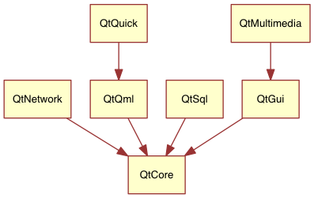

# 初见 Qt 5

“人生若只如初见，何事秋风悲画扇”。希望初见 Qt 5 是一段美好的回忆。

## 序章

**为什么需要 Qt 5 ？或者说为什么需要 Qt Qucik ？**

世界发生了变化。用户的设备和交互方式都变了。只有 Qt 5 才能用简单的方法做出更加现代的界面。

### Qt 5 的关注点

Qt 5 在 Qt 4 的基础上做了全面的更新。让 Qt 这套神奇的工具更加神奇。Qt 5 主要关注以下几点：

-   出色的图像绘制能力：Qt Quick 2 基于 OpenGL(ES) 使用场景图实现。更好的图形绘制效果、更简单的使用方法。
-   开发者的生产效率：QML 和 JavaScript 用于创建 UI，后端由 C++ 驱动。这种分离允许产品的快速迭代，前端开发者只需要关注如何做出漂亮的用户界面，后端开发者只需要关系稳定性、性能以及运行时扩展。
-   跨平台可移植性：核心模块、可选模块。
-   开发发展：Qt 现在是托管在 [qt.io](https://www.qt.io/) 的一个开源项目。由社区驱动。

## Qt 5 介绍

### Qt Quick

Qt Quick 是 Qt 5 中所有用户界面技术的涵盖。Qt Quick 包含以下几种技术：

-   QML - 用于用户界面的标记语言
-   JavaScript - 动态脚本语言
-   Qt C++ - 高度可移植的 C++ 库

QML 用于描述用户界面，并且用户界面可用 JavaScript 代码来增强。你还可以很轻松地用 Qt C++ 本地代码来扩展用户界面。简单来说，声明式的 UI 被称为前端，本地代码部分称为后端。这样可以将计算密集型任务、本地操作和用户界面分离。

在一个典型的 Qt Quick 项目中，前端由 QML/JavaScript 开发，后台复杂的任务由 Qt C++ 开发。这样很自然的分离了设计导向的开发者和功能导向的开发者。一般后台部分使用 Qt 自带的单元测试框架并导出给前端开发者使用。

## Qt 的组成模块

Qt 5 由许多模块组成。一个模块一般就是一个供用户使用的库。有些模块对于所有平台都是必须的，它们被称为“Qt 基础模块”。有些模块是可选的，组成了“Qt 附加模块”。附加模块是大多数开发者不需要使用的，但了解它们是有好处的，它们为一些常见的挑战提供了宝贵的解决方案。

### Qt 模块一览

**核心的基础模块**

QML 编程必须的 Qt 5 模块的最小子集。

| 模块                | 功能描述                                     |
| ----------------- | ---------------------------------------- |
| Qt Core           | 核心的非图形类，供其他模块使用                          |
| Qt GUI            | GUI 组件的基础类，包括 OpenGL                     |
| Qt Multimedia     | 声音、视频、广播和相机功能的基础类                        |
| Qt Network        | 使网络编程更加便捷的类                              |
| Qt QML            | 用于 QML 和 JavaScript 语言的类                 |
| Qt Quick          | 用于构建具有自定义用户界面的高度动态应用的声明式框架               |
| Qt SQL            | 集成了 SQL 功能的类                             |
| Qt Test           | 为 Qt 应用和库提供单元测试的相关类                      |
| Qt WebKit         | 基于 WebKit2 实现，并提供了新的 QML API。参加附加模块的 Qt WebKit Widgets |
| Qt Webkit Widgets | WebKit1 和 Qt 4 中的基于 QWidget 的类           |
| Qt Widgets        | 扩展 Qt GUI 的 C++ 部件类                      |

**Qt 附加模块**

暂时不关心。