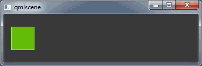
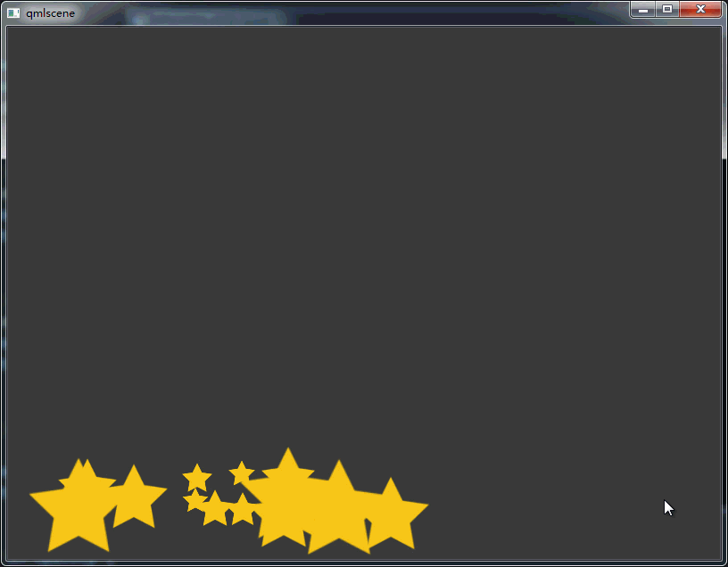

# 动态元素

在前面一章我们知道了可以通过改变元素的几何属性来对元素进行变换。但这种变化都是瞬时的，比如按下一个按键，色块瞬间移动8个像素。这种变化太生硬，不符合现代 UI 的审美。我们希望变化能平滑的发生。在这一章我们将学习如何让元素的属性变化过程在一段时间里平滑的发生，也就是实现动画效果。某些元素的属性的变化更适合用状态变化来描述，所以 Qt Quick 引入了状态的概念，每一个状态定义了一个属性变更的集合。在状态变化之间也可以应用动画，Qt Quick 将这种展现状态变化的动画抽象为过渡动画。

## 动画

动画用来平滑的展现属性的变化。Qt Quick 中的动画效果会在属性的初始值到目标值之间应用差值曲线来提供平滑的过渡。所以你只需要提供目标属性并设置一个过渡所需的时间即可。Qt Quick 中的所有动画都使用同一个时钟。所以所有动画都是同步的，官方文档说这样可以提高性能和视觉质量。

下面的例子我们将让一个色块平滑的移动和旋转。

```qml
import QtQuick 2.9

ColorSquare {
    id: root
    color:"#3C3C3C"
    width: 400; height: 100

    property bool running:false
    property int duration: 600

    GreenSquare {
        id: square
        width: 48
        x: 15
        anchors.verticalCenter: parent.verticalCenter

        NumberAnimation on x {
            to:root.width-square.width-15
            duration: root.duration
            running: root.running
        }

        RotationAnimation on rotation {
            to: 360
            duration: root.duration
            running: root.running
        }
    }

    MouseArea {
        anchors.fill: parent
        onClicked: root.running = true
    }
}
```



这这个例子中动画元素`NumberAnimation`的属性`to`表示要应用变化的属性目标值。`duration`是一个int变量，表示动画持续的时间，单位为毫秒。`running`是一个 bool 变量，指示动画是否开始。`RotationAnimation`也类似。

我们使用动画元素`NumberAnimation`元素对色块的`x`属性，使用`RotationAnimation`对色块的`rotation`属性做了平滑变化。并将两个动画的持续时间都设为 600 ms。当点击界面时，两个动画同时开始。

你还可以对色块的`opacity`和`scale`属性应用动画，可以做出色块消失在远方的效果。

只要你记住“动画是用来平滑的展现属性的变化”，就可以发挥你想象力。下面是我实现一堆小星星消失在“太空”的例子。

```qml
import QtQuick 2.9

ColorSquare {
    id: root
    color:"#3C3C3C"
    width: 800; height: 600

    property bool running:false
    property int duration: 1000

    Repeater {
        anchors.fill: parent
        model: 16 // 生成 16 个星星

        Image {
            x: Math.floor(Math.random()*400)
            y: Math.floor(Math.random()*50+450)
            scale: Math.random()+0.3
            source: "images/star.png"

            NumberAnimation on x {
                to: Math.floor(700+Math.random()*50)
                duration: root.duration
                running:root.running
            }

            NumberAnimation on y {
                to: Math.floor(Math.random()*20)
                duration: root.duration
                running:root.running
            }

            NumberAnimation on scale {
                to: 0
                duration: root.duration
                running:root.running
            }

            NumberAnimation on opacity {
                to: 0.1
                duration: root.duration
                running:root.running
            }


            RotationAnimation on rotation {
                to: 360
                duration: root.duration
                running: root.running
            }
        }
    }


    MouseArea {
        anchors.fill: parent
        onClicked: root.running = true
    }
}
```



### 动画元素

前面我们已经使用两种动画元素：`NumberAnimation` 、` RotationAnimation`。其实 Qt Quick 提供了多种不同的动画元素，每个都有其最适用的场景。下面是几种常用基本动画：

-   `PropertyAnimation` （属性动画）- 展现属性变化的动画
-   `NumberAnimation` （数字动画）- 展现数值变化的动画
-   `ColorAnimation` （颜色动画）- 展现颜色变化的动画
-   `RotationAnimation`（旋转动画） - 展现旋转角度变化的动画

除了这些常用的基本动画元素外，Qt Quick 还为特定的场景提供了专门的动画元素：

-   `PauseAnimation` （暂停动画）- 为动画提供暂停效果

-   `SequentialAnimation` （串行动画）- 让多个动画串行播放

-   `ParallelAnimation` （并行动画）- 让多个动画同时播放

-   `AnchorAnimation` （锚定动画）- 展现锚值变化的动画

-   `ParentAnimation` （父元素动画）-展现父元素变化的动画

-   `SmoothedAnimation` （平滑动画）- 属性变化更平滑的动画

-   `SpringAnimation` （弹簧动画）- 以弹簧的效果展现值变化的动画

-   `PathAnimation`（路径动画） - 沿着路径对元素应用动画

-   `Vector3dAnimation` （3D 容器动画）-展现 QVector3d 值变化的动画

    我们后面将学校怎么创建一系列的动画。当创建复杂动画时，可能会需要在动画播放过程中改用一个属性值或执行一个脚本。Qt Quick 提供了action（动作）元素，在使用动画元素的地方都可以使用动作元素：

    -   `PropertyAction` -指定在动画播放过程中要立即进行的属性更改

    -   `ScriptAction` - 指定要在动画播放过程中执行的脚本

### 应用动画的方式

一般有三种应用动画的方式：

-   属性动画 - 在元素加载完后立即播放
-   属性动画 - 在属性变化时自动播放
-   独立动画 - 使用 `star()`方法明确指定播放，或者在`running`设置为 true 时播放。

>   注意：不要将动画元素和应用动画的方式混淆

