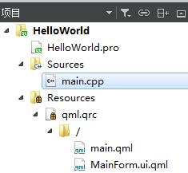
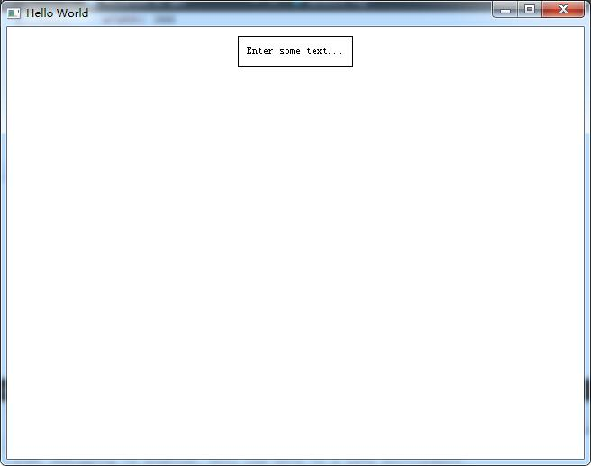

# 开始学习 Qt 5

## 安装 Qt 5 SDK

Qt 开发一般使用官方提供的 IDE——Qt Creator。去官网下载对应的版本安装。我下载的是qt-opensource-windows-x86-5.9.1.exe。安装的时候记得勾选对应的编译器。我安装时发现 Qt Creator 能感知我系统上已经安装好的 VS2015 自带的编译器，以为不需要勾选编译器了，结果不能失败 Qt 版本，所以不创建工程。所以还是得勾选一个编译器才行。

还可以使用 VS2015 来开发 Qt 程序，不过需要先安装 Qt Creator，然后在 VS 上装一个插件，并配置好插件中的一个环境变量，让它指向 Qt Creator 安装目录下的编译器目录。

## Hello World

>   QmlBook 书上描述的 Hello World 由于版本的原因无法重现。下面是 Qt Creator 4.3.1 为我们创建的 Hello World 项目。Qt 版本为 5.9.1。

创建一个 Hello World 来测试一下。打开 Qt Creator。点击 文件-->新建文件或项目-->Qt Quick Application。输入项目名`HelloWorld`，后面的步骤默认就行。

可以看到 Qt Creator 为我们创建的项目结构如下：




其中 HelloWorld.pro 是构建项目需要的配置文件。里面是构建项目需要的相关信息。

main.cpp 是 C++ 本地代码文件，代码如下：

```c++
#include <QGuiApplication>
#include <QQmlApplicationEngine>

int main(int argc, char *argv[])
{
    QGuiApplication app(argc, argv);

    QQmlApplicationEngine engine;
    engine.load(QUrl(QStringLiteral("qrc:/main.qml")));
    if (engine.rootObjects().isEmpty())
        return -1;

    return app.exec();
}
```

可以看出这片代码的任务是创建应用对象、创建 Qml 引擎对象、加载 QML 文件、启动程序。

main.qml 是描述程序主窗口的 QML 代码文件。里面的内容如下：

```qml
import QtQuick 2.6
import QtQuick.Window 2.2

Window {
    visible: true
    width: 640
    height: 480
    title: qsTr("Hello World")

    MainForm {
        anchors.fill: parent
        mouseArea.onClicked: {
            console.log(qsTr('Clicked on background. Text: "' + textEdit.text + '"'))
        }
    }
}

```

可以看到里面的 QML 代码设置了窗口的大小和标题，并添加了一个主要部件 MainForm。

MainForm.ui.qml 是描述主窗口中主要部件 MainForm 的 QML 代码文件。在 IDE 左侧项目浏览中点击该文件会自动打开可视化编辑模式，可以对界面进行可视化编辑。看来设计界面主要的工作在这里进行。切换到编辑模式可以看到里面的代码如下：

```qml
import QtQuick 2.6

Rectangle {
    property alias mouseArea: mouseArea
    property alias textEdit: textEdit

    width: 360
    height: 360

    MouseArea {
        id: mouseArea
        anchors.fill: parent
    }

    TextEdit {
        id: textEdit
        text: qsTr("Enter some text...")
        verticalAlignment: Text.AlignVCenter
        anchors.top: parent.top
        anchors.horizontalCenter: parent.horizontalCenter
        anchors.topMargin: 20
        Rectangle {
            anchors.fill: parent
            anchors.margins: -10
            color: "transparent"
            border.width: 1
        }
    }
}
```

按 `ctrl+R` 构建并运行程序，程序运行结果如下：



目前可以看出的是 main.qml 负责描述主程序窗口的边框和标题，至于窗口内其他内容由 MainForm.ui.qml 描述。

###Qt Quick 程序的运行过程

一个典型的 Qt Quick 程序由一个运行时产生，该运行时叫做 QML 引擎，它加载最初的 QML 代码并解释运行。开发者可以在运行时中注册 C++ 类型来和本地代码通信。这些 C++ 类型也可以绑定到一个插件中，并使用导入语句动态加载。`qmlscene` 和 `qml` 是现成的运行时工具，可以直接使用。

### 使用命令行运行 Qt Quick 程序

前面说了 `qmlscene` 是运行时工具。我们可以用 `qmlscene` 直接加载 QML 代码运行。该工具在 Qt 的安装目录下，比如我的在`C:\Qt\Qt5.9.1\5.9.1\msvc2015_64\bin`，将该目录添加到系统环境变量，就可以在命令行中直接使用`qmlscene` 及其他 Qt 提供的工具了。

打开 cmd，cd 到 HelloWorld 项目下，执行：

```shell
qmlscene main.qml
```


会弹出我们的 HelloWorld 窗口。这在 IDE 中运行是一样的。

再执行：

```shell
qmlscene MainForm.ui.qml
```

也会弹出 HelloWorld 窗口，只是窗口好像变小了。

#### 解释

在 IDE 中和在命令行中运行 Qt Quick 有什么区别？

前面我们说了 Qt Quick 程序的运行过程是由一个叫做 QML 引擎的运行时加载初始的 QML 代码解释运行。在 IDE 中有个 main.cpp 文件，里面创建了一个 QML 引擎并加载相应的 QML 代码。而我们在命令中运行程序时是用的现成的引擎 `qmlscene` 手动加载 QML 代码。两者的过程是一致的。

那为什么 `qmlscene` 加载两个不同的 qml 文件都可以运行呢？而且两次运行得到的窗口大小不一样呢？

因为 `qmlscene` 规定要运行的程序必须有个窗口(window)才能运行，如果传入的 QML 代码中没有描述窗口，就由 `qmlscene` 自动创建一个默认窗口，并将传入的 QML 代码中的内容放入到该窗口中。main.qml 中定义了窗口，还定义了窗口的大小，所以不需要 `qmlscene` 提供窗口。而如果直接传入没有窗口描述 MainForm.ui.qml 文件，就由`qmlscene`提供一个默认大小的窗口。所以两次运行的窗口大小也不一样。

## Qt 5 能做应用程序类型

### 控制台应用程序

控制台应用程序不需要界面，一般当做系统服务的一部分或者命令行。但是你还是可以利用 Qt 5 提供的跨平台能力和高效开发的能力。Qt 5 提供了一系列的现成的组件，包括网络 API、文件 IO、字符串处理、高效的命令行解析器等等。由于Qt 是基于 C++ 的高级 API，你可以兼得开发速度和运行速度。

所以不要只把 Qt 当做 UI 套件，它提供的远超你想象。

### 传统的窗口应用程序

Qt 提供了很多窗口部件，可用于构建窗口程序。构建的方法和mfc相似，都是用的 C++ 本地代码。而且 Qt 提供的这些窗口部件（比如按钮、单选按钮、列表）在不同平台的外观风格都和该平台原生的部件一样。你还可以自定义窗口部件。还可以绘制几何图形。

Qt 和 MFC 一样使用的是 MV 模型。可以将模型和视图解耦，在模型中提供数据，视图负责展现。

### Qt Qucik 应用程序

这才是本系列的重头戏。也是 Qt 5 亮点。

现代软件开发有一个固有的冲突——用户界面的进化速度总是比后端服务的快很多。传统的开发技术中，前端总是和后端混合在一起开发，或者完全没有后端和前端的概念。当客户想在项目开发过程中修改用户界面或者在开发工程中提出一个新的用户界面就会很为难，传统的技术难以应对这种变化。

灵活的方法才能应对灵活的项目。

Qt Quick 提供了一个声明式的环境。用户界面（前端）可以直接使用类似 HTML 的代码（QML）来声明，后端使用本地 C++ 代码。让你在两个世界如鱼得水。