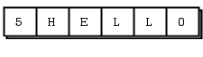

# 套接字 API

> 本文翻译自[套接字 API](http://zguide.zeromq.org/page:all#The-Socket-API)

坦白地说，ZeroMQ 对你耍了一点小把戏，但是我们不会道歉。这是为了你好，我们受到的伤害比你更多。ZeroMQ 提供了一组大家熟悉的类似套接字的 API，为此我们付出了巨大的努力来隐藏一堆消息处理引擎。这样做的结果是慢慢修正你关于如何设计和编写分布式软件的世界观。

套接字是网络编程事实上的标准 API，而且对于防止眼睛掉到脸颊上十分有用。ZeroMQ 对开发人员特别有吸引力的一点是，它使用了套接字和消息概念，将“面向消息的中间件”变成了“额外辛辣的套接字”，这让我们对披萨产生了一种奇怪的渴望，并渴望了解更多。

就像最爱的食物一样，ZeroMQ 套接字易于消化。ZeroMQ 套接字的生命周期和 BSD 套接字的生命一样分为四部分：

- 创建和销毁套接字，一起组成了套接字的生命循环。（参见 `zmq_socket()`,`zmq_close()`）
- 配置套接字，通过设置套接字上的选项并在必要时进行检查。（参见`zmq_setsocketopt()`,`zmq_getsocketopt()`）
- 将套接字插入到网络拓扑中，通过创建 ZeroMQ 连接。（参见 `zmq_bind()`, `zmq_connect()`）
- 使用套接字传输数据，通过在套接字上写和接收消息。（参见`zmq_msg_send()`, `zmq_msg_recv()`）

注意，套接字总是 void 指针，消息（我们很快会讲到）是结构体。所以在 C 语言中，你可以直接传递套接字变量，但传递消息给相关函数时传递地址就行，例如 `zmq_msg_send()` 和 `zmq_msg_recv()`。作为一个助记符，你需要认识到“在 ZeroMQ 中，你创建的所有套接字都属于我们，消息才属于你”。

创建、销毁和配置套接字的工作原理和你对任何对象的期望一样。但你需要记住，ZeroMQ 是一个异步的，有弹性的结构。这一定程度上影响了我们如何将套接字插入到网络拓扑中以及如果使用套接字。

## 将套接字插入到拓扑结构中

要在两个节点间创建连接，你需要在一个节点上调用`zmq_bind()` ，并在另一个节点上调用 `zmq_connect()` 。一般来说，执行 `zmq_bind` 的节点称为 `server`，绑定一个大家都知道的网络地址，而执行 `zmq_connect()` 的节点是 “client”，使用任意的网络地址。因此，我们说“将套接字绑定到一个端点”和“将套接字连接到一个端点”，这个端点就是这个大家都知道的网络地址。

ZeroMQ 连接和传统的 TCP 连接有些不同。其主要的显著差异有：

- ZeroMQ 可以基于任意的传输协议（`inproc`, `ipc`, `tcp`, `pgm`, 或 `epgm`）。参见`zmq_inproc()`, `zmq_ipc()`, `zmq_tcp()`, `zmq_pgm()`, 以及 `zmq_epgm()`。
- 一个套接字可以有多个传出和传入连接。
- 没有 `zmq_accept()` 方法。当一个套接字绑定到一个端点后，会自动开始接受连接。
- 网络连接本身发生在后台，ZeroMQ 会自动在网络连接中断（例如，对等端消失、然后返回）后进行重连。
- 你的应用程序代码不能直接使用这些连接，连接被封装在套接字之下。

许多架构遵循某种客户机/服务器模型。其中服务器是最静态的组件，客户机是最动态的组件，客户机来了又走的的情况最多。有时候会存在寻址问题：服务器对客户机可见，但客户机不一定对服务器可见。因此，这就很明显的决定了哪个节点需要执行 `zmq_bind()`（服务器），哪个节点需要执行 `zmq_connect()`（客户机）。这也依赖于你使用的套接字类型，对于一些不常见的网络结构除外。稍后我们会关注套接字类型。

假设我们在启动服务器之前启动了客户机。在传统的网络中，我们会得到一个大大的红色失败标志。但是 ZeroMQ 允许我们以任意顺序启动和停止各个组件。只有客户机执行了 `zmq_connect()`。连接就已经存在，该阶段就可以开始向套集资写入消息。在某个阶段（希望是在消息没积累太多而导致消息被丢弃或客户机被阻塞之前），服务器启动，执行 `zmq_bind()`，ZeroMQ 开始传递消息。

一个服务节点可以绑定到多个端点（即协议和端口的组合），并且只需要使用一个套接字就可以实现。这意味着它接受跨不同传输协议的连接：

```c
zmq_bind (socket, "tcp://*:5555");
zmq_bind (socket, "tcp://*:9999");
zmq_bind (socket, "inproc://somename");
```

大多数传输协议不像 UDP 协议一样允许你在同一个端点上绑定两次。然而，`ipc` 协议可以，让一个进程绑定到一个已被之前进程使用的端点。这意味着允许进程在奔溃后恢复。

虽然 ZeroMQ 试图对哪端执行绑定和哪端执行连接保持中立，但是还是有区别的。我们稍后会看到更多细节。结果就是，你通常应该将“服务器”视为拓扑结构中静态部分，绑定到一个或多个固定的端点，将“客户机”视为动态部分，它们来来去去并连接到这些固定端点。然后，围绕这个模型来设计应用程序，它“正常工作”的可能性最大。

套接字有不同的类型。套接字的类型定义了套接字的语义、向内向外路由消息的策略、队列等。你可以连接特定类型的套接字，例如，发布者套接字和订阅者套接字。套接字在“消息传递模型”中协同工作。稍后我们将更详细的讨论这些。

正是这些不同的套接字连接方式使 ZeroMQ 具备了作为消息队列系统的基本能力。在此之上还有一个些层，比如代理，我们稍后会讨论它。但从本质上来说，使用 ZeroMQ，你可以像孩子拼接玩具一样定义你的网络体系结构。

## 发送和接收消息

要发送消息，调用 `zmq_msg_send()` 函数， 要接收消息，调用 `zmq_msg_recv()`  函数。这两个函数名很传统，但 ZeroMQ 的 I/O 模型和传统的 TCP 模型大有不同，你需要花点时间来理解它。

ZeroMQ 套接字和 TCP 套接字在处理数据上的主要不同在于：

- ZeroMQ 套接字承载的是消息（这点像 UPD），而 TCP 套接字承载的是字节流。ZeroMQ 消息是长度指定的二进制数据。后面很快会讲到消息，它们的设计需要针对性能进行优化，所有有点棘手。
- ZeroMQ 套接字在后台线程执行 I/O。这意味着收到的消息会自动进入本地输入队列，而发送的消息自动进入本地输出队列，并且对应用程序透明。
- 特定类型的 ZeroMQ 套接字支持 1 对 n 的路由模型。

实际上 `zmq_send()` 函数并不是将消息发送到套接字连接。它会将消息放入到队列中让 I/O 线程异步发送。`zmq_send()` 不会阻塞，异常除外，所以当 `zmq_send()` 返回时，并不一定意味着消息已经发送出去。


## 单播传输

ZeroMQ 有一组可以选择的单播传输机制（`inproc`, `ipc`, 以及 `tcp`）和多播传输机制（epgm, pgm）。多播是一种高级技术，我们后面会讲到。一般都不需要使用多播，除非你明确的知道一对多的单播满足不了你。

对于大多数常见常见，使用 `tcp` 就行，这是一种断开的 TCP 传输机制，并且有弹性、轻便、效率能满足大多数情况。我们说 `tcp` 是断开的，是因为 ZeroMQ `tcp` 传输机制在连接前不要求目标端点存在。客户端和服务端可以在任意时候连接或绑定，可以消失又出现，并且对应用程序透明。

进程间的 `ipc` 传输也是断开的。但它有一个限制：它目前还不支持 Windows。按照惯例，我们使用后缀名 “.ipc” 来避免和其他文件名的潜在冲突。在 UNIX 系统上，你需要特定的权限才能创建 `ipc` 端点，否则在不同用户 ID 下运行的进程可能无法共享这些端点。还需要保证所有的进程都能访问这些文件，例如，让所有进程在相同的工资目录下运行。

线程间的传输 `inproc`，是一种连接的信令传输。它比 `tcp` 和 `ipc` 快很多，也比 `tcp` 和 `ipc` 多了一个特定的限制：在客户端连接之前，服务端必须先绑定。ZeroMQ 在未来的版本中也许修正这个限制，但是目前这个限制决定了 `inproc`  套接字的使用方式：先创建并绑定一个套接字，启动子线程，子线程创建并连接到其他套接字。

## ZeroMQ 不是中立的载体

刚接触 ZeroMQ 的人常问的一类问题（我也问过自己）就是：“怎样用 ZeroMQ 写一个 XX 服务 ？”，例如。“怎样用 ZeroMQ 写一个 HTTP 服务?“ 。这类问题背后的思维：既然我们可以用传统的 TCP 套接字实现一个 HTTP 服务和客户端，那我们也应该可以使用 ZeroMQ 套接字来做同样的事情，只是实现起来更快更好。

但答案是“事情不是这样的”。ZeroMQ 不是中立载体：它在传输协议上强加了一种帧格式，这种帧格式不兼容现有的协议，现有的协议只能使用自己的帧格式。例如，我们比较一下 HTTP 请求和 ZeroMQ 请求，它们都基于 TCP/IP。


HTTP 请求使用 CR-LF (回车-换行) 作为简单的帧分隔符，ZeroMQ 却使用基于长度的帧格式。你可以使用 ZeroMQ 的请求-应答套接字实现一个类似 HTTP 的协议，但它终究不是 HTTP。



从 v3.3 开始，ZeroMQ 提供了一个套接字选项 `ZMQ_ROUTER_RAW`，允许读写非 ZeroMQ 帧。你可以使用该选项来正确的读写 HTTP 请求和响应。该选项由 Hardeep Singh 贡献，他当初是为了在 ZeroMQ 应用中连接 Telnet 服务器。在编写本文时，该选项还在试验阶段，这也反应了 ZeroMQ 是如何不断进化以解决新问题。也许下一个补丁就是你提供的。

## I/O 线程

我们说过，ZeroMQ 在后台线程中执行 I/O。除最极端的应用外，一个应用只需要一个 I/O 线程都够了。当你创建一个新的上下文时，会自动创建一个 I/O 线程。一般的经验法则是，允许每 GB 进出的数据每秒有一个 I/O 线程。在创建任何套接字之前，调用 `zmq_ctx_set()` 方法可以增加 I/O 线程的数量：

```c
int io_threads = 4;
void *context = zmq_ctx_new ();
zmq_ctx_set (context, ZMQ_IO_THREADS, io_threads);
assert (zmq_ctx_get (context, ZMQ_IO_THREADS) == io_threads);
```

我们之前看到过一个套接字可以同时处理几十个、甚至上千个连接。这从根本上影响了你如何编写应用。传统的网络应用为每个远程连接维护一个进程或线程，每个进程或线程维护一个套接字。ZeroMQ 允许你将整个结构折叠成单个进程然后根据需要进行拆分以实现伸缩。

如果你将 ZeroMQ 仅用于线程间通信（即没有外部套接字IO的多线程应用），你可以将 I/O 线程数设置为 0。这不是一个重要的优化，更多是出于好奇。

