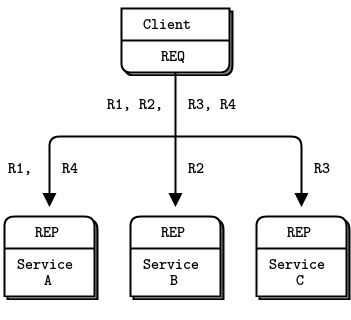
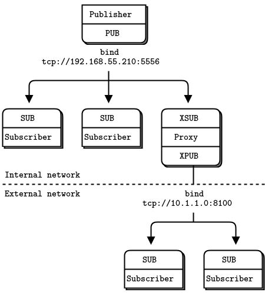

# 消息传递模式

在 ZeroMQ 套接字 API 之下是消息传递模式的世界。如果你有企业级消息传递方面的背景知识，或者熟悉 UDP，你会在 ZeroMQ 的消息传递上看到熟悉的影子。ZeroMQ 新手通常会感动惊喜。我们已经非常熟悉 TCP 的范例，一个套接字一对一的映射到另一个节点。

我们先简单回顾一下，ZeroMQ 做了哪些事情：将数据块（消息）快速高效地交付给节点，节点可以对应线程、进程、网络中的一个节点。为不同的传输（进程内、进程间、TCP、或多播）提供了同一组套接字 API。自动和反复消失后又上线的对等端重连。在必要的情况下，在发送端和接收端对消息进行排队，并且会限制队列的大小以防进程内存耗尽。处理套接字错误。在后台线程中执行 I/O。使用无锁技术在节点之间进行通信，所以永远不存在锁、等待、信号量，或者死锁。

另外，ZeroMQ 会根据称为模式的精确配方案由的排队消息。这些模式是 ZeroMQ 智能所在。这些模式浓缩了我们来自不易的经验，是我们总结出的数据和工作分发的最好方式。ZeroMQ 的模式目前是硬编码，在未来的版本中也许会允许用户自定义模式。

ZeroMQ 的模式对应套接字对的类型。也就是说，要理解 ZeroMQ 的模式，你需要理解套接字的类型及其协同工作的方式。大多数情况下，你都需要花功夫学习，在这个层面上没有什么是可以一看就懂的。

ZeroMQ 内置的模式包括：

- **请求-应答**，将一组客户端连接到一组服务端。这是一种远程调用和任务分发模式。
- **发布-订阅**，将一组发布者连接到一组订阅者。这是一种数据分发模式。
- **管道**，以扇出/扇入的模式连接节点，可以有多个步骤和循环。这是一种冰箱任务分发和收集模式。
- **互斥对**，只连接两个套接字。这种模式用于连接同进程内的两个线程，不要和“正常”的套接字对混淆。

> 译者注：fan-out/fan-in（扇入/扇出）是数字电路中的概念，一般人可以第一次听说。这里有一篇文章可以参考：http://www.51hei.com/bbs/dpj-44186-1.html

我们在第一章-基础中讨论了前三种模式，在本章后面会讨论互斥对模式。`zmq_socket()` 的手册页对模式由非常清晰的讲解，值得你反复阅读，直到开始理解为止。下述套接字类型组合对绑定连接时有效（任何一端都可以绑定）：

- 发布和订阅
- 请求和应答
- 请求和路由（注意，请求插入了一个额外的空帧）
- DEALER 和 REP (（注意，REP 假设为非空帧）
- DEALER 和路由
- DEALER and DEALER
- 路由和路由
- 推和拉
- PAIR and PAIR

后面还会看到 XPUB 和 XPUB 套接字（它们类似 PUB 和 SUB 的原始版本）。任何其他组合将会产生不可预料的结果，在 ZeroMQ 的未来版本中可能会直接返回错误。当然，你可以通过代码桥接不同的套接字类型，比如，从一个类型的套接字中读，并写入到另一个类型的套接字。

## 高级消息传递模式

前面列出的四个模式是 ZeroMQ 的核心。它们时 ZeroMQ API 的一部分，在核心 C++ 库中实现，并保证在所有的版本中可用。

在四个核心模式之上，我们还添加了高级消息传递模式。我们在 ZeroMQ 的基础之上使用不同的语言实现了这些高级模式。它们不属于核心库，不在 ZeroMQ 包中，作为 ZeroMQ 社区的一部分存在于它们各自的空间中。例如 Majordomo 模式，是一种可靠请求-应答模式的探索，位于 ZeroMQ 组织的 GitHub Majordomo 项目中。

本书的目的之一就是为你提供一组这样的高级模式，涵盖从小型（如何明智的处理）到大型（如何构建可靠的发布-订阅架构）。

## 处理消息

`libzmq` 库时间上有两组发送和接收消息的 API。`zmq_send()` 和 `zmq_recv()` 方法我们已经在前面简单的程序总使用过。我们将频繁时使用它们，但是 `zmq_recv()` 不擅长处理任意大小的消息：它将消息截断为你提供的缓冲区大小。所以我们提供了第二组和 `zmq_msg_t` 结构协同的 API，这是一个丰富但也更难使用的 API：

- 初始化消息： `zmq_msg_init()`, `zmq_msg_init_size()`, `zmq_msg_init_data()`
- 发送和接收消息: `zmq_msg_send()`, `zmq_msg_recv()`
- 释放消息： `zmq_msg_close()`
- 访问消息内容：`zmq_msg_data()`, `zmq_msg_size()`, `zmq_msg_more()`
- 访问消息属性：`zmq_msg_get()`, `zmq_msg_set()`
- 其他消息处理： `zmq_msg_copy()`, `zmq_msg_move()`

在网络上，ZeroMQ 消息是从零开始的任意大小的块，适合存储在内存中。你可以自己选择序列化机制，protocol buffers、msgpack、JSON，或者其他机制。比较明智的的做法是选择一个可移植的数据表示方式，但是需要你自己权衡。

在内存中，ZeroMQ 消息是 `zmq_msg_t` 结构（或者类，取决于语言）。下面是在 C 语言中是用 ZeroMQ 的基本原则：

- 创建并传递 `zmq_msg_t` 结构，而不是数据块
- 读取消息之前，调用 `zmq_msg_init()` 创建一个空消息，然后传递给 `zmq_msg_recv()`
- 想要根据新数据发送一条消息，你得先调用 `zmq_msg_init_size()` 创建一条消息，并同时分配一块同样大小的数据块。然后调用 `memcpy` 填充消息，最后将消息传递给 `zmq_msg_send()`
- 释放（不是销毁）一条消息，你得调用 `zmq_msg_close()`。该调用会删除引用，最后 ZeroMQ 会销毁该消息。
- 访问消息内容，调用 `zmq_msg_data()`。获取消息里包含的数据大小，调用 `zmq_msg_size()`
- 不要轻易使用`zmq_msg_move()`, `zmq_msg_copy()`, 以及 `zmq_msg_init_data()`，除非你阅读了手册并确切的知道你在干什么
- 当你传递一个消息给 `zmq_msg_send()` 后，ZeroMQ 将清理该消息，例如将消息的大小设为 0。不能将同一条消息发送两次，也不能发送以后再访问消息中的数据

如果你需要将同一条消息发送两次，并且消息很大，你可以创建一个新的消息，调用 `zmq_msg_init()` 进行初始化，然后调用 `zmq_msg_copy()` 创建前一条消息的副本。这个过程不会复制消息中的数据，只是复制了一份引用。这样就可以达到发送同一条消息两次的目的（如果你希望发送更多次，只需要创建更多的副本）。有副本的消息会在最后一个副本发送或关闭后销毁。

ZeroMQ 还支持多帧消息，可以让你以单个消息的形式发送或接收一个帧列表。多帧消息在实际应用中很普遍，本章后面以及第三章：高级请求-应答模式中将会详细讨论。

帧（也叫“消息块”）是 ZeroMQ 在线上传输的基本格式。帧是指定长度的数据块。长度为 0 及以上。如果你曾经进行过 TCP 编程就知道为什么帧是问题“现在应该在该套接字上读取多少个字节数据？”的有用答案。

有一个称为 ZMTP 的线级协议，定义了 ZeroMQ 如何在 TCP 连接上读写帧。如果你对它的工作原理感兴趣，可以阅读一下这个非常简短的协议。

最初，ZeroMQ 消息和 UDP 一样，一个消息就是一帧。后来，我们添加了多帧消息，格式也非常简单，就是一系列 “more” 位为 1 的帧最后跟一个 “more” 位为 0 的帧。ZeroMQ API 允许你在写消息时添加一个 “more” 位，读取消息时也可以检查 “more” 位是否存在。

在 ZeroMQ 的底层 API 及参考文档中，提到消息和帧时有点混淆。下面是一些有用的词汇解释：

- 一条消息可以有一个或多个块
- 块也被称作帧
- 每个块都是 `zmq_msg_t` 对象
- 在底层 API  中，分别发送和接收每个块
- 高级 API 提供了包装器来发送整个由多块组成的消息

还有一些关于消息需要了解的事：

- 你可以发送长度为 0 的消息，例如，把 0 长度的消息当做信号从一个线程发送到另一个线程。
- ZeroMQ 保证交付一条消息的所有块，或者完全不交付
- ZeroMQ 不是立刻发送消息，而是在稍后某个不确定的时间发送。所以多块的消息不能超过内存大小
- 消息（单块或多块）必须能装入内存。如果你想发送任意大小的文件，你应该将文件分成几部分发送，每部分作为一个单块的消息发送。使用多块的单个消息并不能减少内存消耗。
- 在不能自动销毁对象的编程语言中，你必须在完成一个消息的接收后主动调用 `zmq_msg_close()` 。发送消息后则不必

再提一下，到目前为止，强烈建议你不要使用 `zmq_msg_init_data()`。这是一个零拷贝方法，而且肯定会给你带来麻烦。在想优化程序几微秒运行时间之前，你还需要更加了解 ZeroMQ。

这么多 API 可能会让你感觉有点累。这些方法优先考虑的是性能而不是简单性。如果你没有仔细阅读文档之前就开始使用这些方法，你肯定会出错。所以一个好点的语言绑定的主要工作之一就是将这些 API 封装在易于使用的类中。

## 处理多个套接字

到目前为止，大多数示例的主循环都是：

1. 在套接字上等待消息
2. 处理消息
3. 重复上面的过程

如果我们想同时读取来自多个端点的消息呢？最简单的方法是将一个套接字连接到所有端点，并让 ZeroMQ 为我们做扇入。不过这么做的前提是远程端点都是相同的模式，不能将一个 pull socket 连接到一个 PUB 端点。

如果要同时读取多个套接字，需要使用 `zmq_poll()`。更好的方法是将 `zmq_poll()` 封装到一个框架中，让框架将 `zmq_poll()` 转换为一个不错的事件驱动器，但是需要比较大的工作量。

我们先从一个 dirty hack 示例开始，虽然列出这个反面示例一部分原因是因为好玩，但更主要的是为了像你展示如何进行非阻塞套接字读取。下面是一个使用非阻塞读从两个套接字读取数据的简单示例。这个混乱的程序即是天气更新的订阅者，又是并行任务的工作进程。

> 译者注： dirty hack 的隐喻参见 [知乎-什么是 Dirty hack ？](https://www.zhihu.com/question/20372589)

```python
# encoding: utf-8
#
#   从多个套接字读取数据。该版本使用简单的 recv 循环
#
#   Author: Jeremy Avnet (brainsik) <spork(dash)zmq(at)theory(dot)org>

import zmq
import time

# 初始化上下文和套接字
context = zmq.Context()

# 连接到通风机
receiver = context.socket(zmq.PULL)
receiver.connect("tcp://localhost:5557")

# 连接到天气服务
subscriber = context.socket(zmq.SUB)
subscriber.connect("tcp://localhost:5556")
subscriber.setsockopt(zmq.SUBSCRIBE, b"10001")

# 处理来自两个套接字的消息
# 我们优先处理来自通风机的流量
while True:
    # 处理任意等待中的任务
    while True:
        try:
            msg = receiver.recv(zmq.DONTWAIT)
        except zmq.Again:
            break
        # 处理任务

    # 处理任意等待中的天气更新
    while True:
        try:
            msg = subscriber.recv(zmq.DONTWAIT)
        except zmq.Again:
            break
        # 处理天气更新

    # 活动结束, sleep 1 毫秒
    time.sleep(0.001)
```

这种方法的缺点之一就是处理第一条消息之前会有额外的延时（进程刚启动，进入循环，如果没有读取到任何消息，则会进入循环末尾的休眠）。这在对亚毫秒级延迟敏感的的应用程序中会是一个问题。

你也可以改成轮流从两个套接字中读取，而不是像本例中优先读取其中一个套接字。

现在再来看看同样毫无实际意义的一段代码，但是使用了 `zmq_poll()`：

```python
# encoding: utf-8
#
#   从多个套接字读取消息，该版本使用了 zmq.Poller()
#
#   Author: Jeremy Avnet (brainsik) <spork(dash)zmq(at)theory(dot)org>

import zmq

# 初始化上下文和套接字
context = zmq.Context()

# 连接到通风机
receiver = context.socket(zmq.PULL)
receiver.connect("tcp://localhost:5557")

# 连接到天气更新
subscriber = context.socket(zmq.SUB)
subscriber.connect("tcp://localhost:5556")
subscriber.setsockopt(zmq.SUBSCRIBE, b"10001")

# 初始化需要轮询套接字集合
poller = zmq.Poller()
poller.register(receiver, zmq.POLLIN)
poller.register(subscriber, zmq.POLLIN)

# 从两个套接字读取消息
while True:
    try:
        socks = dict(poller.poll())
    except KeyboardInterrupt:
        break

    if receiver in socks:
        message = receiver.recv()
        # 处理任务

    if subscriber in socks:
        message = subscriber.recv()
        # 处理天气更新
```

`poller.register(socket, flags)` 的第一个参数表示需要轮询的套接字或者实现了 `fileno()` 方法能返回一个文件描述符的 Python 对象。第二个参数是事件标志，可以为 `POLLIN`、`POLLOUT` 或者 `POLLIN | POLLOUT`。

## 多帧消息

ZeroMQ 的消息可以由多个帧组成，叫做 “多帧消息”。现实中的应用程序大量使用多帧消息，即可用于封装带有地址信息的消息，也可以用于简单的序列化。我们稍后将查看一个回复信封的示例。

我们先要学习的是怎样在一个应用（例如代理）中盲目和安全的读写多帧消息，这种应用不需要检查消息，只需要忙转发。

当处理多帧消息时，每块都是一个 `zmq_msg` 结构。例如，如果你要发送一个包含五块的消息，你必须创建、发送、并消耗 5 个 `zmq_msg` 结构。你可以预先创建所有的结构（将其保存在一个数组或结构体中），或者在要发送的时候逐个执行。

下面展示了如何发送一个多帧消息（接收时所有帧都保存到同一个消息对象）：

```c
zmq_msg_send (&message, socket, ZMQ_SNDMORE);
//…
zmq_msg_send (&message, socket, ZMQ_SNDMORE);
//…
zmq_msg_send (&message, socket, 0);
```

上面示例中，`zmq_msg_send` 的第三个参数用于设置消息帧的 “”more“ 位，为 0 则表示最后一帧。

下面展示了我们接收和处理一个消息的所有块的过程，无论消息是单帧还是多帧：

```c
while (1) {
    zmq_msg_t message;
    zmq_msg_init (&message);
    zmq_msg_recv (&message, socket, 0);
    //  处理消息帧
    …
    zmq_msg_close (&message);
    if (!zmq_msg_more (&message))
        break;      //  最后一帧
}
```

上面的示例使用 `zmq_msg_more` 来检查消息的 "more" 位是否为 1 来判断是否为消息的最后一帧。

关于多帧消息，你需要知道的一些事情：

- 当你发送多帧消息时，第一帧以及后续帧只有你在交付完最后一帧时才真正开始通过网络发送
- 如果你使用 `zmq_poll()` 轮询消息，在收到某条消息的第一帧时，说明该消息的其他帧也到了
- 你要么收到消息的所有帧，要么完全收不到该消息
- 无论你是否检查消息帧的 `more` 属性，你都会收到消息的所有帧
- 发送一条消息时，ZeroMQ 先将该消息的帧保存在内存队列中，直到最后一帧到齐，才开始发送它们。

## 中介和代理

ZeroMQ 的目标是分散智能，但并不意味着网络的中间部分都是空白。网络中间部分有很多基础设施，通常我们会使用 ZeroMQ 来构建这些基础设施。ZeroMQ 管道可以从很小的管道到成熟的面向服务的代理。消息传递领域将它们称为中介，即中间的部分能处理任何一端。在 ZeroMQ 中，我们根据上下文将其称为代理、队列、转发器、设备或 broker。

这种模式在现实世界中极为常见，这就是为什么我们的社会和经济中充斥着各种中介机构，它们没有其他实际功能，但降低了大型网络的复杂性和规模成本。现实世界中的中介通常被称为批发商、分销商、经理等。

## 动态发现问题

在设计大型分布式架构时需要解决的问题之一就是发现。也就是，各个节点之间如何发现彼此？当节点可能会上线又下线时，发现彼此就会更加困难，我们称之为“动态发现问题”。

动态发现有几种解决方案。最简单的方案就是完全避免动态发现，硬编码（或配置）网络结构，手工完成发现。例如，当一个新节点加入时，你重新配置网络加入新节点。


在实践中，手工配置的方法会导致越来越脆弱和笨拙的系统架构。假设你有一个发布者和 100 个订阅者。为了将每个订阅者连接到发布者，你给每个订阅者配置了一个发布服务者端点。看起来很简单，因为订阅者是动态的，发布者是静态的。现在，假设你要突然增加很多发布者，问题就变得不那么简单了。如果你继续手工将每个订阅者连接到每个发布者，避免动态发现的成本会越来越高。


动态发现有很多方案，最简单的方案就是添加一个中介，中介是网络中的一个静态节点，其他节点都连接到它。在传统的消息传递中，这通常是 broker 负责的工作。ZeroMQ 没有提供这样的消息 broker，但是可以很方便的构建中介节点。

你可能会疑惑，如果所有的网络最终都会变的足够大，以至于需要中介节点，那为什么我们不简单地在每个应用中设置一个消息 broker 呢？这对于初学者来说，听起来这是一个很公平的妥协。只要一直使用星型的拓扑结构，不管性能，系统总能正常工作。然而，消息 broker 是贪婪的，作为中介，它会变得太复杂、强状态相关、最终就会出问题。

最好将中介看成简单的无状态的消息交换机。一个很好的类比就是 HTTP 代理，它就在那里，但没有任何特殊的作用。在我们的示例中，添加了一个发布子代理解决了动态发现问题。我们在网络中间添加一个代理。代理打开一个 XSUB 套接字，并绑定到总所周知地 IP 地址和端口。然后，所有其他发布者连接到该套接字，而不是彼此互相连接。同样，代理也打开一个 XPUB 套接字，并绑定到另一个总所周知的 IP 地址和端口，所有其他订阅者都连接到该套接字。添加更多订阅者和发布者就变得很简单。


我们需要 XPUB 和 XSUB 套接字，因为 ZeroMQ 从订阅者到发布者进行订阅转发。XSUB 和 XPUB 与 SUB（订阅） 和 PUB（发布） 完全一样，只是他们将订阅公开为特殊消息。代理必须从 XPUB 套接字读取订阅消息并将其写入到 XSUB 套接字，从而将订阅消息从订阅端转发到发布端。这是 XSUB 和 XPUB 的主要作用。

## 共享队列（DEALER 和路由套接字）

在 Hello World 客户/服务 应用中，我们有一个 client 与一个服务通信。然而，实际情况中，我们通常运行多个服务和 client 存在。这让我们可以扩展服务的功能（多个线程、进程或街道）。唯一的限制是服务必须是无状态的，所有的状态保存在请求中，或共享存储（例如数据库）中。



有两种方法可以连接多个客户和服务。蛮力的方法是将每个客户端套接字连接到多个服务端点。一个客户端套接字可以连接到多个服务套接字，然后 REQ 套接字将分发请求到这些服务。假设将一个客户端套接字连接到三个服务端点,客户机请求 R1、R2、R3、R4。R1 和 R4 属于服务 A，R2 属于服务 B，R3 属于服务 C。

你可以很方便地添加多个客户端。还可以添加更多的服务。每个客户端将分发其请求到各个服务。但是客户端必须知道服务拓扑。如果你有 100 客户端，然后决定添加 3 个服务，为了让这 100 个客户端知道 3 个新的服务，你必须配置并重启这 100 个客户端。

再极端一点，你肯定不想在凌晨 3 点钟的时候起来给耗尽资源的超级计算集群添加几百个新的服务节点。太多静态部分就像液体混凝土：知识是分散的，拥有的静态部分越多，改变拓扑结构需要的工作量就越大。我们需要的是位于客户机和服务器之间的东西，它集中了拓扑的所有知识。理想情况下，我们应该可以在任何时候轻松的添加和删除服务和客户机，而不需要接触拓扑的其他部分。

所以，让我们来写一个小型的消息队列 broker 让架构变得灵活。该 broker 绑定了两个端点，一个作为前端连接客户机，一个作为后端连接服务。然后使用 `zmq_poll()` 监控这两个套接字，当收到消息时，在两个套接字之间传递消息。该 broker 不需要明确的管理某个队列——ZeroMQ 在每个套接字上自动管理队列。


当你使用 REQ 和 REP 对话时，你将得到一个严格同步的请求-应答模式。客户端发送一个请求，服务读取请求并发送响应，客户端读取响应。如何客户端或服务端尝试做其他操作（比如，客户端在不等待响应的情况下连续发送两个请求），将导致错误。

但是我们的 broker 必须是非阻塞的。显然，我们可以使用 `zmq_poll()` 来等待两个套接字的活动，但不能使用 REP 和 REQ 套接字，因为它们时阻塞的。幸运的是，我们可以使用两个名为 DEALER 和 ROUTER 的套接字可以实现非阻塞的请求-响应。在第三章：高级请求-响应模式中，我们将看到 DEALER 和 ROUTER 套接字可以用来构建各种异步请求-响应流。现在，我们只需要了解 DEALER 和 ROUTER 套接字可以让我们扩展 REQ-REP ，让 REQ-REP 跨一个中介，也就是我们的小型 broker。

在这个简单的扩展请求-应答模式中，REQ 和 ROUTER 对话，DEALER 和 REP 对话，我们需要有代码（就像我们的 broker 一样）将消息从一个套接字转发到另一个套接字。

请求-应答 broker 绑定两个端点，一个用于客户机连接（前端套接字），一个用于服务连接（后端套接字）。要测试该 broker，你需要更改服务，一遍他们连接到后端套接字。下面是代码示例：

客户端代码，rrclient.py

```python
#   请求-应答 客户端
#   连接 REQ 套接字到 tcp://localhost:5559
#   发送 "Hello" 到服务端，期待返回 "World"
#
import zmq

#  初始化上下文和套接字
context = zmq.Context()
socket = context.socket(zmq.REQ)
socket.connect("tcp://localhost:5559")

#  发出 10 个请求, 每个请求都等待一个返回
for request in range(1,11):
    socket.send(b"Hello")
    message = socket.recv()
    print("Received reply %s [%s]" % (request, message))
```

服务端代码，rrworker.py

```python
#  请求-应答服务端
#   连接 REP 套接字到 tcp://localhost:5560
#   期待来自客户端的 "Hello", 回复 "World"
#
import zmq

context = zmq.Context()
socket = context.socket(zmq.REP)
socket.connect("tcp://localhost:5560")

while True:
    message = socket.recv()
    print("Received request: %s" % message)
    socket.send(b"World")
```

broker 代码，rrbroker.py，会正确处理多帧消息：

```python
# 一个简单的请求-应答 broker
# Author: Lev Givon <lev(at)columbia(dot)edu>

import zmq

# 初始化上下文和套接字
context = zmq.Context()
frontend = context.socket(zmq.ROUTER)
backend = context.socket(zmq.DEALER)
frontend.bind("tcp://*:5559")
backend.bind("tcp://*:5560")

# 初始化轮询套接字集合
poller = zmq.Poller()
poller.register(frontend, zmq.POLLIN)
poller.register(backend, zmq.POLLIN)

# 在套接字之间转发消息
while True:
    socks = dict(poller.poll())

    if socks.get(frontend) == zmq.POLLIN:
        message = frontend.recv_multipart()
        backend.send_multipart(message)

    if socks.get(backend) == zmq.POLLIN:
        message = backend.recv_multipart()
        frontend.send_multipart(message)
```


使用请求-应答 broker 可以使客户/服务体系结构变得容易伸缩，因为客户端不见服务端，服务端也不见客户端，唯一静态的节点就是中间的 broker。

## ZeroMQ 的内置代理方法

我们在实践中发现，上一节 rrboker.py 中的核心循环非常有用。可以让我们毫不费力地构建出一个 pub-sub 转发器、共享队列以及其他小型中介。在实际中也很常用，所以 ZeroMQ 将这个循环封装成了一个方法 `zmq_proxy()`：

```c
zmq_proxy (frontend, backend, capture);
```

参数中的两个套接字（也可以是三个，如果你想捕捉数据的话）被正确连接、绑定和配置。调用 `zmq_proxy` 方法，就像启动了 rrbroker.py 的主循环一样。我们来用 `zmq_proxy` 重写一下请求-应答 broker，并将它重新标记为“消息队列”，让它听起来很昂贵的样子：

`msgqueue.py`：Python 实现的消息队列

```python
"""
   简单的消息队列 broker，和请求-应答 broker 类似，不过使用了 ``zmq.proxy``
   Author: Guillaume Aubert (gaubert) <guillaume(dot)aubert(at)gmail(dot)com>
"""

import zmq

def main():
    context = zmq.Context()

    # 让客户端连接的套接字
    frontend = context.socket(zmq.ROUTER)
    frontend.bind("tcp://*:5559")

    # 让服务端连接的套接字
    backend  = context.socket(zmq.DEALER)
    backend.bind("tcp://*:5560")

    zmq.proxy(frontend, backend)

    # 永远不会执行到这一步...
    frontend.close()
    backend.close()
    context.term()


if __name__ == "__main__":
    main()
```

大多数 ZeroMQ 用户到了这个阶段会开始思考，“如果我讲任意一个类型的套接字插入到代理中会发生什么错误呢？”。最简单的回答就是：你试试看，看会发生什么。实际上，你以后会坚持使用套接字类型为 ROUTER/DEALER、XSUB/XPUB 或 PULL/PUSH。

## 传输桥接

ZeroMQ 用户经常会考虑一个问题，“如何将 ZeroMQ 网络与技术 X 连接起来呢？”，X 表示某种其他的网络或消息传递技术。



方法很简单，建一座桥就行。这里的桥指一个小应用程序，它在一个套接字上使用 一种协议，并在第二个套接字上转换成第二种协议。你也可以将它称为协议解释器。ZeroMQ 中常见的桥接场景是桥接两个传输或网络。

例如，我们写一个位于发布者和一组订阅者之间的小代理，桥接两个网络。前端套接字（SUB）面向天气服务所在的内部网络，后端套接字（PUB）面向外部网络上的订阅者。代理订阅前端套接字上的气象服务，并在后端套接字上重新发布数据。

`wuproxy.py`：Python 实现的天气更新代理

```python
# 天气代理设备
#
# Author: Lev Givon <lev(at)columbia(dot)edu>

import zmq

context = zmq.Context()

# 连接到天气服务的前端套接字
frontend = context.socket(zmq.SUB)
frontend.connect("tcp://192.168.55.210:5556")

# 面向订阅者的后端套接字
backend = context.socket(zmq.PUB)
backend.bind("tcp://10.1.1.0:8100")

# 订阅所有消息
frontend.setsockopt(zmq.SUBSCRIBE, b'')

# 将消息分流到订阅者
while True:
    # 处理多块消息
    message = frontend.recv_multipart()
    backend.send_multipart(message)

```

这个例子看起来和前面的代理示例类似，关键不同在于前端和后端套接字分别位于不同的网络上。我们还可以使用该模型将组播网络（`pgm` 传输）连接到 `tcp` 发布服务器。

