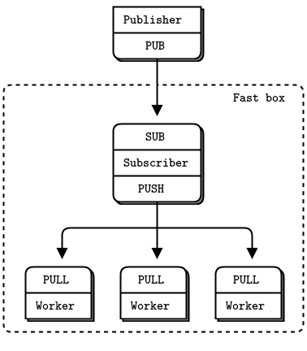

# 高速订阅（黑盒模式）

现在我们来看一种使我们订阅者飞快的方法。发布-订阅的一个常见用例是分发大型数据流，例如来自股票交易所的市场数据。一个典型的设置是一个订阅者连接到股票交易所，获取价格报价，并将它们发送给许多订阅者。如果订阅者较少，可以使用 TCP。如果订阅者狠毒，可能会使用多播，例如PGM。

假设我们平均每秒有 100,000 * 100 字节的消息。在过滤掉不需要发送给订阅者的市场数据后，这是一个典型速率。现在我们决定记录一天的数据（可能有在 8 小时内 250 GB），然后将其重发到模拟网络，假设只有一小群订阅者。虽然每秒 10 万条数据对 ZeroMQ 应用来说很容易，但我们想更快的重播它。

因此，我们使用一组框来设置我们的体系结构 - 一个用于发布者，一个用于每个订阅者。这些指定的框 - 8 个核心，12 个用于发布者。

当我们向订阅者注入数据时，我们注意到两件事：

1. 当我们处理一条消息时，即使是最少的工作量，也会使订阅者的速度减慢到无法再次赶上发布者的程度。
2. 即使经过仔细的优化和 TCP 调优后，我们在发布者和订阅者两端都达到了每秒大约 600 万条消息的上限。

我们需要做的第一件事就是将订阅者拆分成多线程设计，这样我们就可以在一个线程中处理消息时，同时在另一个线程中读取消息。通常我们会以相同的方式处理每一条消息。而是可能通过前缀来过滤消息。当消息符合某些条件时，订阅者将调用 worker 来处理该消息。就 ZeroMQ 而言，就是发送消息到工作线程。

订阅者看起来向队列设备。我们可能会可以使用各种套接字来连接订阅者和 worker。如果假设流量是单向的，则可以使用 PUSH 和 PULL 并将所有路由工作委托给 ZeroMQ。这是最简单、最快速的方法。

订阅者通过 TCP 或 PGM 和发布者通信，通过 `inproc://` 与处于同一个进程中的 worker 通信。

很多高性能产品在这个场景使用的方法是分片。通过分片，将工作分割为独立并行的流，比如半个 topic key 对应一个流。我们可以使用多个流，但是除非有空闲的核，否则性能性能还是无法扩展。我们来看看如何将工作分成两个流：

- 两个 IO 线程。
- 两个网络接口，一个订阅者一个。
- 每个 IO 线程绑定到一个特定网络接口。
- 两个订阅者线程，各自绑定到特定核。
- 两个订阅套接字，对应两个订阅者线程。
- 剩余核分配给 worker 线程。
- Worker 线程连接到两个订阅者的 PUSH 套接字。

理想情况下，我们希望体系结构中完全加载的线程数量和核的数量匹配。当线程开始争夺核和 CPU 周期时，多线程的成本盖过了收益。例如，创建更多的 IO 线程没有任何益处。

