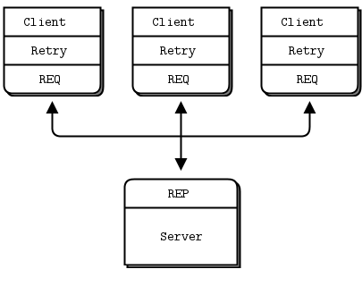

# 客户端可靠性（Lazy Pirate 模式）

只需要对客户端做一些修改我们就可以得到一个非常简单的可靠请求-应答模式。我们称之为 Lazy Pirate 模式。在客户端不再进行阻塞式接收，而是：

- 轮询 REQ 套接字，在确定一个请求到达时才从 REQ 套接字接收
- 如果超时时间内没收到应答，则重发请求
- 如果再多次请求后还是没有应答则放弃事务

如果你尝试以严格发送/接收以外的任何方式使用 REQ 套接字，将会导致错误（从技术上讲，REQ 套接字实现了一个小型的优先状态机来强制发送/接收，就像乒乓球一样，一来一回，所以错误码叫 “EFSM”）。当我们想在 pirate 模式中使用 REQ 套接字时，这个强制规定会有点烦人，因为我们可能会在得到回复之前连续发送几个请求。

一种粗暴但非常好的解决方法是在发生错误后简单地关闭并重新打开套接字。如下面对的 `lpclient.py` 所示：

```python
#  Lazy Pirate 客户端
#  使用 zmq_poll 进行安全的 请求-应答
#  启动后, 启动 lpserver 并随机杀死/重启它
#
#   Author: Daniel Lundin <dln(at)eintr(dot)org>
from __future__ import print_function

import zmq

REQUEST_TIMEOUT = 2500
REQUEST_RETRIES = 3
SERVER_ENDPOINT = "tcp://localhost:5555"

context = zmq.Context(1)

print("I: 连接到服务端...")
client = context.socket(zmq.REQ)
client.connect(SERVER_ENDPOINT)

poll = zmq.Poller()
poll.register(client, zmq.POLLIN)

sequence = 0
retries_left = REQUEST_RETRIES
while retries_left:
    sequence += 1
    request = str(sequence).encode()
    print("I: 发送 (%s)" % request)
    client.send(request)

    expect_reply = True
    while expect_reply:
        socks = dict(poll.poll(REQUEST_TIMEOUT))
        if socks.get(client) == zmq.POLLIN:
            reply = client.recv()
            if not reply:
                break
            if int(reply) == sequence:
                print("I: 服务端返回 OK (%s)" % reply)
                retries_left = REQUEST_RETRIES
                expect_reply = False
            else:
                print("E: 服务端返回的格式不正确: %s" % reply)

        else:
            print("W: 服务端没有返回...")
            # Socket is confused. Close and remove it.
            client.setsockopt(zmq.LINGER, 0)
            client.close()
            poll.unregister(client)
            retries_left -= 1
            if retries_left == 0:
                print("E: 服务端好像下线了, 放弃")
                break
            print("I: 重连并重发 (%s)" % request)
            # 创建新连接
            client = context.socket(zmq.REQ)
            client.connect(SERVER_ENDPOINT)
            poll.register(client, zmq.POLLIN)
            client.send(request)

context.term()
```

和下面的 `lpserver.py` 一起运行：

```python
#  Lazy Pirate 服务端
#  将 REQ 套接字绑定到 tcp://*:5555
#  和 hwserver 相同，除了:
#   - 原样返回请求
#   - 随机慢运行, 或退出模拟奔溃.
#
#   Author: Daniel Lundin <dln(at)eintr(dot)org>
from __future__ import print_function

from random import randint
import time
import zmq

context = zmq.Context(1)
server = context.socket(zmq.REP)
server.bind("tcp://*:5555")

cycles = 0
while True:
    request = server.recv()
    cycles += 1

    # 在几次循环后随机模拟各种问题
    if cycles > 3 and randint(0, 3) == 0:
        print("I: Simulating a crash")
        break
    elif cycles > 3 and randint(0, 3) == 0:
        print("I: Simulating CPU overload")
        time.sleep(2)

    print("I: Normal request (%s)" % request)
    time.sleep(1) # 执行一些耗时操作
    server.send(request)

server.close()
context.term()
```



要运行这个测试用例，你需要在两个控制台窗口分别启动客户端和服务端。服务端在收到几条消息后就会随机地行为失常。你可以检测客户端的响应。下面是服务端的典型输出：

```
I: normal request (1)
I: normal request (2)
I: normal request (3)
I: simulating CPU overload
I: normal request (4)
I: simulating a crash
```

下面是客户端的输出：

```
I: connecting to server...
I: server replied OK (1)
I: server replied OK (2)
I: server replied OK (3)
W: no response from server, retrying...
I: connecting to server...
W: no response from server, retrying...
I: connecting to server...
E: server seems to be offline, abandoning
```

客户端对每条消息进行排序，并检查响应是否按正确的顺序返回：没有任何请求或响应丢失，没有任何响应重复返回或出现顺序错误。多测试几次，知道你确信这个机制确实有效。在实际实际应用中，你不需要给你请求设置序列号，这里只是为了测试我们的设计。

客户端使用 REQ 套接字，并粗暴地进行关闭/重开是因为 REQ 套接字强制执行严格的发送/接收循环。你可能会想，为什么不用 DEALER 套接字代理，但这种想法并不是一个好方案。首先，这意味着你需要模仿 REQ 在信封上的操作（如果你忘记了 REQ 在信封上的操作，这是个好迹象，证明你不想这么做）。其实，你可能会得到意想不到的回复。

只有当一组客户端和一个服务端进行通信时才能只在客户端上处理故障。它可以应对服务端的崩溃，并且只有服务重启后还是同一个服务才行。如果出现永久性错误，比如服务器硬件上的电源中断，这种模式就会失效。由于服务器中的应用程序代码通常是体系结构中最大的故障源，因此依赖单个服务器并不靠谱。

所以，Lazy Pirate 模式的优缺点如下：

- 优点：容易理解和实现
- 优点：易于使用现有的客户端和服务端代码
- 优点：ZeroMQ 会自动重连
- 缺点：不支持故障转移到备份或备用服务器

