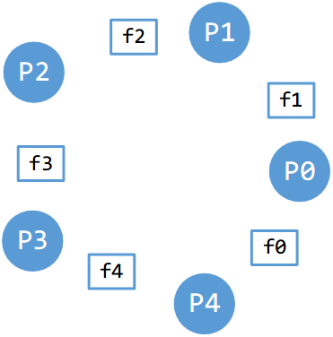
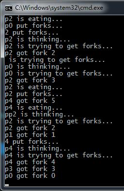
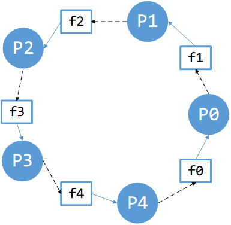

# 哲学家进餐问题

今天来聊聊操作系统并发主题中一个经典的问题：哲学家进餐问题。这个问题几乎在每本讲操作系统的书上都会提到，在笔试面试中也是常见。

## 问题描述

话说有5个哲学家围坐一桌，在他们两两之间都放了一把叉子。这些哲学家要么在思考人生，要么思考完后饿了就吃东西。但是这些哲学家都特别讲究，每个哲学家需要拿到他左右两边的两把叉子后才能进餐。吃完后放下叉子，继续思考人生。如此循环... 如下图所示，P 代表哲学家，f 代表叉子。



我们不管是谁这么无聊，把五个哲学家放一起又不玩桌游，也不管这些哲学家为什么可以接受用别人用过的叉子吃东西，而不能只用一把叉子吃东西。我们只关注其中的并发问题。如果哲学家 a 拿到了它左边的叉子，而右边的叉子被另一个哲学家 b 拿走。如果 a 采取的策略是拿着手中的叉子干等 b 放下叉子，而 b 又在等 c，...，这样就会形成一个闭环。每个哲学家都手握一把叉子等待另一个哲学家放下叉子。这样干等下去，所有的哲学家都会饿死。这个过程映射到计算机中，哲学家相当于线程，叉子相当于资源，哲学家相互干等在计算机中就叫”死锁“。我们要做的就是避免死锁的发生。

## 代码描述

这里我们先用代码描述一下哲学家进餐问题的整个过程，观察死锁是怎么发生的。我们给哲学家编号 0~5，给叉子也编号 0~5。

我们先描述一下哲学家的主要活动。用一个函数来表示哲学家在思考人生。

```c++
void think(int p)
{
	cout << "p" << p << " is thinking...\n";
}
```

p 表示哲学家的编号。

哲学家思考完后需要进餐，进餐得先获取叉子。因为进餐需要两把叉子，所以先获取左边的叉子，再获取右边的叉子。

```c++
void getforks(int p)
{
	cout << "p" << p << " is trying to get forks...\n";
	// 获取左边的叉子
	cout << "p" << p << " got fork " << p << endl;
	// 获取右边的叉子
	cout << "p" << p << " got fork " << p + 1 << endl;
}
```

标号为ｐ的叉子表示哲学家左边的叉子，编号为ｐ＋１的叉子表示哲学家右边的叉子。但实际上，上面的代码是有问题的。因为我们没有描述具体获取叉子的过程。一把叉子被某个哲学家获取后，就不能被其他哲学家再获取了。怎样表示叉子呢？你可能想用数组来表示叉子，用 bool 变量来表示叉子是否被获取。但这样会有一个竞态问题，可能会发生哲学家 P1 尝试获取 叉子 f1 时，判断出叉子 f1 没被获取，正要获取的时候发生线程切换，哲学家 P2 开始执行，尝试获取 f1，他也检测到 f1 没被获取，然后获取了 f1， 然后哲学家 P1 恢复执行，也获取了 f1。这样就出现另个哲学家获取了同一把叉子。所以我们得用互斥锁（或者二值信号量）来表示叉子。互斥锁的互斥性可以保证只有一把叉子只能同时被一个哲学家拿到。OK，我们更改一下获取叉子的代码。

```c++
mutex fork_mtxs[5];  //叉子对应的锁
// 获取叉子
void getforks(int p)
{
	cout << "p" << p << " is trying to get forks...\n";

	// 获取左边的叉子
	fork_mtxs[p].lock();
	cout << "p" << p << " got fork " << p << endl;

	// 获取右边的叉子
	fork_mtxs[(p + 1) % 5].lock();
	cout << "p" << p << " got fork " << p + 1 << endl;
}
```

哲学家进食：

```c++
void eat(int p)
{
	cout << "p" << p << " is eating...\n";
}
```

哲学家吃完后放下叉子：

```c++
void putforks(int p)
{
	cout << "p" << p << " put forks...\n";
	fork_mtxs[p].unlock();
	fork_mtxs[(p + 1) % 5].unlock();
}
```

再用一个循环表示哲学家的整个活动：

```c++
void philosoerLoop(int p)
{
	while (true)
	{
		think(p);
		getforks(p);
		eat(p);
		putforks(p);
	}
}
```

整个程序：

```c++
#include <iostream>
#include <string>
#include <thread>
#include <mutex>
#include <vector>
#include <chrono>

using std::cout;
using std::cerr;
using std::endl;
using std::thread;
using std::string;
using std::mutex;
using std::vector;

mutex fork_mtxs[5];  // 叉子对应的锁

// 哲学家p陷入思考
void think(int p)
{
	cout << "p" << p << " is thinking...\n";
}

// 哲学家p获取叉子
void getforks(int p)
{
	cout << "p" << p << " is trying to get forks...\n";

	// 获取左边的叉子
	fork_mtxs[p].lock();
	cout << "p" << p << " got fork " << p << endl;

	// 获取右边的叉子
	fork_mtxs[(p + 1) % 5].lock();
	cout << "p" << p << " got fork " << p + 1 << endl;
}

// 哲学家p放下叉子
void putforks(int p)
{
	cout << "p" << p << " put forks...\n";
	fork_mtxs[p].unlock();
	fork_mtxs[(p + 1) % 5].unlock();
}

// 哲学家进食
void eat(int p)
{
	cout << "p" << p << " is eating...\n";
}

// 哲学家循环
void philosoerLoop(int p)
{
	while (true)
	{
		think(p);
		getforks(p);
		eat(p);
		putforks(p);
	}
}

int main()
{
	vector<thread> threads;

	for (int i = 0; i < 5; i++)
	{
		threads.push_back(thread(philosoerLoop, i));
	}

	for (auto &th:threads)
	{
		th.join();
	}

	return 0;
}
```

### 观察死锁

执行一下代码。这种情况几乎肯定会发生死锁。



>   输出信息出现混乱是因为多个线程尝试向控制台输出信息，对控制台也竞争关系。我们忽略它就行。

程序执行一会后就会停下来不动。根据输出每个哲学家都拿到了一把叉子，然后死锁发生了。如下图：



我们用实线箭头表示某把叉子为某个哲学家所有，用虚线箭头表示某个哲学家在等待某把叉子。比如 P1 拿到了 f1，在等待 f2，但 f2 被 P2 拿到了，P2 又在等待 f3...这样就形成了一个闭环。计算机系统中也常有是否有这种闭环来判断是否有死锁发生。

## 一个简单的解决方案：改变申请资源的顺序

既然每个哲学家先获取到左边的叉子，再去获取右手边的叉子会出现闭环。我们可以改变其中某个哲学家获取叉子顺序，这样就不会形成闭环了。这种简单的解决方案由 Dijkstra 提出。我们让 P4 先获取右手边的叉子再获取左手边的叉子。获取叉子的代码就变成了：

```c++
void getforks(int p)
{
	cout << "p" << p << " is trying to get forks...\n";

	if (p == 4)
	{
		// 获取右边的叉子
		fork_mtxs[(p + 1) % 5].lock();
		cout << "p" << p << " got fork " << p + 1 << endl;

		// 获取左边的叉子
		fork_mtxs[p].lock();
		cout << "p" << p << " got fork " << p << endl;
	}
	else
	{
		// 获取左边的叉子
		fork_mtxs[p].lock();
		cout << "p" << p << " got fork " << p << endl;

		// 获取右边的叉子
		fork_mtxs[(p + 1) % 5].lock();
		cout << "p" << p << " got fork " << p + 1 << endl;
	}
}
```

再次运行一下代码，发现程序可以一直执行下去，不会出现停止的情况。

你可以画图分析一下这种情况，根本不可能产生闭环。

>   在某些情况下调整申请资源的顺序也可以避免死锁。

## 另一种解决方案：设置等待资源的时间

另一种打破闭环的方法是给哲学家等待叉子的行为设置一个期限，等待一段时间后放弃等待，并方向已有的叉子。这样即使形成了闭环，过一段时间自然有哲学家放弃手中的叉子，其他哲学家就可以进餐了。不过这种机制不能用锁实现，得用条件变量。