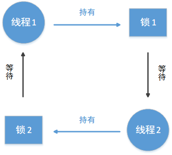
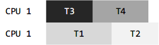
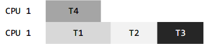

# 常见的并发 bug

在并发编程中，死锁是个经典的 bug。但更常见的是其他类型的 bug。本文尝试总结一下这些并发编程的常见的问题以及其解决方案。也许你会发现，本文其实是《Operating Systems：Three Easy Pieces》一书的读书笔记。

## 并发编程中的 bug 类型

《Operating System：Three Easy Pieces》将并发编程中的 bug 类型分为死锁 bug 和非死锁 bug。并且统计了四大开源软件中这两种类型的 bug 数量。统计到的四大开源软件包括：MySQL（流行的开源数据库系统），Apache（著名的 web server），Mozilla（浏览器），OpenOffice（开源的 Office 套件）。统计数据如下表：

| 软件         | 应用场景      | 非死锁 bug | 死锁 bug |
| ---------- | --------- | ------- | ------ |
| MySQL      | 数据库       | 14      | 9      |
| Apache     | Web 服务器   | 13      | 4      |
| Mozilla    | Web 浏览器   | 41      | 16     |
| OpenOffice | Office 套件 | 6       | 2      |
| 总数         |           | 74      | 31     |

可以看出，虽然死锁 bug 占一定比例，但非死锁 bug 更多。

## 非死锁 bug

非死锁 bug 占据了并发 bug 中大部分。但它们到底是什么样的 bug？怎么发生的？怎么解决？我们将分析非死锁 bug 中最主要的两种类型：原子性破坏 bug、顺序性破坏 bug。

### 原子性破坏 bug

原子性破坏 bug 是指一个线程中的某段代码在逻辑上应该为原子操作，但是执行到一半，切换到另一个线程执行，而另一个线程修改了这段代码的状态，导致原子性被破坏。这么说你可能不明白我在说什么，看下面的例子就一目了然。

```c
# 线程 1
if (thd)
{
  ...
fputs(thd->proc_info, ...);
  ...
}

# 线程 2
thd = NULL;
```

假设线程1 执行完 if 语句中的判断，正准备执行第 5 行的打印语句，访问指针变量 thd 指向的内容。突然发现线程切换，线程 1 休眠，线程 2 开始执行并将指针变量 thd 指向NULL。然后线程 1 恢复执行是就成了访问 NULL 指针指向的内容，于是内存错误，程序奔溃。

这种错误的解决方法也很简单，在 thd 前后加个锁就行了。线程 1 和 线程 2 在访问 thd 前都需要获得锁，这样可以保证 thd 的原子性访问。修改后的代码如下所示：

```c
pthread_mutex_t thd_lock = PTHREAD_MUTEX_INITIALIZER;

# 线程 1
pthread_mutex_lock(&thd_lock);
if (thd)
{
  ...
fputs(thd->proc_info, ...);
  ...
}
pthread_mutex_unlock(&thd_lock);

# 线程 2
pthread_mutex_lock(&thd_lock);
thd = NULL;
pthread_mutex_unlock(&thd_lock);
```

### 顺序性破坏 bug

不多说，直接上代码示例：

```c
# 线程 1
void init()
{
  ...
  mThread = PR_CreateThread(mMain, ...);
  ...
}

# 线程 2
void mMain(...)
{
  ...
  mState = mThread->State;
  ...
}
```

该代码本来的意思是在线程 1 中创建一个线程，并在线程 2 中访问新建线程的状态。但是如果如果线程 1 来不及创建这个新线程，线程 2 就开始执行并访问一个不不存在的线程状态。这样错误就产生了。正确的顺序应该是线程 1 先创建好线程，线程 2 才能访问新建线程的状态。我们需要某种机制来保证这个先后顺序，条件变量正适合干这事。修改后的代码如下：

```c
pthread_mutex_t mtLock = PTHREAD_MUTEX_INITIALIZER;
pthread_cond_t mtCond = PTHREAD_COND_INITIALIZER;
int mtInit = 0;

# 线程 1
void init()
{
  ...
  mThread = PR_CreateThread(mMain, ...);
  // 通知线程2 新线程已经创建好
  pthread_mutex_lock(&mtLock);
  mtInit = 1;
  pthread_cond_signal(&mtCond);
  pthread_mutex_unlock(&mtLock);
  ...
}

# 线程 2
void mMain(...)
{
  ...
  // 等待新线程创建好
  pthread_mutex_lock(&mtLock);
  while (mtInit == 0)
  {
    pthread_cond_wait(&mtCond, &mtLock);
  }
  pthread_mutex_unlock(&mtLock);
  mState = mThread->State;
  ...
}
```

上面的代码用一个变量 mtInit 表示新线程是否创建完毕，用条件变量 mtCond 来通知线程 2 新线程已创建好，并用一个锁 mtLock 保证对 mtInit 的原子性访问。如果你对条件变量的这种用法不理解，请看我的另一篇关于条件变量的博文。

### 非死锁 bug 小结

我们上面举的例子都很容易理解，但不要以为实际工程中的这类 bug 有这么好找，而且这么容易修复。实际工程中的数据结构往往很复杂，加上模块的封装，这种 bug 不容易发现，而且可能涉及到一大堆数据结构，不容易修复。

## 死锁 bug

形成死锁的情况一般是线程 A  持有锁 1，而在等待锁 2,；而线程 B 持有锁 2，而在等待锁 1。这样就现成了一个循环依赖。如下图所示。各个线程不会放弃自己已有的资源，也不会放弃。当然一个死锁中也可能不止两个线程，而是多个线程循环依赖。



既然死锁的特征这么明显，那为什么死锁还经常出现呢？我们应该怎样预防、避免死锁？或者退而求其次，怎样检测到死锁并恢复呢？

### 为什么会出现死锁？

你也许会觉得上图出现的死锁太简单了，只要让两个线程以一致顺序获取锁 1 和 锁 2，就不会有出现死锁了。但是现实中的大型系统很复杂，模块之间有着复杂的依赖关系。比如操作系统，虚拟存储系统可能需要访问文件系统来从磁盘导入数据块更新页面。文件系统随后可能向虚拟存储系统申请一个内存页面来读入数据块。所以大型系统中的锁策略需要小心设计，避免代码中自然出现的循环依赖。

另一个原因是因为封装。在软件开发中，我们倾向于模块化，隐藏实现细节而提供接口。但不幸的是，这种模块化和锁不搭。一些看似没毛病的接口将导致死锁。比如 Java 中的 Vector 类。一个线程可能会这样调用它的接口：

```java
Vector v1, v2;
v1.AddAll(v2);
```

因为该方法需要做到线程安全，所以 v1、v2 的访问都需要先获取锁。假如该线程先获取 v1 的锁，再获取 v2 的锁。假设这时候另一个线程调用了`v2.AddAll(v1)`，它先获取 v2 的锁，再获取 v1 的锁。这样就很容易产生死锁。但调用者对此一无所知。因为这种实现细节是隐藏的。

### 死锁产生的必要条件

要产生死锁，必须满足以下四个必要条件：

-   **互斥**：线程要求对它需要的资源进行互斥性访问。（要获取锁）
-   **持有并等待**：线程持有已经申请到的资源，并等待其他资源。
-   **不可剥夺**：线程已持有的资源（比如锁）不能强行拿走。
-   **循环等待**：存在一个循环链条，其中每个线程都持有一些资源并且在等待被下一个线程持有的资源。

如果这四个条件中有任何一个不满足都不会出现死锁。下面要将的预防死锁的方法就是防止出现这四个必要条件中的某一条。

### 预防死锁

下面从死锁发生的四个必要条件入手，只要破坏四个条件中的一个就能预防死锁。

#### 打破循环等待

可能最实用的（也是最常用的）死锁预防技术就是打破循环等待了。在写锁相互的代码时避免构成一个环。不免环的最直接方法就是给各个线程规定一个总的获取锁的顺序。比如在只有两个锁 L1、L2 的系统，你可以规定所有线程必须先获取 L1，然后再获取 L2，这样永远不会出现循环等待，也就不会出现死锁了。

当然，在复杂的系统中，锁的数量可能远远大于 2。很难规定一个总的锁获取顺序。可以只规定部分锁的获取顺序，同样也可以预防死锁。比如在哲学家进餐问题中的死锁问题，你不需要解开所有环节，解开其中一个节点就行。

不管是规定总的获取锁顺序还是部分锁的获取顺序，都需要小心翼翼的设计锁策略。而且，这种顺序只是一种惯例，一个草率马虎的程序员很容易忽略这种锁协议，从而导致死锁。另外，这种排序需要深刻理解代码库，明白各个例程的调用过程，一个不小心就可能会导致死锁。

>   tip:获取锁时，如果逻辑上两个锁没有先要顺序的要求。可以根据锁变量的地址值大小来排序，所有线程都先获取地址值小的锁变量，再获取地址值大的锁变量。

#### 打破持有并等待

既然持有并等待是因为获取了部分锁，然后等待另外的锁。我们可以然线程要么获取到所有锁，要么一个都不获取到。也就是保证所有锁的原子性获取。额外用一个锁来包含这些锁。（有锁保护锁，怎么有点循环依赖的感觉，但是真的有效哦。每个线程中的获取锁的代码如下所示：

```c
pthread_mutex_lock(prevention); // 开始获取锁
pthread_mutex_lock(L1);
pthread_mutex_lock(L2);
...
5 pthread_mutex_unlock(prevention); // 获取完毕
```

这样任何一个线程都获取锁 L1 和 L2 的过程都是原子性的。自然也不会因为获取 L1 和 L2 而引发死锁。

但这种解决方法是有很多局限性。其一是因为这种方法需要具体的知道某个过程需要获取哪些锁，和封装相矛盾。其二是这种方法会降低系统的并发性，因为所有的锁都必须提前得到，而不是等到真的需要它们。

#### 打不可剥夺

既然多线程陷入死锁的原因是因为等待其他线程持有的锁，我们可以让线程在获取不到锁时主动放弃已有的锁。这样其他线程就可以获取到锁，就不会出现死锁了。很多线程库都提供了这种灵活的接口，可以先尝试获取锁，获取不到直接返回一个值告之调用者，而不是无限期等待，调用者可以根据返回值决定放弃已持有的锁。示例代码如下：

```c
top:
  pthread_mutex_lock(L1);
  if (pthread_mutex_trylock(L2) != 0)
  {
    pthread_mutex_unlock(L1);
    goto top;
 }
```

不过这样又引发了一个新问题：**livelock**。就是两个线程可能都重复的尝试该过程。虽然没形成死锁，但两个线程长时间都在不停重复这个尝试获取的过程。过程如下：

```c
线程 1 获取到 L1
线程 2 获取到 L2
线程 1 尝试获取 L2，获取不到
线程 2 尝试获取 L1，获取不到
线程 1 放弃 L1，重新开始整个获取过程
线程 2 放弃 L2，重新开始整个获取过程
```

livelock 有一个解决方法就是在线程每次尝试重新获取锁之前都休眠一个随机延迟。这样可以大大减小 livelock 的可能性。

除了livelock，这种尝试获取锁的方法也有缺点：还是封装问题，如果某个锁的获取封装在某个被调用的例程中，想要重新跳转回去实现起来很困难，特别是当现场在获取 L1 后还申请了其他资源，要跳转到获取 L1 之前就得小心释放这些申请的资源。所以这种方法的使用场景有限。比如在 Java 的 vector 方法实现中就很适用。

#### 打破互斥

最后一种预防死锁的方法是打破互斥，听起来几乎不可能，因为我们的线程代码本身就有临界区，不用锁来做互斥怎怎么行。

这种方法是利用强大的硬件指令搭配各种特殊的数据结构来实现无锁结构。使用的场景也比较受限。业界用的不多，本人不感兴趣。略过...

### 通过调度避免死锁

有些场景死锁避免比死锁预防的方法更合适。死锁避免需要提前知道各个线程需要获取哪些锁，并以某种方式调度这些线程，来保证死锁不会发生。也就是通过调度来避免死锁的发生。

比如，假设我们有两个CPU，四个线程。进一步假设我们知道线程1（T1）需要获取锁 L1 和 L2，T2 也需要获取 L1 和 L2，T3 需要获取 L2，T4 不需要任何锁。需求表如下：

|      |  T1  |  T2  |  T3  |  T4  |
| :--: | :--: | :--: | :--: | :--: |
|  L1  | yes  | yes  |  no  |  no  |
|  L2  | yes  | yes  | yes  | yes  |

调度器可以计算出只要 T1 和 T2 不同时运行就不会出现死锁。所以使用如下图所示的调度方案：



再看另一个竞争更激烈的例子。需求表如下：

|      |  T1  |  T2  |  T3  |  T4  |
| :--: | :--: | :--: | :--: | :--: |
|  L1  | yes  | yes  | yes  |  no  |
|  L2  | yes  | yes  | yes  |  no  |

T1，T2 和 T3 都需要 L1、L2 。下面是一种可能的调度方案可以避免死锁：



不过这种完成所有任务的总时间就比较长了。虽然可以并发的执行这些任务，但是因为害怕死锁而选择了最保守的方式，以性能为代价换取安全。

此类解决方法比较著名的有 Dijkstra 提出的银行家算法。此类方法有两个缺点：其一是，这类方法只适用于有限的场景。比如在某个嵌入式系统中，所有需要执行的任务以及他们需要获取的锁都是提前预知的。其二是，这类方法减少了并发性。所以通过调度来避免死锁并不是一个广泛采用的通用解决方法。

### 检测并恢复

最后一个一般性的解决策略是允许死锁偶尔发生，在检测到死锁时采取措施。例如，某个系统一年才宕机一次，那你只需要重启它就行了。如果死锁出现的次数很少，这也是种务实的解决方案。

很多数据库系统中都采用死锁检测和恢复技术。一个死锁检测器定时执行，创建一个资源图，检测其中是否出现环。如果发现环，说明系统出现了死锁，可能需要重启系统。如果数据结构需要更复杂的修复，相关人员需要参与过程。

