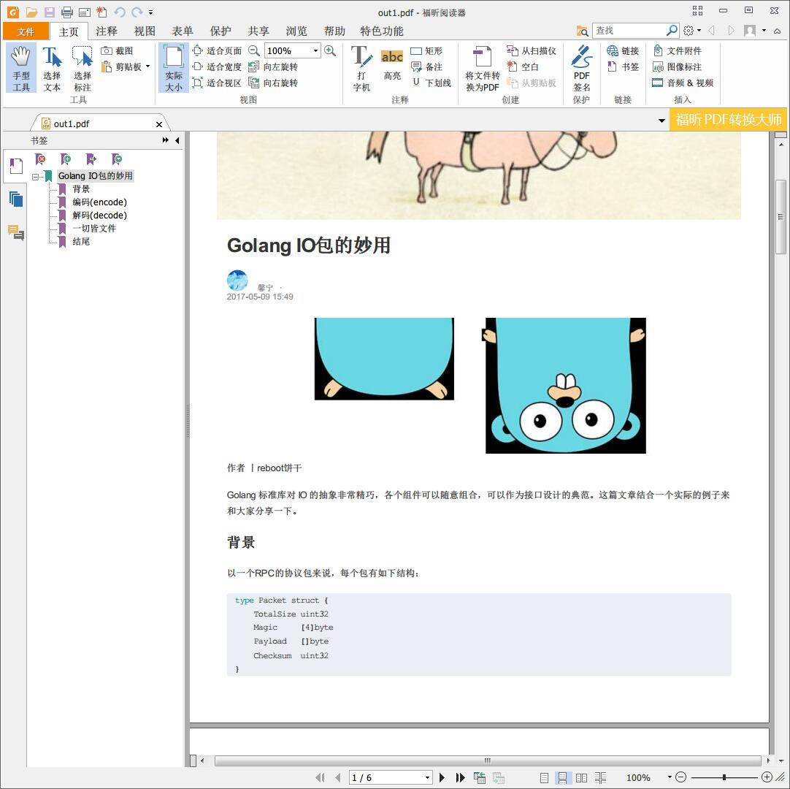

# Python 的 HTML to PDF 库比较

按关键字搜索到了 pdfkit、Weasy Print、xhtml2pdf

## PDFKit

### 简介

**PDFKit** 是 Wkhtmltopdf 的Python 版包装。而 Wkhtmltopdf 使用 webkit 渲染引擎和 qt 来实现 html 到 pdf 的转换。支持 Python2 和 Python 3。

wkhtmltopdf 需要 X server，但如果程序的运行环境，比如 VPS，没装 X server 的服务器，你需要安装一个“虚拟”的 X server。参见[这里](https://github.com/JazzCore/python-pdfkit/wiki/Using-wkhtmltopdf-without-X-server)。

[GitHub 仓库](https://github.com/JazzCore/python-pdfkit)

[pypi 地址](https://pypi.python.org/pypi/pdfkit)

### 安装

1.  安装 Python-PDFkit

```shell
$ pip install pdfkit
```

2.  安装 wkhtmltopdf

Debian/Ubuntu 平台：

```shell
$ sudo apt-get install wkhtmltopdf
```

警告：pypi 官网说 debian/ubuntu 仓库中的 wkhtmltopdf 编译时没有包好 wkhtmltopdf 的 QT 补丁，所以缺少一些功能，比如添加页眉、页脚、大纲（书签）、TOC （目录）等。要使用这些功能，你可以在 wkhtmltopdf [官网](http://wkhtmltopdf.org/)下载静态的二进制文件安装，或者使用[该脚本](https://github.com/JazzCore/python-pdfkit/blob/master/travis/before-script.sh)自动安装。

如果是 Windows 平台，可以去[官网](http://wkhtmltopdf.org/)下载对应的二进制文件安装。

### 使用

对于简单转换任务：

```python
import pdfkit

pdfkit.from_url('http://google.com', 'out.pdf')
pdfkit.from_file('test.html', 'out.pdf')
pdfkit.from_string('Hello!', 'out.pdf')
```

你也可以用列表一次性传递多个 URL 或文件

```python
pdfkit.from_url(['google.com', 'yandex.ru', 'engadget.com'], 'out.pdf')
pdfkit.from_file(['file1.html', 'file2.html'], 'out.pdf')
```

你也可以直接传递一个打开的文件对象：

```python
with open('file.html') as f:
    pdfkit.from_file(f, 'out.pdf')
```

如果你希望进一步对待产生的 pdf 文档进行处理，你可以用变量保存：

```python
# Use False instead of output path to save pdf to a variable
pdf = pdfkit.from_url('http://google.com', False)
```

你也可以使用一些选项来控制生成文档的排版、获取网页时使用 header 等。对于重复的选项，例如 custom-header 你可以使用列表或元组。

```python
options = {
    'page-size': 'Letter',
    'margin-top': '0.75in',
    'margin-right': '0.75in',
    'margin-bottom': '0.75in',
    'margin-left': '0.75in',
    'encoding': "UTF-8",
    'custom-header' : [
        ('Accept-Encoding', 'gzip')
    ]
    'cookie': [
        ('cookie-name1', 'cookie-value1'),
        ('cookie-name2', 'cookie-value2'),
    ],
    'no-outline': None
}

pdfkit.from_url('http://google.com', 'out.pdf', options=options)
```

由于 wkhtmltopdf 的命令行语法，TOC（目录） 和 Cover （封面）选项必须分开指定。如果你需要 Cover 排在 TOC 之前，使用 cover_first 选项指定。

```python
toc = {
    'xsl-style-sheet': 'toc.xsl'
}

cover = 'cover.html'

pdfkit.from_file('file.html', options=options, toc=toc, cover=cover)
pdfkit.from_file('file.html', options=options, toc=toc, cover=cover, cover_first=True)
```

你还可以指定转换时使用的 css 文件

```python
# Single CSS file
css = 'example.css'
pdfkit.from_file('file.html', options=options, css=css)

# Multiple CSS files
css = ['example.css', 'example2.css']
pdfkit.from_file('file.html', options=options, css=css)
```

Warning This is a workaround for [this bug](http://code.google.com/p/wkhtmltopdf/issues/detail?id=144) in wkhtmltopdf. You should try –user-style-sheet option first.

也可以直接在 THML 用 meta 标签中指定选项。

```html
body = """
    <html>
      <head>
        <meta name="pdfkit-page-size" content="Legal"/>
        <meta name="pdfkit-orientation" content="Landscape"/>
      </head>
      Hello World!
      </html>
    """

pdfkit.from_string(body, 'out.pdf') #with --page-size=Legal and --orientation=Landscape
```

### 配置

每个 pdfkit API 调用都有一个可选的配置参数。该参数必须是 pdfkit.configuration() API 调用返回的示例。该 API 接收配置选项为初始化参数。可用的参数包括：

-   wkhtmltopdf -  wkhtmltopdf 二进制文件的路径（看来 pdfkit 是直接包装了该二进制文件）。默认情况下，pdfkit 会使用`which`（类 UNIX 环境） 或 `where` （Windows 环境）来自己确定 wkhtmltopdf 可执行文件的位置。
-   meta_tag_prefix - pdfkit 特定元标签的前缀（在 HTML 中使用的标签），默认前缀为 `pdfkit-`。

例子：

```python
config = pdfkit.configuration(wkhtmltopdf='/opt/bin/wkhtmltopdf')
pdfkit.from_string(html_string, output_file, configuration=config)
```

### Troubleshooting

-   `IOError: 'No wkhtmltopdf executable found'`:

    确保你的 $PATH 中包含了 wkhtmltopdf 的路径，或者使用配置显示指定 wkhtmltopdf 可执行文件的路径。

-   `IOError: 'Command Failed`:

    该错误意味着 PDFKit 无法处理你的输入。你可以尝试直接执行命令行程序，找出是哪些错误导致了失败（对于某些 wkhtmltopdf 版本，可能是段错误）。

### 本人使用经历

我爬取了网页保存到本地，并做了一些修改。用如下代码测试了一下：

```python
import pdfkit

config = pdfkit.configuration(wkhtmltopdf='C:/Program Files/wkhtmltopdf/bin/wkhtmltopdf.exe')
pdfkit.from_file('out.html', 'out1.pdf', configuration=config)
```

运行后报错如下：

```
C:\Python361\python.exe "D:/Python 练习/pdfkittest.py"
Traceback (most recent call last):
  File "D:/Python 练习/pdfkittest.py", line 5, in <module>
    pdfkit.from_file('out.html', 'out1.pdf', configuration=config)
  File "C:\Python361\lib\site-packages\pdfkit\api.py", line 49, in from_file
    return r.to_pdf(output_path)
  File "C:\Python361\lib\site-packages\pdfkit\pdfkit.py", line 156, in to_pdf
    raise IOError('wkhtmltopdf reported an error:\n' + stderr)
OSError: wkhtmltopdf reported an error:
Loading pages (1/6)
QFont::setPixelSize: Pixel size <= 0 (0)
Counting pages (2/6)                                               
QFont::setPixelSize: Pixel size <= 0 (0)
Warning: Received createRequest signal on a disposed ResourceObject's NetworkAccessManager. This might be an indication of an iframe taking too long to load.
Resolving links (4/6)
Loading headers and footers (5/6)                                           
Printing pages (6/6)
Done                                                                      
Exit with code 1 due to network error: ContentNotFoundError


Process finished with exit code 1
```

看来有一些网络访问错误。不过还是成功的生成了 pdf 文件。我查看了一下 pdf 文件，和原网页的效果差不多。感觉没毛病。效果如下：



