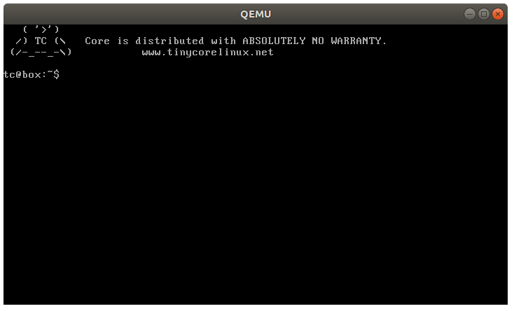
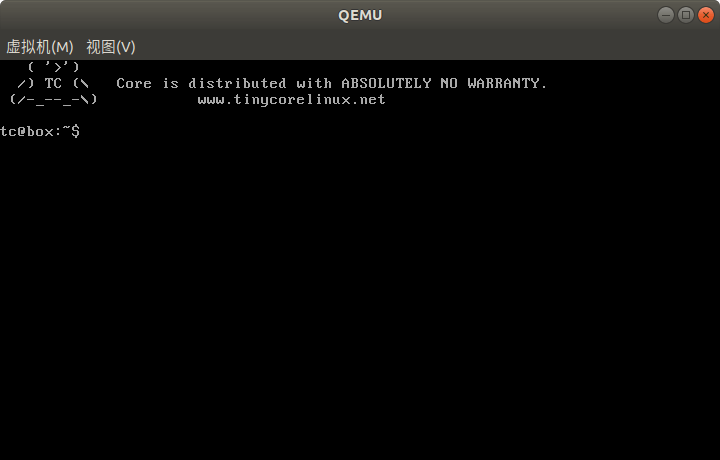
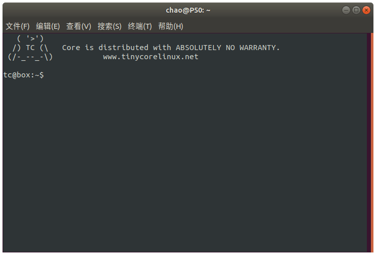

# QEMU 的各种现实类型

`qemu-system-x`可以设置虚拟机的图形显示方式。参数为`-display type`，其中 type 可以为 sdl、curses、none、gtk、vnc。我们来尝试一下。

一般 QEMU 启动虚拟机时都会在一个窗口中显示 QEMU 监视器、虚拟机的 VGA 图形或文本模式输出

## sdl

如果不指定 `-dsiplay type`，默认的显示类型就是`sdl`。表示用 SDL 库绘制的监视器窗口。`-display sdl`的选项为`-sdl`。

```shell
$ qemu-system-i386 -sdl ./tinycorelinux.img
```

这里的 tinycorelinux.img 是我 TinyCore linux 制作的一个镜像。效果如下：



## gtk

```shell
$ qemu-system-i386 -display gtk ./tinycorelinux.img
```



可以看到用 GTK 绘制的窗口有两个菜单选项：**虚拟机(M)**、**视图(V)**。

## curses

`-display curses`的快捷命令是`-curses`，通过 curses 接口显示文本模式的输出。如果图形设备处于图形模式或者图形设备不支持文本模式则什么也不输出。

>   curses 是一个在终端绘制图形的库。



这种现实方式直接将当前终于当成虚拟机的终端。你可以用快捷键`Esc+1,2`在监视器终端和虚拟机终端来回切换。

## vnc

`-display vnc=<arg>`的快捷命令为`-vnc <arg>`，表示为虚拟机启动一个 VNC 服务。然后可以通过 VNC 客户端访问虚拟机的图形界面。

```shell
$ qemu-system-i386 -display vnc=127.0.0.1:5901 ./tinycorelinux.img
```

运行该命令后，我们看不到任何虚拟机界面。但是可以通过 VNC 客户端访问虚拟机界面。

我们来用 gvncviewer 访问试试：

```shell
$ gvncviewer 127.0.0.1:5901
```

就可以看到如下效果：


## none

`-display none`表示不显示虚拟机的输出。这种模式表示虚拟机是有一张虚拟显卡的，但是 QEMU 没有显示虚拟机的输出。目前不太了解这种模式有什么意义，这怎么和虚拟机交互呢？通过网络吗？

## `-display none`和`-nographic`的区别

`-nographic`目前不太了解，看官方文档的意思是：`-display none`只是不显示虚拟机的输出，而后者还对虚拟机的串口和并口进行了重定向。