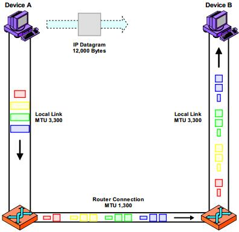
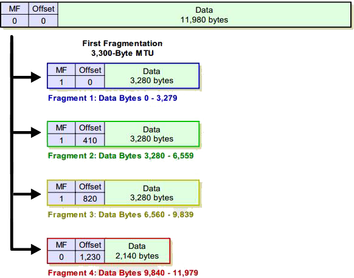
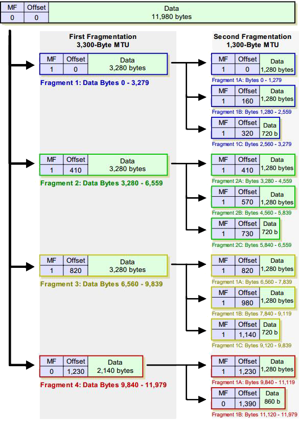

# IP 数据报的分片和重组

IP 的主要任务时在互联的设备之间交付数据。需要把从高层收到的数据封装到 IP 数据报中，然后在网下传给数据链路层封装成帧，再通过物理网络链路发送。设备与设备相连的下层网络连接可能是局域网、无线局域网、拨号连接、DSL 等。每个物理网络都有各自的帧格式，每种格式都限制了单个帧中能够发送的最大数据量。如果某个 IP 数据报长度大于下层网络帧能承载的最大数据量，就需要对数据报进行分片处理，然后这些数据报被单独发送并再重组为初始报文。

## MTU 和数据报分片

每个物理网络链路上能传输的最大帧长度叫网络的最大传输单元（MTU）。通常以太网的 MTU 为1500 字节。RFC 791 规定路由器处理的 MTU 至少为 576。不同的物理网络 MTU 值可能不一样。

IP 层收到跨越互联网发送的报文时，首先检查其长度，计算添加首部（20 字节或更多）后的 IP 数据报长度。如果长度超过了下层网络的 MTU，IP 成会将报文分成多个 IP 片。

举个例子，假如你要想楼下实验室的同学发送数据。但你所在实验室的物理网络 MTU 是 3300，而里同学实验室所在物理网络的 MTU 只有 1300，两个实验室的网络通过一个路由器连接。你发送的数据报到达路由器时大多是 3300 字节，然后路由器对这些数据报分片，分成最大为 1300 数据报才能继续发送到你同学的电脑上。

## 多阶段分片

有时候发送的数据跨越一个物理网络时进行了一次分片，而下一个物理网络的 MTU 更小，还得再进行一次分片。下图是一个例子。

这个例子展示了一个 IP 数据报两次分片的过程。图中矩形按比例表示不同大小数据报或数据报片。设备 A 产生了一个大小为 1200 字节的数据报，在经过第一个 MTU 为 3300 字节的物理链路时被分成 3 个3300 字节和一个小一点的数据报片。经过第二个 MTU 为 1300 的链路时，各个数据报片被再次分片。经过地三个 MTU 为 3300 字节的物理链路时并不会发生重组，重组发生在设备 B 上。

## 数据报分片需要解决的问题及对应的 IP 数据报首部字段

将 IP 数据报分片然后重组需要解决一下三个问题:

-   **顺序和放置**。分片产生的片通常从按原始报文从头到尾的顺序传输，但并不一定。事实上，某些实现方式是先发送最后一片，以便接收设备立即知道原始报文的总长度。接收设备收到这些片后必须能够知道这些片在原始报文中的顺序，以便正确的重组它们。
-   **不同数据报的分片隔离**。源设备可能一次发送多个需要分片的数据报。目的设备收到这些报文后必须能够分辨哪些片属于同一个数据报，以便重组。
-   **完成**。接收数据时，目的设备必须能够知道何时已经收到一个数据报的所有片了，以便开始重组。

IP 数据报的设计针对这几个问题在首部中添加了相应字段。其中：

-   **片偏移量**对应**顺序和放置**问题。片偏移量对应了片在初始数据报中的位置顺序。
-   **标识**字段对应**不同数据包的分片隔离问题**。标识字段值相同的分片属于同一报文。
-   **标志**字段中的一个 比特位（MF）对应**完成**问题。来自同一个初始报文的最后一个分片 MF 标志位 0，其他的 MF 标志为 1。接收到 MF 标志为 0 的分片就意味着接收了所有分片，可以开始重组了。

## 一个数据报分片的实例

执行分片的设备遵从特定的算法对报文进行分片，但分片的具体实现取决于具体的设备。接前面的例子，我们来看看其具体分片过程的典型实现。下图描述了这个过程。

初始报文有 12000 字节，其中首部 20 字节，负载数据 11980 字节。需要按 MTU 为 3300字节 来分片。具体分片过程如下：

-   取初始报文前 3300 字节数据成为第一片。包含了初始报文的首部（首部中的一些字段被修改）。初始报文还剩下 8700 （12000-3300）字节的负载数据需要封装。
-   从初始报文剩下的 8700 字节中取前 3280 字节数据，添加一个20 字节新首部，生成第二片（3300 字节）。初始报文还剩下 5420 字节。
-   从初始报文剩下的 5420 字节中取前 3280 字节的数据，添加一个 20 字节的新首部，生成第三片。初始报文还剩下 2140 字节。
-   将剩余的 2140 字节加上一个 20 字节的新首部，生成第四片。

注意第一个分片的总长度字段、MF 标志、片偏移字段都被修改。前三个分片的 MF 为 1，最后一片的 MF 标志为0，表示它是报文的最后一个分片。

第一片的偏移字段为0，第二片的偏移字段为 410，表示该片位于初始报文负载数据的第3280（410x8）字节。

另一个对分片重要的标识字段没给出，这个四个分片的标识字段相同。

## 多次分片

如果分片后的报文片在经过一个 MTU 更小的物理链路时，需要再进行一次分片。接上面的例子，假如上面分片后的数据又经过一个 MTU 为 1300 字节的物理链路时，再次分片的结果如下图：

可以看到第二次分片产生的分片格式和第一次分片产生的分片格式一样。注意，还是只有一个片的 MF 位为0。所以并不能从分片结果上看出一个分片到底经过了几次分片操作。这样重组的时候只需要重组一次就行。

## 报文重组

源设备或中间路由器对数据报分片后，一个数据报就变成了多个报文片。报文的目的设备必须收集所有的数据报片，根据片首部中的几个关键字段，将数据报片重组成初始报文。

### 报文重组只发生在目的设备

虽然报文分片对应报文重组，但它们并不是两个对称的过程。区别在于：中间设备能够对数据报进行分片，或进一步分片已经被分过片的数据报。但中间设备不会对数据报进行重组。及时很小的数据报片传输到 MTU 很大的物理链路上也不会进行重组。

### 报文重组只发生在目的设备的原因

-   分片从源设备到达目的设备的路径可能不同，中间路由器无法看到报文的所有片。
-   路由器如果需要执行分片重组的话，会增加复杂性。
-   路由器执行报文重组的话，得等所有的分片到达，重组后才能继续发送。这样会减缓选路速度。

### 这种设计带来的缺陷

虽然协议规定中间设备不对数据报进行重组，但这种设计也有其缺陷：

-   有很多小的片经过长距离传输，增加了片丢失的概率，进一步增加了整个报文丢失的概率。
-   使得数据链路层帧容量效率降低。同样的报文，链路层发送的帧明显变多了。

## 报文重组过程

重组过程的具体实现取决于具体设备，但通常包含下列过程（或功能）：

-   **片识别和分片报文标识**。片识别是指根据数据报中的 MF 为 1 或片偏移大于 0 来判断收到了报文片。分片报文标识根据源和目的 IP 地址、首部中的协议标识、标识字段识别报文。
-   **缓存初始化**。接收设备初始化缓存，以便存储接收到的报文片。
-   **定时器初始化**。接收设备为报文的重组过程设置定时器。定时器确保设备不会无限期的等待丢失的报文。
-   **片接收和处理**。无论何时报文的一个片到达，将该片插入报文缓存中由片偏移字段指定的位置，同时记录该报文的这个部分已到达。

当整个缓存区填满并且收到了 MF 比特位置 0 的片，重组就完成了。重组后的数据报与正常的、未分片的数据报一样处理。如果重组定时器超时，说明由报文片丢失，该报文就不能重组出来。这些片会被丢弃并产生一个 ICMP 超时报文。

## MTU 路径发现

从前面的内容可以看出，分片会引入更多的首部信息，导致负载数据在整个传输数据中的比例变小，而且分片也需要时间。所以分片降低了效率。为了提高效率，我们需要尽可能使用最大的 MTU，尽量减少分片的过程。

### 路径 MTU

如果我们知道两个设备之间所有物理网络的最小 MTU，发送数据时以这个 MTU 值决定 IP 报文的大小，就可以避免分片。这里引入一个路径 MTU 的概念。

**路径 MTU**：两个通信设备之间路径中的最小 MTU。

路径 MTU 不一定是一个常数，它取决于当时所选择的路由。而选路不一定是对称的。因此路径 MTU 在两个方向上不一定是相同的。

### 路径 MTU 发现

我们可以使用 MTU 路径发现报文获知整个路径上的 MTU。

MTU 路径发现报文采用了 ICMP 的差错报告机制。路由器在发现数据报过大必须要分片才能通过，但 DF 为 1 的数据报时，就返回一个目的地不可达的 ICMP 报文。

通过发送不同大小的数据报，并设置不允许分片标志（DF）阻止路由器分片，这样就可以探明该路径上的最小 MTU。

## 参考

《TCP/IP 详解卷一：协议》 W. Richard Stevens

《TCP/IP 指南卷一：底层核心协议》 Charles M. Kozierok