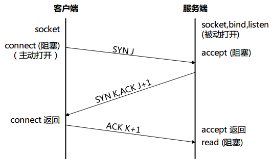

# TCP 和UDP 基础 

## 概述

UDP 是一个简单的、不可靠的数据包协议。无连接。

TCP 是一个复杂的、可靠的字节流协议。有连接。

## UDP 的不可靠性

UDP 不保证 UDP 数据数据报会到达最终目的地，不保证各个数据包的先后顺序跨网络后保持不变，也不保证每个数据包只到达一次。

没有确认机制，没有超时和重传。

## UDP的无连接特性

UDP 客户端与服务器之间不必存在任何长期的关系。例如，一个 UDP 客户端可以创建一个套接字并发送一个数据报给一个给定的服务器，然后立即用同一个套接字发送另一个服务器。同样地，一个 UDP 服务器可以用同一个 UDP 套接字从若干个不同的客户接收数据报。

## TCP 连接

TCP 客户端和服务器之间要先建立连接，然后在该连接上交换数据。

## TCP 的可靠性

### 确认和重传机制

当 TCP 向另一端发送数据时，它会等待对方返回一个确认。如果没有收到确认，TCP 就自动重传数据并等待更长时间。在数次重传失败后才放弃，这种尝试发送数据上所花的时间一般为 4~10 分钟（依赖于具体实现）。

>   TCP 并不保证数据一定会被对方端点收到（这也是不可能的）。TCP 只是尽力将数据传送到对方端点，否则就放弃重传并中断连接来通知用户。也可以说 TCP 并不是 100% 可靠的协议，它提供的是数据的可靠传送或故障的可靠通知。

### RTT 动态估算

TCP 含有动态估算客户和服务器之间的往返时间（round-trip time，RTT）的算法，以便它知道等待一个确认需要多少时间。例如，RTT 在一个局域网内大约是几毫秒，跨越一个广域网可能是数秒。另外，RTT 受网络流通各种变化因素的影响，TCP 会持续估算一个连接的 RTT（也就是说 RTT 是随网络情况动态更新的）。

### 数据序列号

TCP 通过给要发送的数据的**每一个字节**关联一个序列号来进行排序。例如，某个应用写 2048 个字节的数据到一个 TCP 套接字，导致 TCP 发送 2 个报文：第一个报文所含数据的序列号为 1~1024，第二个报文所含数据的序列号为 1025~2048。如果这些报文非顺序到达，接收端可以根据序列号来重新排序，排好序后再递给接收应用。如果接收端收到来自对端的重复数据（譬如对端认为一个报文已丢失并因此重传了一份，而现实是这个报文没有丢失，只是拥挤了），就可以根据序列号判断出数据是重复的，直接丢掉重复数据。

接收端发送确认时也要通过序列号指出收到了哪些数据。

### TCP 可靠性总结

TCP 通过确认和重传机制保证了数据的可到到达，并使用 RTT 动态估算算法决定每次确认等待的时间，通过序列号来保证数据的有序性和判断数据是否重复。所以说，TCP 就是吊。

## TCP 的流量控制

TCP 总是告知对端任何时刻它一次能从对端接收多少字节的数据，这就是**通知窗口**。任何时刻，该窗口代表接收缓冲区当前可用空间大小，从而保证发送端发送的数据不会使接收缓冲区溢出。这个窗口是动态变化的：当接收到对端的数据时，窗口就减小，当接收端应用从缓冲区读取数据时，窗口就增大。通知窗口窗口减小到 0 也是有可能的：当 TCP 对应套接字的接收缓冲区已满，导致它必须等待应用从该缓冲区读取数据时，才能再从对端接收数据。

## TCP 的三路握手

TCP 建立连接的过程如下：

1.  服务端调用 socket、bind 和 listen 函数完成准备工作，称之为被动打开。
2.  客户端调用 connect 发起连接，成为主动打开。导致客户 TCP 发送一个 SYN（同步）报文，告知服务端客户在连接建立后要发送数据的初始序列号。通常 SYN 报文不携带数据，其所在 IP 数据报包含一个 IP 首部、一个 TCP 首部及可能的 TCP 选项。
3.  服务端向客户端发送一个报文，该报文包含对客户端 SYN 的确认（ACK）和自己的 SYN。也是就说服务端在单个报文中发送了 SYN 和对客户 SYN 的 ACK （确认）。
4.  客户端向服务器发送一个 ACK，用于确认服务端的 SYN。

这个过程需要发送三个报文，所以称之为三路握手。

上图是 TCP 三路握手的图示。客户端初始的序列号为 J，服务端初始序列号 K。ACK 中的确认号是发送 ACK 这端期待的下一个序列号。因为 SYN 报文已经占用了一个字节的序列号空间，所以 ACK 中的确认号是对应 SYN 的初始序列号加 1。

## TCP 连接终止

TCP 建立连接需要 3 个报文，终止一个连接则需要 4 个报文。（所以有人把 TCP 终止连接叫四路分手）

步骤如下：

1.  TCP 某端的应用调用 close，称该端执行**主动关闭**。导致该端的 TCP 发送一个 FIN 报文，表示数据发送完毕。
2.  接收到这个 FIN 报文的对端执行**被动关闭**。这个 FIN 由 TCP 确认，即 TCP 发送一个 ACK （确认）。它的接收也是作为一个文件结束符传递给接收端应用进程。该文件结束符会排在该应用进程接收的任何数据之后，因为 FIN 的接收意味着接收端应用进程在相应连接上再无后续数据可以接收。
3.  一段时间后，接收到文件描述符的应用调用 close 关闭它的套接字。导致该端 TCP 也发送一个 FIN 报文。
4.  主动关闭端收到 FIN 报文后发送一个 ACK 报文来确认这个 FIN。

每个方向都需要一个 FIN 和一个 ACK，因此通常需要 4 个报文。但某些情况下步骤 1 的 FIN 可以随数据一起发送。另外步骤 2 和 步骤 3 的报文都出自被动关闭端，有可能合成一个报文。

整个过程的图示如下：

ACK 中的确认号是该端期望收到对端后续数据的序列号，因为 FIN 报文消耗了一个序列号，所以 ACK 中的确认号是对应 SYN 的序列号加 1。

## 参考

《UNIX 网络编程卷一：套接字互联网API》 W. Richard Stevens,Bill Fenner,Andrew M. Rudoff

《TCP/IP 指南卷一：底层核心协议》 Charles M. Kozierok