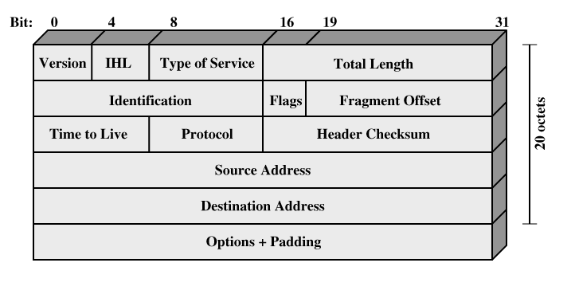

# 从 IP 数据报格式说起

本文尝试从 IP 数据报格式来谈谈网络协议在 IP 层的各种行为和特性。本文说的 IP 数据报特指 IPv4 数据报。

## IP 数据报首部格式

IP 数据报分为首部和负载两部分。首部包含寻址和控制字段，而负载就是要在网络上发送的数据。首部格式如上图所示。下面挨个说明一下各个字段的意义。

|        字段名         | 长度（字节） |                    描述                    |
| :----------------: | :----: | :--------------------------------------: |
|    版本号(Version)    | 4 bit  |           IP 数据报的版本号。IPv4 为 4            |
|     首部长度(IHL)      | 4 bit  | 指定首部的长度。单位为4个字节的字。一般IP首部为20个字节。所以该值一般为 5。5x4=20(字节) |
|     服务类型（TOS）      |  1 字节  |   用于携带提供服务质量特征信息的字段，如 IP 数据报的优先交付。用的不多   |
|      总长度（TL）       |  2 字节  | 指定 IP 数据报的总长度，单位为字节。由于该字段只有16个bit，所以一个 IP 数据报的总长度最大为 65535 个字节 |
| 标识(Identification) |  2 字节  | 报文的分片标识，属于同一个报文的每个分片，该值是相同的。接收设备会把该字段值相同的所有分片组成一个报文 |
|     标志(Flags)      | 3 bit  | 3 个控制标志，两个用于管理分片，另一个预留。其中 DF 比特位用于设置是否允许分片，DF 比特位用于只是该片是否为报文的最后一片 |
|        片偏移         | 13 bit |       指定该分片中的数据位于报文中的偏移量，单位为 8 字节        |
|      生存期(TTL)      |  1 字节  | 指定该数据报在网络上允许生存的时间，单位为路由器跳数。每个路由器在发送数据报前会将该值减1，如果TTL 字段减到0，则认为该数据报经历了太长的路由，丢弃该数据报 |
|    协议(Protocol)    |  1 字节  | 标识数据报所携带数据的高层协议，通常是传输层或封装的网络层协议，如TCP、UDP、ICMP... |
|       首部检验和        |  2 字节  |   根据 IP 首部计算得到的检验和码，用于检测首部在传输过程中是否出现差错   |
|        源地址         |  4 字节  |            最初发送该数据报的设备 IP 的地址            |
|        目的地址        |  4 字节  |             数据报最终接收方的 IP 地址              |
|         选项         |  可变的   |       一个或多个选项可能包含在 IP 数据报标准首部的后面。        |
|         填充         |  可变的   | 由于 IP 首部的长度必须是 32 bit 的整数倍，如果标准首部后面添加了选项，长度就不一定是 32 bit 的整数倍了，所以需要填充足够的0来使它成为32bit的整数倍。 |

首部之后就是负载数据了。

## 首部长度和填充

协议规定 IP 数据报的首部长度必须上 32 bit 的整数倍。这点在首部长度字段上也有体现。首部长度字段只有4 bit，但是单位为 32 bit。加上选项字段后，为了让首部字段保持为 32 bit 的整数倍，需要填入足够的 0。

## 首部检验和

IP 首部检验和的计算过程如下：

1.  将检验和字段全置为 0 
2.  对首部以 16 bit 为单位进行二进制反码求和
3.  将结果写入检验和字段

接收方收到数据报后，同样以 16 bit 为单位对数据报首部进行检验和计算。计算的二进制位结果全为1，则说传输过程中数据报首部没出现差错。否则丢弃该数据报。**但是不生成差错报文，由上层协议自己去发现丢失的数据报并重传**。

## TTL 字段和 IP 数据报生存期

由于 IP 数据报在网络上发送时，在错误的情况下有可能从路由器 A 到路由器 B，再到路由器 C 后又回到路由器 A，我们称之为路由环路。为了避免路由环路中无休止循环，设计了该字段(TTL)。

TTL 定义了 IP 数据报在网络上的最长生存时间。初始值由源主机设置(通常为32或64)，没经过一个路由器就会减1。如果路由器对该值减1后发现该值为 0，则丢掉该数据报，不再传输，并发送 ICMP 报文通知源主机。避免了路由环路中的无休止循环。

虽然 TTL 最初定义为一个时间值（单位为秒），但现在路由器转发一个数据报的时间远远小于1秒，所以该值并不能用于测量报文实际存活时间。

>   TTL地段是防止路由器环路的主要机制**之一**。

## 标识、标志、片偏移字段和 IP 数据报的分片、重组行为

这个问题稍稍有点复杂，所以放到另一篇博文中了。见《IP 数据报的分片和重组》

