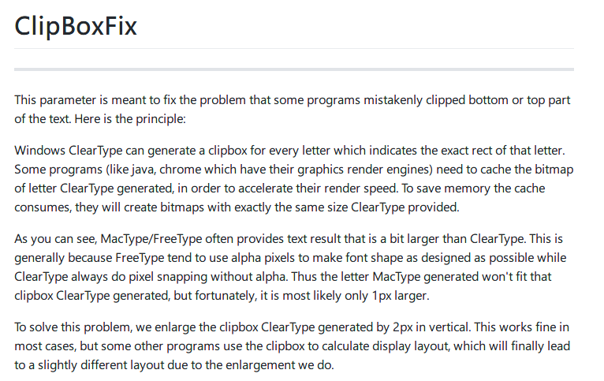
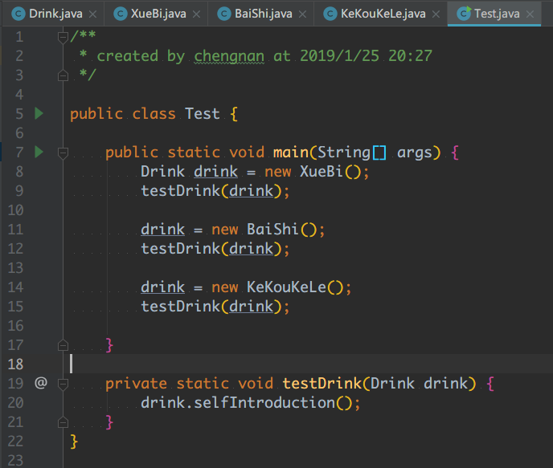

> 其实我想取的标题是《Win10 + 1080p 显示器 + IDEA 2018.3 + MacType 让字体如4K般顺滑》，但是知乎专栏不支持这么长的标题。

# Win10 + 1080p 显示器 + IDEA 2018.3 + MacType 让字体如 4K 般顺滑

本文比较啰嗦，只想看答案的可以直接拉到最后看解决方案。

## 敏感的穷人注定要(不)折(快)腾(乐)

我之前小半年的工作环境是 MBP 顶配外接 27 寸的 4K 显示器。字体显示很顺滑。直到我最近换了工作，现在的环境是 Win10 台式机  + 24 寸的 1080p 显示器。由奢入俭难啊，刚开机的时候我眼睛都要花了，我以为是驱动没装好，于是去问其他同事，他们都说正常没毛病。我又去叫了公司 IT 部门的同事，他也说没毛病。强行让自己适应了半天，还是觉得我眼睛要瞎。适应了两天，我感觉自己马上就要近视了。

于是我想起了读书时用 win7 + 1080p 显示器时装过的 MacType。win7 装完 MacType 后可以让大多数软件的字体渲染效果向 mac 的字体渲染靠近。我多次推荐给同实验室的同学，结果他们居然看不出差别。可能就像有的人听不出100块的耳机和3000块耳机的区别，有的人也看不出好的字体渲染效果和差的字体渲染效果的差别，他们是幸福的。而我这种敏感的穷人注定快乐不起来。

于是我开始了折腾在 Win10 上装 MacType。耗费了我大量时间。我先是在 [MacType官网](https://www.mactype.net/)上下载了最新的 MacTypeInstaller_2017_0628_0.exe。我的天，都 2019 了，官方正式版居然还是 2017，作者也太稳重了吧，和那些就知道刷版本号的家伙有天然之别，不愧是是良心软件。

## 受挫

早就听说 MacType 在 Win10 上有不兼容问题，果然让我遇到了。装上后感觉系统上的字体确实好了一点，但和印象中在 win7 上使用的效果相差甚远。我尝试了一下方法：

- 以各种不同的方式加载 MacType，多次重启电脑。并无卵用。
- 在 win10 的系统设置里将字体大小设为 125%，然后又设为 100 %。并无卵用。
- 设置 win10 的 ClearType。好像也没什么用。

可能是我之前用过 4K 显示器，所以G点提高了。MacType 还是那个 MacType，我已经不是那个我了。于是我放弃折腾了。

但是当我打开 IDEA 的时候，我实在是受不了 IDEA 的字体渲染，MacType 看起来没有对 IDEA 产生任何影响。我我人生的前二十多年没有近视，难道成年后还有近视吗，我不服。于是我又开始了折腾。为了让 MacType 对 IDEA 的字体渲染生效，我在网上搜索后先后尝试了一下方法：

- 设置 JDK 的启动参数，没用。（这个方法有一些中文博客到提到过，源头是 Stack Overflow）

- 在 MacType 的配置文件中加上如下配置，没用。

  ```ini
  [Experimental@idea.exe]
  ClipBoxFix=1
  [Experimental@idea64.exe]
  ClipBoxFix=1
  ```

- 更换 IDEA 的 boot jre 然后又换回去。这个有效，但是字体顶部的像素出现丢失。

- 更换字体，没用。

- 打开和关闭 IDEA 自带的抗锯齿选项，没用。

- 在 MacType 的设置里跳过 IDEA 进程或 Java 相关进程，没用，还是开启吧。

看来切换 IDEA 的 boot jre 能让 MacType 对 IDEA 生效，但是效果出现了不兼容的现象。百度和 Google 能搜到的方法我都试了，都没用。我只有两种选择：

1. 不用 MacType，忍受 IDEA 在 Win10 + 1080P 显示器上的完整的糟糕的字体渲染。
2. 使用 MacType，忍受字体渲染效果良好但是部分字体顶部丢失的情况。

于是我选择了第一种，并计划慢慢攒钱买 MBP+4K 显示器。

## 看见希望

我在网上搜索了一下 MBP 顶配和主流的 4K 显示器。发现价格太高了，而且新版 MBP 的散热问题还是没有解决。我觉得再次尝试解决 MacType + IDEA 的字体顶部像素丢失问题。在我用 Google 搜索这个问题的时候搜到了 GitHub 上的一个页面 [ClipBoxFix](https://github.com/snowie2000/mactype/wiki/ClipBoxFix)。



哥的四级英语水平翻译出就是：

> ClearType (Windows 内置的字体顺滑技术) 会为每个字符产生一个渲染用的矩形位图，有些程序（比如 Java）为了加快渲染效率会缓存这些矩形位图，而且为了节约内存，缓存的位图和 ClearType 一样大。
>
> 而 MacType/FreeType（MacType 基于 FreeType）提供的字体通常比 ClearType 大一点，所以 MacType 渲染的字符通常比 ClearType 大一个像素（是上下左右各个方向都大一个像素吗？）。为了让解决这个问题，MacType 将 ClearType 产生渲染位图在垂直方向上扩张了 2 个像素。

所以我猜测：IDEA 是用 Java 开发的，它会按原来的大小缓存 ClearType 为渲染字符产生的位图。但是使用 MacType 后每个字符渲染的结果比 IDEA 缓存的位图大，渲染结果返回给 IDEA 后，IDEA 还是按照 ClearType 提供的位图大小来排版字符，大多数字符的可以见区域原本就小一点，所以没被裁掉，而某些字符占满了为其分配的位图，排版时就会出现可见区域（比如顶部）被裁掉。

而且还有一个问题，既然 MacType 渲染的字符比 ClearType 渲染的字符大一点。这个差距会不会随着字号的变大而变大，如果差距会随着变大，那 MacType 固定在垂直方向上多分配的 2 个像素也是不够的。

## 绝处逢生

既然是 MacType/FreeType、ClearType 之间的实现差别 + IDEA 的字符渲染缓存策略造成的问题，我也解决不了啊，我不可能去看这三者的源码并去修改吧，没那本事。

但是通过上面找到的页面，我跳转到了 MacType 的源码官方仓库地址。然后跳转到了其  [releases](https://github.com/snowie2000/mactype/releases) 页面，看到了几个已经发布了 2018 的 beta 版本。而且在发行说明中提到了对 win10 和 DirectWrite 的优化。我的天，说不定它也修复了在部分软件中出现的字体顶部像素缺失的问题，毕竟这个问题这么常见。于是我卸载了我系统上旧的 MacType，下载了最新的 MacTypeInstaller_2018.1-beta5.exe，安装后发现太完美了。下面是安装最新版的 MacType 后 IDEA 中的字体渲染图。



字体是 Monaco，字号18。

虽然比不上 MBP + 4K 显示器的效果，但是我已经非常满意了。攒钱买 MBP + 4K 显示器的机会可以延后考虑了。钱包暂时逃过一劫。

## 总结一下解决方案

- 去 GitHub 下并安装最新的 MacType。地址：https://github.com/snowie2000/mactype/releases
- 如果还不行，来回切换 IDEA 的 boot jre。